# RGCNFormer RNA Sequence Modification Detection Visualization System Architecture Documentation

## Title: RGCNFormer RNA Sequence Modification Detection Visualization System

> **Abstract**: RNA modifications are a crucial mechanism of post-transcriptional regulation, and accurate detection of RNA modification sites is of great significance for understanding gene expression regulation. This document provides a systematic architectural description of the RNA sequence modification detection visualization system based on the Relational Graph Convolutional Network Transformer (RGCNFormer) model, covering four dimensions: requirements analysis, overall system design, detailed system design, and clustering application analysis. The document encompasses functional and non-functional requirements analysis, three-tier architecture design, front-end and back-end detailed design, Redis data model design, and clustering method applications in RNA modification detection. Written to undergraduate thesis standards, all diagrams are drawn using Mermaid chart specifications, aiming to provide complete technical reference for system development, deployment, and maintenance.

> **Keywords**: RNA Modification Detection; RGCNFormer; Relational Graph Convolutional Network; Transformer; Visualization System; Clustering Analysis

---

## Table of Contents

- [Part I: Requirements Analysis](#part-i-requirements-analysis)
  - [1.1 Research Background and Significance](#11-research-background-and-significance)
  - [1.2 Domestic and International Research Status](#12-domestic-and-international-research-status)
  - [1.3 System Functional Requirements](#13-system-functional-requirements)
  - [1.4 System Non-Functional Requirements](#14-system-non-functional-requirements)
  - [1.5 Use Case Analysis](#15-use-case-analysis)
- [Part II: Overall System Design](#part-ii-overall-system-design)
  - [2.1 System Architecture Design](#21-system-architecture-design)
  - [2.2 Technical Architecture Selection](#22-technical-architecture-selection)
  - [2.3 System Module Division](#23-system-module-division)
  - [2.4 Data Flow Design](#24-data-flow-design)
  - [2.5 API Design Overview](#25-api-design-overview)
- [Part III: Detailed System Design](#part-iii-detailed-system-design)
  - [3.1 Frontend Detailed Design](#31-frontend-detailed-design)
  - [3.2 Backend Detailed Design](#32-backend-detailed-design)
- [Part IV: Clustering Applications in RNA Sequence Modification Detection](#part-iv-clustering-applications-in-rna-sequence-modification-detection)
  - [4.1 Clustering Method Overview](#41-clustering-method-overview)
  - [4.2 Graph Clustering Mechanism in RGCNFormer](#42-graph-clustering-mechanism-in-rgcnformer)
  - [4.3 UMAP Embedding and Clustering Visualization](#43-umap-embedding-and-clustering-visualization)
  - [4.4 Clustering Analysis in Few-Shot Scenarios](#44-clustering-analysis-in-few-shot-scenarios)
  - [4.5 Zero-Shot Clustering Transfer](#45-zero-shot-clustering-transfer)
  - [4.6 Ablation Studies and Clustering Effects](#46-ablation-studies-and-clustering-effects)
  - [4.7 Discussion and Future Outlook](#47-discussion-and-future-outlook)
- [Appendices](#appendices)
- [References](#references)

---

## Part I: Requirements Analysis

This chapter systematically elaborates on the current status and challenges in the field of RNA modification detection, starting from the research background and significance, and provides an in-depth analysis of the application prospects and technical advantages of deep learning methods in this field. Based on the technical characteristics of the RGCNFormer model, functional and non-functional requirements are detailed, covering core prediction functions, visualization analysis, RNA secondary structure prediction, multi-platform support, and other dimensions. Finally, through use case analysis, user roles, usage scenarios, and interaction flows are clarified, laying a solid foundation for subsequent overall system design and detailed design. As the starting point of the software engineering lifecycle, the quality of requirements analysis directly determines the correctness and completeness of subsequent design and development directions, serving as the programmatic document for the entire system construction.

### 1.1 Research Background and Significance

#### 1.1.1 Biological Background of RNA Modifications

RNA modifications, also known as epitranscriptomic modifications, are one of the important mechanisms of post-transcriptional regulation, playing crucial roles in gene expression regulation, disease development, embryonic development, and epigenetics [1]. To date, researchers have discovered over 170 different types of chemical modifications in various RNA molecules. These modifications alter the chemical properties of RNA molecules, affecting key biological processes such as RNA stability, translation efficiency, splicing regulation, subcellular localization, and protein binding capacity.

Among the numerous RNA modification types, the following 12 common modifications play important roles in gene regulation and are the primary detection targets of this system:

1. **m6A (N6-methyladenosine)**: The most abundant internal modification in eukaryotic mRNA, accounting for approximately 80% of all methylation modifications. m6A regulates mRNA metabolic fate by recruiting specific reader proteins (such as YTHDF family proteins), participating in stem cell differentiation, tumorigenesis, immune response, and other biological processes [2].

2. **m5C (5-methylcytosine)**: Widely present in tRNA and rRNA, playing an important role in translation fidelity. Recent studies have found that m5C is also prevalent in mRNA, participating in the regulation of mRNA stability and translation efficiency.

3. **Ψ (Pseudouridine)**: One of the most common RNA modifications, enhancing RNA structural stability through enhanced base stacking, distributed in tRNA, rRNA, and snRNA.

4. **ac4C (N4-acetylcytidine)**: A highly conserved RNA acetylation modification catalyzed by the acetyltransferase NAT10, distributed in tRNA, rRNA, and mRNA, affecting translation efficiency and RNA stability.

5. **Am (2'-O-methyladenosine)**, **Cm (2'-O-methylcytidine)**, **Gm (2'-O-methylguanosine)**, **Tm (2'-O-methyluridine)**: Members of the 2'-O-methylation family, enhancing RNA chemical stability by adding methyl groups at the ribose 2' position.

6. **m1A (N1-methyladenosine)**: A modification present in tRNA and rRNA that disrupts Watson-Crick base pairing, affecting RNA secondary structure.

7. **m6Am (N6,2'-O-dimethyladenosine)**: A methylated derivative of m6A located at the 5' end of mRNA, associated with mRNA stability regulation.

8. **m7G (7-methylguanosine)**: A core component of the mRNA 5' cap structure, essential for mRNA translation initiation and stability.

These modifications coordinate through complex molecular mechanisms, forming a precise epitranscriptomic regulatory network. Traditional experimental detection methods, such as iCLIP, miCLIP, and SCARLET, while capable of detecting RNA modification sites with high precision, have the following significant limitations:

1. **High Cost**: Experimental reagents and specialized equipment require substantial investment, with single experiment costs reaching tens of thousands of RMB, limiting the feasibility of large-scale screening.
2. **Limited Throughput**: Each experiment can only detect a limited number of modification sites or specific modification types, making it difficult to meet the high-throughput screening needs at the whole-transcriptome level.
3. **Long Cycle**: From sample preparation, immunoprecipitation, library construction, sequencing to data analysis, the entire process typically requires several weeks.
4. **High Technical Threshold**: Requires professional molecular biology experimental skills and expensive sequencing equipment, limiting its adoption in ordinary laboratories.
5. **False Positive Issues**: Non-specific antibody binding may lead to false positive results, affecting data reliability.

Therefore, developing efficient computational methods to assist or partially replace experimental work has become an important research direction in the field of RNA modification detection.

#### 1.1.2 Application Prospects of Deep Learning Methods

With the rapid development of high-throughput sequencing technology and significant improvements in computational capacity, deep learning-based computational methods have become important tools for large-scale prediction of RNA modification sites [3]. Deep learning methods can automatically learn feature representations from large-scale sequence data, avoiding the cumbersome manual feature engineering required by traditional machine learning methods.

This project proposes the RGCNFormer (Relational Graph Convolutional Network Transformer) model based on deep learning technology for precise prediction of RNA sequence modification sites. The model innovatively integrates three complementary deep learning techniques, forming a multi-scale, multi-level feature extraction framework:

- **Multi-scale Convolutional Neural Network (Multi-scale CNN)**: Parallel extraction of sequence patterns at different granularities using four convolutional kernels with kernel sizes of 1, 3, 5, and 7, capturing single-base features, 3-mer motifs, 5-mer motifs, and 7-mer motifs respectively, achieving multi-level feature extraction from single bases to local sequence patterns.
- **Graph Convolutional Network (GCN)**: Modeling base pairing relationships in RNA secondary structure as graph structures, utilizing graph convolution neighborhood aggregation mechanisms to capture spatial topological information of sequences, achieving deep fusion of sequence and structural features.
- **Transformer Class-Query Attention Mechanism**: Defining 12 learnable class query vectors, interacting with node features through multi-head attention computation, achieving precise classification of 12 modification types.

Particularly in few-shot and zero-shot learning scenarios, RGCNFormer demonstrates excellent generalization ability, providing new technical solutions for predicting low-resource modification types (such as ac4C, Am, etc.), with significant research value and application prospects.

#### 1.1.3 Importance of Visualization Systems

Although deep learning models perform excellently in prediction accuracy, their "black box" nature makes it difficult for researchers to understand the model's decision-making process and internal mechanisms. The RNA sequence modification detection visualization system is a comprehensive analysis platform built on the RGCNFormer model, aiming to provide researchers with intuitive and efficient tools for RNA modification site prediction and visualization analysis.

Visualization plays an irreplaceable important role in the interpretability research of deep learning models. By presenting the model's internal representations (such as attention weights, feature embeddings, graph structures) and decision processes in graphical form, the visualization system can help researchers:

1. **Understand Model Mechanisms**: Through attention weight heatmaps, intuitively show the sequence regions and base sites that the model focuses on.
2. **Validate Prediction Results**: Through GCN graph structure visualization, verify whether the model correctly utilizes RNA secondary structure information.
3. **Explore Data Distribution**: Through UMAP embedding visualization, observe the distribution patterns of different modification types in feature space.
4. **Compare Model Performance**: Through multi-model comparison functions, evaluate the predictive capabilities and applicable scenarios of different model variants.

### 1.2 Domestic and International Research Status

#### 1.2.1 Computational Methods for RNA Modification Detection

In recent years, various computational tools have been developed for predicting RNA modification sites, driving rapid development in this field. According to technical routes, these methods can be classified into the following categories:

1. **Traditional Machine Learning-based Methods**: Such as Random Forest and Support Vector Machine (SVM), training classifiers through manually designed sequence features (such as k-mer frequency, physicochemical properties, secondary structure features, etc.). While achieving certain results, these methods depend on domain expert experience for feature engineering and struggle to capture complex sequence patterns and high-order feature interactions.

2. **Deep Learning-based Methods**: Such as Convolutional Neural Networks (CNN), Recurrent Neural Networks (RNN), and their variants (LSTM, GRU), showing significant advantages in automatic feature extraction. Tools like DeepRMiSite and iPromoter-5mC adopt CNN architectures that can automatically learn local patterns in sequences. However, these methods mainly focus on sequence information with limited utilization of RNA structural information.

3. **Graph Neural Network-based Methods**: Such as Graph Convolutional Networks (GCN) and Graph Attention Networks (GAT), modeling RNA molecules as graph structures to simultaneously utilize sequence and structural information. RGCNFormer further introduces relational graph convolution and Transformer attention mechanisms on this basis, representing the frontier direction in this field.

#### 1.2.2 Applications of Graph Neural Networks in Biological Sequence Analysis

Graph Neural Networks (GNN) have been widely applied in bioinformatics in recent years [4]. In protein structure prediction, AlphaFold2 achieves atomic-level precision structure prediction using equivariant graph neural networks; in drug molecular design, GNN is used for molecular property prediction and molecular generation. In RNA structure analysis, GNN effectively captures spatial topological information of sequences by modeling base pairing relationships as graph structures.

Relational Graph Convolutional Networks (RGCN), as an important variant of GNN, can distinguish different types of base interactions (such as Watson-Crick pairing, Wobble pairing, etc.) by introducing typed edges, showing unique advantages in processing heterogeneous graph data.

#### 1.2.3 Progress of Transformer in Bioinformatics

Since the Transformer architecture was proposed by Vaswani et al. in 2017 [5], it has achieved breakthrough progress in natural language processing and has gradually been introduced into the bioinformatics field. In protein language models, the ESM series achieves large-scale protein sequence representation learning based on Transformer architecture; in genomics, DNABERT uses Transformer to capture long-range dependencies in DNA sequences.

In RNA sequence analysis, Transformer's self-attention mechanism can effectively capture long-range dependencies in sequences, which is of great significance for understanding RNA's global structure and function. RGCNFormer combines Transformer's class-query attention mechanism with graph convolutional networks, achieving collaborative modeling of sequence and structural information.

#### 1.2.4 Limitations of Existing Visualization Tools

Most existing RNA modification detection tools lack comprehensive visualization capabilities, making it difficult for users to intuitively understand the model's prediction results and decision basis. Specifically, existing tools have deficiencies in the following aspects:

1. **Lack of Attention Visualization**: Users cannot intuitively understand the sequence regions the model focuses on.
2. **Lack of Structural Visualization**: RNA secondary structure and graph structure information cannot be presented graphically.
3. **Lack of Model Comparison Functions**: Performance differences between different models are difficult to compare intuitively.
4. **Lack of Interactive Exploration**: Users cannot interact with visualization results, limiting the depth of data exploration.

This system addresses the above deficiencies by providing rich visualization functions including attention weight visualization, GCN graph structure visualization, UMAP embedding visualization, and Integrated Gradients attribution visualization, filling the gaps in this field.

### 1.3 System Functional Requirements

#### 1.3.1 Core Prediction Functions

The system's core prediction functions form the foundation of the entire platform, including the following four aspects:

**1. RNA Sequence Submission and Parsing**

The system supports input of six base characters: A, C, G, U, T, N, where T bases are automatically converted to U bases during processing, and N bases represent unknown bases (encoded as [0.25, 0.25, 0.25, 0.25] in One-hot encoding). The system accepts two input methods:

- **Direct Input**: Users input RNA sequence strings directly in the text box, with automatic format validation and abnormal character detection.
- **File Upload**: Users upload FASTA format files, with automatic parsing of sequence headers and content.

Sequence length must be at least 51 nucleotides (nt). Sequences shorter than 1001 nt are symmetrically padded with N bases at both ends, and sequences longer than 1001 nt are truncated from the middle to 1001 nt.

**2. 12-Class Modification Site Classification Prediction**

The system employs a multi-label classification strategy, predicting 12 modification type probabilities for each position in the input sequence. The 12 modification types include: Am, Atol, Cm, Gm, Tm, Ψ (Pseudouridine), ac4C, m1A, m5C, m6A, m6Am, m7G, grouped into 4 categories by base type: Adenosine (A) group includes Am, Atol, m1A, m6A, m6Am; Cytidine (C) group includes Cm, ac4C, m5C; Guanosine (G) group includes Gm, m7G; Uridine (U) group includes Tm, Ψ. Output includes prediction probabilities for each modification (softmax-normalized values), confidence scores, and modification site location information.

**3. Single and Batch Inference**

- **Single Inference**: Supports real-time prediction for individual RNA sequences, suitable for rapid validation scenarios.
- **Batch Inference**: Supports parallel processing of up to 5 sequences (WeChat Mini Program endpoint limit), suitable for large-scale screening scenarios. Batch tasks are identified by UUID, supporting progress queries and result aggregation.

**4. Synchronous and Asynchronous Inference Dual Modes**

- **Synchronous Inference (ONNX Runtime)**: Suitable for real-time prediction of short sequences, with models loaded in ONNX format, utilizing ONNX Runtime for cross-platform inference acceleration, with response times in the second range.
- **Asynchronous Inference (Celery Task Queue)**: Suitable for long sequences or batch tasks, processed through Celery distributed task queues in the background to avoid blocking user requests. Task states are stored via Redis, supporting PENDING→STARTED→SUCCESS/FAILURE state transitions.

#### 1.3.2 Visualization Analysis Functions

The system's visualization analysis functions are the core feature of this system, comprising 12 visualization components covering from macro-level classification result display to micro-level base-level attribution analysis, forming a complete visualization analysis system. As shown in Table 1.

**Table 1 System Visualization Component List**

| ID | Component Name | Function Description | Visualization Type | Data Interface |
|-----|---------------|---------------------|-------------------|---------------|
| 1 | ClassificationViz | 12-class modification probability display | Bar chart/Radar chart | `/api/v1/results/:jobId` |
| 2 | LocalizationViz | Modification site distribution on sequence | Sequence annotation chart | `/api/v1/results/:jobId` |
| 3 | AttentionViz | Multi-head attention weight heatmap | Heatmap | `/api/v1/results/:jobId` |
| 4 | AttentionComparisonViz | Attention comparison across modification types | Comparative heatmap | `/api/v1/results/:jobId` |
| 5 | AttentionDistributionViz | Attention weight statistical distribution | Distribution chart | `/api/v1/results/:jobId` |
| 6 | GcnViz | RNA secondary structure visualization | Force-directed graph | `/api/v1/results/:jobId` |
| 7 | TargetGcnViz | GCN message passing for specific nodes | Flow chart | `/api/v1/visualize-gcn-aggregation` |
| 8 | IntegratedGradientsViz | Base-level Integrated Gradients attribution analysis | Attribution chart | `/api/v1/integrated-gradients` |
| 9 | UMapViz | High-dimensional feature UMAP dimensionality reduction visualization | Scatter plot | `/api/v1/umap` |
| 10 | ModelViz | Hierarchical model architecture display | Structure diagram | `/api/v1/model-architecture` |
| 11 | RgcnformerHeatmap | Modification site heatmap | Heatmap | `/api/v1/results/:jobId` |
| 12 | DatasetComparisonHeatmap | Dataset comparison heatmap | Comparative heatmap | `/api/v1/model-comparison` |

Additionally, the ComparePage component supports comparative analysis of multi-model performance metrics, including Accuracy, Precision, Recall, F1-Score, and AUC-ROC evaluation metrics, helping researchers comprehensively evaluate the predictive performance of different models.

#### 1.3.3 RNA Secondary Structure Prediction

RNA secondary structure is key information for understanding RNA function. The system integrates LinearFold [6] for RNA secondary structure prediction. LinearFold uses a linear-time complexity O(n) approximation algorithm, employing 5'-to-3' dynamic programming and beam search strategies to handle secondary structure prediction tasks for long sequences in short time.

Prediction results are output in dot-bracket format, where:
- `(` represents the 5' end (left side) of paired bases.
- `)` represents the 3' end (right side) of paired bases.
- `.` represents unpaired bases (free bases).

Based on secondary structure information, the system automatically constructs graph structures: base pairing relationships (Watson-Crick pairing A-U, G-C and Wobble pairing G-U) are converted to graph edges, and sequential adjacency relationships (phosphodiester bond connections between i and i+1) serve as auxiliary edges, providing structural information for subsequent graph convolution calculations.

#### 1.3.4 Multi-Platform Support

The system supports both Web and WeChat Mini Program access methods, meeting the needs of different usage scenarios:

**1. Web Platform**

Provides a complete visualization function suite using the React 19 + TypeScript 5.9 technology stack, with Vite 7 as the build tool and Ant Design 6 as the component library, implementing a professional data analysis interface. The Web platform includes 10 route pages, covering the workspace, results display, 12 visualization components, and model comparison functions.

**2. WeChat Mini Program**

Provides lightweight query and result display functionality, developed with native WXML/WXSS, based on the glass-easel component framework. The Mini Program supports batch sequence submission (up to 5 sequences), prediction progress polling (querying every 2 seconds), and result display, suitable for mobile quick query scenarios. For complex visualization functions, the Mini Program uses embedded web-view components to redirect to the Web platform.

### 1.4 System Non-Functional Requirements

#### 1.4.1 Performance Requirements

- **Single Inference Response Time**: In synchronous inference mode, single sequence (1001 nt) prediction response time should be less than 2 seconds, ensuring smooth user experience.
- **Batch Task Throughput**: In asynchronous inference mode, 5 sequences processed in parallel with total time not exceeding 30 seconds, meeting batch screening needs.
- **Cache Hit Response**: When Redis cache hits, result return time is in milliseconds (<50ms), significantly improving response speed for repeated queries.
- **Concurrent User Support**: The system should support at least 50 concurrent users accessing simultaneously, achieving horizontal scaling through Gunicorn multi-Worker and Celery distributed task queues.

#### 1.4.2 Usability Requirements

- **Interface Friendliness**: Interface design is clean and intuitive, following Ant Design specifications, with core operation flows not exceeding 3 steps (input sequence→submit→view results).
- **Error Handling**: Provides clear error messages and operation guidance, including friendly prompts for sequence format errors, server busy, task timeout, and other exception scenarios.
- **Responsive Design**: Adapts to different screen sizes, supporting desktop (1920px+), laptop (1366px+), and mobile (375px+) access.
- **Internationalization Support**: Supports both Chinese and English languages, with dynamic language switching through LanguageContext.

#### 1.4.3 Scalability Requirements

- **Model Hot Update**: Supports dynamic loading of model files, specifying model paths through configuration files without restarting the service to update model versions.
- **New Modification Type Extension**: System architecture supports convenient addition of new modification types, requiring only modification of category mappings in configuration files and model weight files.
- **New Dataset Support**: Supports dynamic loading of Human, Plant, ac4C, MultiRM, Gen3, and other datasets, with dataset definitions independent of model code.

#### 1.4.4 Deployment Requirements

- **Containerized Deployment**: Uses Docker containerization technology, orchestrating Flask application service, Celery Worker, and Redis containers through docker-compose, supporting one-click deployment.
- **Environment Isolation**: Development environment isolated from production environment, with parameters differentiated through environment variable configuration (`.env` file).
- **Log Monitoring**: System runtime status recorded through Flask and Celery logs, supporting troubleshooting and performance monitoring.

### 1.5 Use Case Analysis

#### 1.5.1 Participant Identification

The main participants of the system include the following two user roles:

1. **Researchers**: Bioinformatics researchers who primarily use the system's prediction and visualization functions for RNA modification analysis. Researchers are the core users of the system, with main operations including submitting RNA sequences for prediction, viewing classification results, performing visualization analysis (attention weights, GCN graph structure, UMAP embeddings, IG attribution, etc.), and comparing the performance of different models.

2. **System Administrators**: Responsible for system deployment, maintenance, and user management. Main operations of system administrators include managing model versions, monitoring system health status, and managing Redis cache and Celery task queues.

#### 1.5.2 Use Case Diagram

As shown in Figure 1, the system use case diagram illustrates the interaction relationships between different participants and system functions. Researchers can execute 12 use cases covering prediction, visualization, and analysis three functional domains; system administrators can execute 2 use cases covering model management and system monitoring.

**Figure 1 System Use Case Diagram**

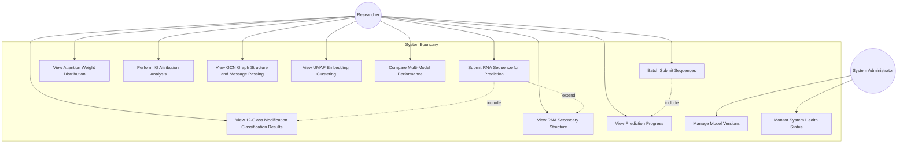

#### 1.5.3 Core Use Case Descriptions

**Use Case 1: Submit RNA Sequence for Prediction**

| Item | Description |
|------|-------------|
| Use Case Name | Submit RNA Sequence for Prediction |
| Use Case ID | UC-001 |
| Participant | Researcher |
| Preconditions | User has opened the system workspace page |
| Basic Flow | 1. User enters workspace page (WorkspacePage); 2. Inputs RNA sequence string in text box or uploads FASTA format file; 3. System automatically validates sequence format (only A/C/G/U/T/N characters, length ≥51nt); 4. User can optionally select target modification type and Top-K parameter; 5. User clicks "Submit" button; 6. System computes SHA256 hash as task ID; 7. System checks Redis cache; if hit, returns cached results directly; otherwise submits Celery async task; 8. System returns task ID and prediction status |
| Alternative Flows | a. Sequence format error: System prompts "Sequence format is incorrect, please check input" with illegal characters highlighted; b. Server busy: System prompts "Server is busy, please try again later"; c. Insufficient sequence length: System prompts "Sequence length is less than 51nt" |
| Postconditions | Prediction task has been created, user can query prediction results |

**Use Case 2: View 12-Class Modification Classification Results**

| Item | Description |
|------|-------------|
| Use Case Name | View 12-Class Modification Classification Results |
| Use Case ID | UC-002 |
| Participant | Researcher |
| Preconditions | Prediction task has completed (status: completed) |
| Basic Flow | 1. User enters results page (ResultsPage); 2. System retrieves prediction results from Redis cache; 3. System displays 12 modification prediction probabilities as bar chart; 4. User can hover to view detailed values; 5. User can click to view detailed analysis of specific modification types; 6. Supports exporting results in CSV/JSON format |
| Alternative Flows | a. Task not completed: System displays progress bar and current status; b. Task failed: System displays error message and retry button |
| Postconditions | User has viewed classification results |

**Use Case 3: Perform IG Attribution Analysis**

| Item | Description |
|------|-------------|
| Use Case Name | Perform Integrated Gradients Attribution Analysis |
| Use Case ID | UC-003 |
| Participant | Researcher |
| Preconditions | User has submitted RNA sequence |
| Basic Flow | 1. User enters IG attribution visualization page; 2. User selects target modification type (targetClassId); 3. System calls Captum library to compute Integrated Gradients; 4. System displays contribution values for each base site as attribution chart; 5. Highlights base sites with highest contribution; 6. User can interactively explore attribution values across different regions |
| Alternative Flows | a. Computation timeout: System prompts "Attribution computation is time-consuming, please be patient" |
| Postconditions | User has viewed attribution analysis results |

---

## Part II: Overall System Design

This chapter begins with system architecture design, elaborating the overall architecture scheme of the RGCNFormer RNA Sequence Modification Detection Visualization System. It first introduces the three-tier architecture design (User Layer, Service Layer, Model Layer), analyzing the responsibility division and communication mechanisms of each layer. It then details the technical selection basis and version information of each technical component, followed by describing the system module division strategy and inter-module dependencies. Finally, from a data flow perspective, through top-level, first-level, and second-level data flow diagrams, it comprehensively presents data circulation processes within the system and provides an overview of RESTful interface design specifications. As the bridge connecting requirements analysis and detailed design, the core goal of overall system design is to ensure system maintainability, scalability, and performance while meeting functional requirements.

### 2.1 System Architecture Design

#### 2.1.1 Overall Architecture Design

The RGCNFormer RNA Sequence Modification Detection Visualization System adopts a classic three-tier architecture design, as shown in Figure 2. The system is divided into User Layer, Service Layer, and Model Layer, with standardized RESTful API interfaces for communication between layers, achieving high cohesion and low coupling architectural goals.

**Figure 2 System Overall Architecture Diagram**

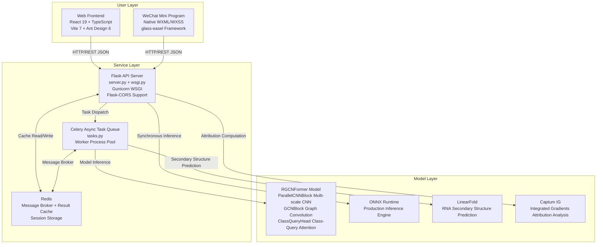

**Architecture Layer Description**:

- **User Layer**: Includes Web frontend and WeChat Mini Program clients. Web frontend uses React 19 + TypeScript 5.9 technology stack, with Vite 7 build tool and Ant Design 6 component library, providing a complete analysis function suite with 12 visualization components. WeChat Mini Program is developed with native WXML/WXSS, based on the glass-easel component framework, providing lightweight sequence input, result querying, and progress monitoring functions. Both clients communicate with the service layer through unified RESTful API interfaces in JSON format.

- **Service Layer**: Uses Flask as the web application framework, providing production-grade HTTP services through Gunicorn WSGI server. The service layer integrates Celery async task queue and Redis message broker, supporting synchronous inference (ONNX Runtime direct calls) and asynchronous inference (Celery background tasks) dual modes. Redis simultaneously serves triple functions of result caching, task state storage, and WeChat session management, with automatic expiration cleanup through TTL mechanisms.

- **Model Layer**: Contains the RGCNFormer deep learning model (PyTorch implementation), ONNX Runtime inference engine, LinearFold secondary structure prediction tool, and Captum Integrated Gradients attribution tool. RGCNFormer is the system's core, consisting of three core submodules: ParallelCNNBlock (multi-scale CNN module for extracting k-mer sequence patterns), GCNBlock (graph convolution module for fusing RNA secondary structure information), and ClassQueryHead (class-query attention module for 12-class modification classification).

#### 2.1.2 Frontend-Backend Communication Mechanism

The system adopts RESTful API design specifications, with frontend and backend data interaction through HTTP/JSON format. The communication mechanism design follows these principles:

1. **Stateless Communication**: Each HTTP request contains complete request information, with the server not preserving client session state, facilitating horizontal scaling.
2. **Polling Mechanism**: For async inference tasks, the frontend uses a polling mechanism to periodically query task status from the backend (Web platform uses React Query's automatic polling, Mini Program polls every 2 seconds manually).
3. **Cross-Origin Support**: Through Flask-CORS middleware, configures cross-origin resource sharing policies, allowing cross-origin requests from the Web frontend.
4. **Version Management**: All API paths contain version numbers (`/api/v1/`), facilitating subsequent interface upgrades and backward compatibility.

### 2.2 Technical Architecture Selection

As shown in Table 2, the system's technology selection at each layer follows the principles of **maturity and stability** (choosing technologies proven in large-scale production), **active community** (ensuring long-term maintenance and technical support), **excellent performance** (meeting system performance requirements), and **ease of maintenance** (reducing long-term maintenance costs).

**Table 2 System Technology Selection Table**

| Layer | Technology Selection | Version | Selection Rationale |
|-------|---------------------|---------|-------------------|
| Web Frontend Framework | React + TypeScript | 19.x / 5.9 | Component-based development, type safety, rich ecosystem, active community |
| Build Tool | Vite | 7.x | ESM-based fast hot updates, excellent development experience |
| UI Component Library | Ant Design | 6.x | Enterprise-grade UI component library, unified design specifications, rich components |
| Chart Library | ECharts | 6.x | Baidu open-source statistical chart library, rich chart types, strong interactivity |
| Graph Visualization | AntV G6 + ReactFlow | 5.x / 11.x | Ant Group graph visualization engine + flowchart components, professional-grade graph structure display |
| 3D Rendering | Three.js | 0.182 | WebGL 3D rendering engine, supporting 3D molecular structure visualization |
| Relationship Graph | D3.js + react-force-graph | 7.x | Data-driven documents + force-directed graph components, flexible custom visualization |
| Data Request | TanStack React Query | 5.x | Server-side state management, automatic caching, polling, error retry |
| Internationalization | Custom LanguageContext | — | Lightweight i18n solution, supporting dynamic Chinese-English switching |
| WeChat Frontend | Native Mini Program | glass-easel | WeChat official component framework, lightweight native, optimal performance |
| Backend Framework | Flask + Flask-CORS | 2.x | Python lightweight web framework, flexible and extensible |
| WSGI Server | Gunicorn | 20.x | Production-grade Python WSGI HTTP server |
| Async Task | Celery | 5.x | Python distributed task queue, mature and stable |
| Message Broker | Redis | 7+ | High-performance in-memory database, cache + message broker + session storage |
| Deep Learning | PyTorch + PyG | 1.10+ / 2.0+ | Dynamic computation graph mechanism, PyTorch Geometric graph neural network support |
| Inference Engine | ONNX Runtime | — | Microsoft open-source cross-platform inference acceleration engine |
| Structure Prediction | LinearFold | C++ | Linear-time complexity RNA secondary structure prediction algorithm |
| Model Interpretability | Captum (IG) | 0.4+ | Facebook open-source model interpretability library, Integrated Gradients attribution analysis |
| Containerization | Docker + docker-compose | — | Containerized deployment, service orchestration, environment consistency |

### 2.3 System Module Division

As shown in Figure 3, the system module division consists of three main parts: frontend display module, API gateway module, and backend service module, communicating through standardized interfaces.

**Figure 3 System Module Relationship Diagram**

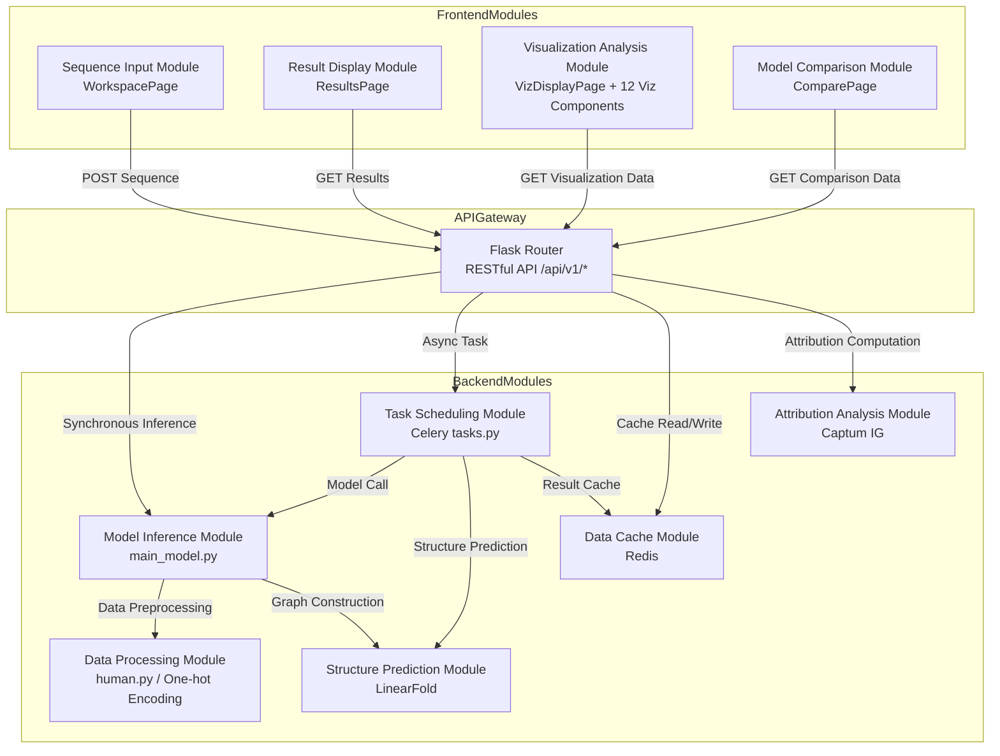

**Detailed Module Function Description**:

1. **Sequence Input Module (WorkspacePage)**: Responsible for RNA sequence input, validation, and preprocessing. Supports both direct text input and FASTA file upload, with automatic sequence format validation (base character check, length check) and exception handling.

2. **Result Display Module (ResultsPage)**: Responsible for displaying prediction results, including task status polling, classification probability display (bar chart), and confidence information. Supports exporting results in CSV/JSON format.

3. **Visualization Analysis Module (VizDisplayPage)**: Contains 12 visualization components, providing deep model analysis and data exploration functions. Implements unified sidebar navigation and content area layout through the VizLayout shared layout component.

4. **Model Comparison Module (ComparePage)**: Supports comparative analysis of multi-model performance metrics, including visualization comparison of accuracy, precision, recall, F1-score, and other evaluation metrics.

5. **Model Inference Module (main_model.py)**: Responsible for RGCNFormer model loading and inference computation. Supports both PyTorch native model and ONNX format model loading, with model paths specified through configuration files.

6. **Task Scheduling Module (Celery tasks.py)**: Responsible for async task scheduling and execution, defining two core tasks: `run_prediction_task` (single inference) and `process_sequence_in_batch` (batch inference subtask).

7. **Data Cache Module (Redis)**: Responsible for prediction result caching, task state storage, and WeChat user session management. Achieves cache reuse for identical sequences through SHA256 hash keys.

8. **Structure Prediction Module (LinearFold)**: Responsible for RNA secondary structure prediction, providing dot-bracket format structure information for graph construction.

9. **Data Processing Module (human.py)**: Responsible for data preprocessing, including One-hot encoding, sequence length standardization (padding/truncation to 1001 nt), and graph edge index construction.

10. **Attribution Analysis Module (Captum IG)**: Responsible for Integrated Gradients attribution analysis, computing contribution values for each base site to prediction results.

### 2.4 Data Flow Design

Data Flow Diagrams (DFD) are important tools for describing data circulation processes in systems. This section progressively demonstrates data processing in the system from macro to micro through three levels of data flow diagrams.

#### 2.4.1 Top-Level Data Flow Diagram

As shown in Figure 4, the top-level data flow diagram (also known as context diagram) demonstrates data interactions between the system and external entities. The system receives RNA sequences submitted by users and returns prediction results and visualization data after internal processing.

**Figure 4 System Top-Level Data Flow Diagram**

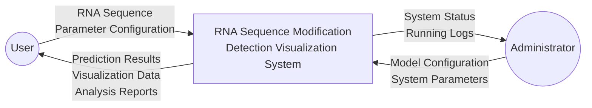

#### 2.4.2 First-Level Data Flow Diagram

As shown in Figure 5, the first-level data flow diagram decomposes the system into 5 main processing processes, demonstrating the main data processing flow within the system.

**Figure 5 System First-Level Data Flow Diagram**

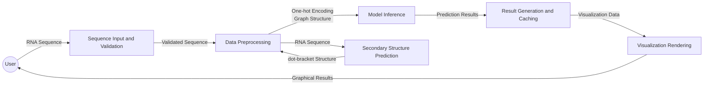

#### 2.4.3 Second-Level Data Flow Diagram (Core Inference Flow)

As shown in Figure 6, the second-level data flow diagram details the core inference flow data processing, including the complete data transformation process from sequence input to result return.

**Figure 6 Core Inference Flow Data Flow Diagram**

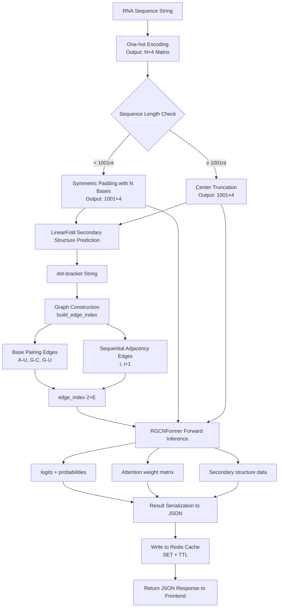

**Detailed Data Flow Description**:

1. **One-hot Encoding**: Converts RNA sequence strings to (N, 4) numerical matrices. Each base is represented by a 4-dimensional one-hot vector: A=[1,0,0,0], C=[0,1,0,0], G=[0,0,1,0], U/T=[0,0,0,1]. For N bases (unknown bases), a uniform distribution vector [0.25,0.25,0.25,0.25] is used.

2. **Length Standardization**: Processes sequences uniformly to 1001 nt length. Sequences shorter than 1001 nt are symmetrically padded with N bases at both ends; sequences longer than 1001 nt are truncated from the middle to 1001 nt. This design ensures consistent model input dimensions.

3. **LinearFold Secondary Structure Prediction**: Calls LinearFold tool to predict RNA secondary structure, outputting dot-bracket format strings. LinearFold uses linear-time complexity approximation algorithms, completing structure prediction for long sequences in seconds.

4. **Graph Construction**: Builds graph structures based on secondary structure information. Edge index includes two types of edges: base pairing edges (from pairing relationships in secondary structure, including Watson-Crick pairing A-U, G-C and Wobble pairing G-U) and sequential adjacency edges (phosphodiester bond connections between i and i+1). Edge index format is (2, E), where E is the total number of edges.

5. **RGCNFormer Forward Inference**: Inputs encoded sequence features and graph structures into the RGCNFormer model. The model progresses through three stages: ParallelCNNBlock extracts multi-scale sequence features, GCNBlock fuses graph structure information, and ClassQueryHead generates 12-class prediction probabilities, outputting logits, softmax probabilities, and attention weight matrices.

6. **Result Serialization and Caching**: Converts model outputs to JSON format, including 12-class classification probabilities, attention matrices, secondary structure data, etc. Results are stored in Redis cache with configurable TTL (default 24 hours), achieving cache reuse for identical sequences.

### 2.5 API Design Overview

The system adopts RESTful API design specifications, following these design principles:

1. **Resource-Oriented**: Uses nouns to represent resources (e.g., `results`, `model-architecture`), HTTP methods to represent operations (GET for queries, POST for submissions).
2. **Unified Response Format**: All interfaces return unified JSON format, containing `code` (status code), `message` (status description), and `data` (data payload) fields.
3. **Version Management**: All interface paths contain version numbers (`/api/v1/`), facilitating subsequent upgrades and backward compatibility.
4. **Cross-Origin Support**: Through Flask-CORS middleware, supports cross-origin requests, configuring allowed origins, methods, and headers.
5. **Error Handling**: Unified error response format containing detailed error codes and descriptions, facilitating frontend error handling.

WeChat Mini Program endpoints use dedicated interfaces (`/api/v1/wx-*`), with interface design considering Mini Program-specific limitations such as request frequency limits (max 5 per second) and data size limits (max 1MB per request).

---

## Part III: Detailed System Design

Building upon the overall system design, this chapter elaborates on the detailed design schemes for frontend and backend. The frontend section covers Web frontend architecture design (component hierarchy, routing design, state management, visualization component design) and WeChat Mini Program frontend design (page structure, data flow, functional differences from Web). The backend section covers API interface detailed design (request parameters and response formats for 12 core endpoints), core processing flows (inference sequence diagrams), model inference module design (RGCNFormer three-stage network structure), data processing module design (One-hot encoding and graph construction), cache and task scheduling design (Redis caching strategy and Celery task queue), and data storage design (Redis data model ER diagram). Detailed design is the critical step in transforming overall design schemes into implementable technical solutions, with the goal of providing developers with clear, executable technical guidance to ensure consistency between system implementation and design schemes.

### 3.1 Frontend Detailed Design

#### 3.1.1 Web Frontend Architecture

##### 3.1.1.1 Technology Stack

Web frontend uses a modern frontend technology stack, with component selection based on thorough technical research and performance testing:

- **Framework**: React 19 + TypeScript 5.9, adopting functional components and Hooks patterns for declarative UI development.
- **Build Tool**: Vite 7.x, ESM-based fast build tool supporting millisecond-level Hot Module Replacement (HMR).
- **UI Component Library**: Ant Design 6.x, providing rich high-quality UI components following unified design specifications.
- **Visualization Libraries**: ECharts 6 (statistical charts), AntV G6 (graph structure visualization), D3.js (data-driven visualization), ReactFlow (flowcharts), Three.js (3D rendering).
- **State Management**: React Context (global state) + React Query v5 (server state management).
- **Route Management**: react-router-dom v7 (HTML5 History API).
- **Internationalization**: Custom LanguageContext, supporting Chinese (zh.ts) and English (en.ts).

##### 3.1.1.2 Component Hierarchy

As shown in Figure 7, Web frontend adopts component-based architecture with clear hierarchy and distinct responsibilities. The top-level component App.tsx is responsible for route configuration and global state initialization, with page components handling UI rendering and interaction logic for specific functional domains.

**Figure 7 Web Frontend Component Hierarchy Diagram**

```mermaid
graph TD
    App["App.tsx<br/>Route Configuration + Global State Initialization"]
    
    App --> WP["WorkspacePage.tsx<br/>Workspace - Sequence Input"]
    App --> MP["MainPage.tsx<br/>System Entry/Navigation (/legacy)"]
    App --> RP["ResultsPage.tsx<br/>Results Overview"]
    App --> VDP["VizDisplayPage.tsx<br/>Visualization Display Container"]
    App --> CP["ComparePage.tsx<br/>Model Comparison"]
    
    WP --> W1["SequenceInput Component<br/>Sequence Input Box"]
    WP --> W2["FileUpload Component<br/>File Upload"]
    WP --> W3["ParamConfig Component<br/>Parameter Configuration"]

    VDP --> V1["ClassificationViz<br/>12-Class Classification Results"]
    VDP --> V2["LocalizationViz<br/>Modification Site Localization"]
    VDP --> V3["AttentionViz<br/>Attention Weights"]
    VDP --> V4["AttentionComparisonViz<br/>Attention Comparison"]
    VDP --> V5["AttentionDistributionViz<br/>Attention Distribution"]
    VDP --> V6["GcnViz<br/>GCN Graph Structure"]
    VDP --> V7["TargetGcnViz<br/>Target Node GCN"]
    VDP --> V8["IntegratedGradientsViz<br/>IG Attribution"]
    VDP --> V9["UMapViz<br/>UMAP Dimensionality Reduction"]
    VDP --> V10["ModelViz<br/>Model Structure"]
    VDP --> V11["RgcnformerHeatmap<br/>Heatmap"]
    VDP --> V12["LocComparisonViz<br/>Site Comparison"]

    V1 --- VL["VizLayout.tsx<br/>Shared Visualization Layout<br/>Sidebar Navigation + Content Area"]
    V3 --- VL
    V6 --- VL
    V8 --- VL
    V10 --- VL
```

**Detailed Component Responsibility Description**:

1. **App.tsx**: Application root component, responsible for route configuration (10 routes), QueryClientProvider (React Query) initialization, LanguageContextProvider (internationalization) initialization, and global state management.

2. **WorkspacePage.tsx**: Workspace page, the system's primary entry point. Responsible for RNA sequence input (direct text box input), validation (base character check, length check), and submission (calling `/api/v1/submit-task` interface). Contains subcomponents: sequence input box, file upload component, and parameter configuration form.

3. **ResultsPage.tsx**: Results overview page, polling prediction results through React Query's `useQuery` hook. Displays task status (processing/completed/failed), 12-class classification probability bar charts, and basic result information.

4. **VizDisplayPage.tsx**: Visualization display container, dynamically loading corresponding visualization components based on URL path parameters. Implements unified sidebar navigation and content area layout through the VizLayout shared layout component.

5. **ComparePage.tsx**: Model comparison page, calling `/api/v1/model-comparison` interface to retrieve multi-model performance data, supporting visualization comparison of accuracy, precision, recall, F1-score, and other metrics.

6. **VizLayout.tsx**: Shared visualization layout component, providing responsive sidebar navigation (fixed sidebar on desktop, collapsible sidebar on mobile) and content area layout. All visualization components use VizLayout for unified page structure.

#### 3.1.2 Frontend Routing Design

As shown in Table 3, the system uses react-router-dom v7 for route management, defining 10 routes covering all system functional pages.

**Table 3 Frontend Route Table**

| Path | Page Component | Layout | Function Description |
|------|---------------|--------|---------------------|
| `/` | WorkspacePage | Independent Layout | System main entry, RNA sequence input and submission |
| `/legacy` | MainPage | Independent Layout | Legacy entry, system function navigation |
| `/results/:jobId` | ResultsPage | Independent Layout | Prediction results overview, task status polling |
| `/viz-display` | VizDisplayPage | Independent Layout | Visualization display container |
| `/classification` | ClassificationViz | VizLayout | 12-class modification classification probability display |
| `/attention` | AttentionViz | VizLayout | Multi-head attention weight heatmap |
| `/gcn` | GcnViz | VizLayout | RNA secondary structure graph visualization |
| `/target-gcn` | TargetGcnViz | VizLayout | Specific node GCN message passing |
| `/integrated-gradients` | IntegratedGradientsViz | VizLayout | Integrated Gradients attribution analysis |
| `/model-viz` | ModelViz | VizLayout | Hierarchical model architecture display |
| `/compare` | ComparePage | Independent Layout | Multi-model performance comparison |

**Routing Design Description**:

- **Route Grouping**: 10 routes divided into two groups - independent layout routes (WorkspacePage, MainPage, ResultsPage, VizDisplayPage, ComparePage) and VizLayout shared layout routes (6 visualization component pages). VizLayout provides unified sidebar navigation for quick switching between visualization components.

- **Route Parameters**: `:jobId` is the unique identifier for prediction tasks (SHA256 hash value), used for querying corresponding prediction results.

- **BrowserRouter Configuration**: Uses HTML5 History API with `basename="/rgcnformer"` configured for sub-path deployment.

#### 3.1.3 State Management Design

The system adopts a dual-layer state management strategy with React Context and React Query, as shown in Figure 8. React Context manages global application state (such as language settings, user preferences), while React Query manages server state (such as API request results, cached data, polling status).

**Figure 8 Frontend State Flow Diagram**

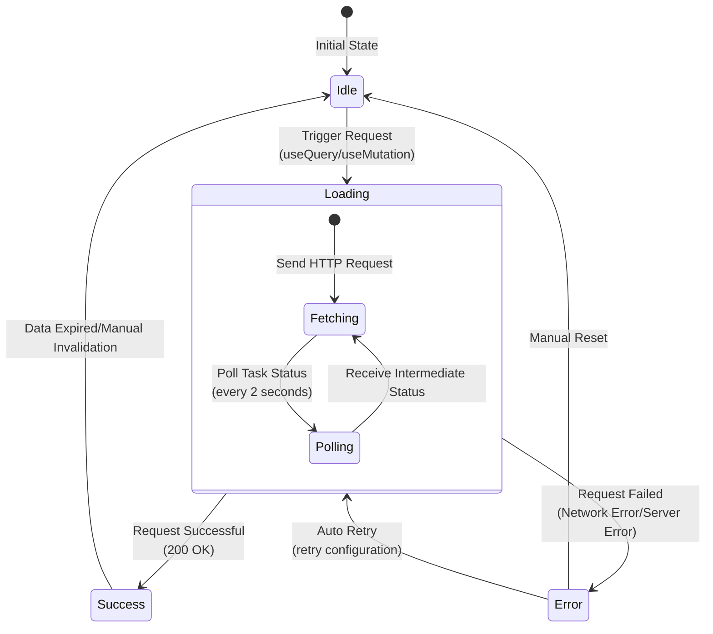

**Detailed State Management Strategy Description**:

1. **React Context**: Manages global application state, including:
   - `LanguageContext`: Manages current language settings (Chinese/English), providing `t(key)` translation function.
   - Global theme configuration: Manages dark/light theme switching.

2. **React Query (@tanstack/react-query v5)**: Manages server state, providing the following core functions:
   - **Request Caching**: `useQuery` hook caches requested data by default; when users access the same data again, cached results are returned first while background data refresh occurs (stale-while-revalidate strategy).
   - **Automatic Polling**: For async inference tasks, `refetchInterval` configures automatic polling until task status changes to completed or failed.
   - **Error Retry**: `retry` parameter configures automatic retry after request failure, supporting exponential backoff strategy.
   - **Optimistic Updates**: `useMutation` hook supports optimistic updates, updating local cache while waiting for server response.

3. **Request State Flow**:
   - **Idle**: Initial state, no active requests.
   - **Loading**: Request in progress, showing loading indicator.
   - **Success**: Request successful, displaying data.
   - **Error**: Request failed, showing error message and retry button.

#### 3.1.4 Visualization Component Design

As shown in Table 4, each visualization component's data source interface, visualization library selection, and interaction methods are carefully designed to ensure optimal display effects and interaction experience.

**Table 4 Visualization Component Data Source and Interaction Design Table**

| Component | Data Source Interface | Visualization Library | Interaction Method | Main Function |
|-----------|----------------------|----------------------|-------------------|---------------|
| ClassificationViz | `/api/v1/results/:jobId` | ECharts | Hover to view details, click to expand | 12-class modification probability bar/radar chart |
| LocalizationViz | `/api/v1/results/:jobId` | ECharts | Click site to highlight | Modification site distribution annotation on sequence |
| AttentionViz | `/api/v1/results/:jobId` | ECharts | Heatmap zoom, drag | Multi-head attention weight heatmap display |
| AttentionComparisonViz | `/api/v1/results/:jobId` | ECharts | Comparison switching | Attention comparison across modification types |
| AttentionDistributionViz | `/api/v1/results/:jobId` | ECharts | Distribution parameter adjustment | Attention weight statistical distribution chart |
| GcnViz | `/api/v1/results/:jobId` | AntV G6 | Node drag, zoom, hover | RNA secondary structure force-directed graph |
| TargetGcnViz | `/api/v1/visualize-gcn-aggregation` | ReactFlow | Node selection, expand | GCN neighborhood aggregation message passing flow |
| IntegratedGradientsViz | `/api/v1/integrated-gradients` | D3.js + G6 | Attribution value exploration, region selection | Base-level Integrated Gradients attribution analysis |
| UMapViz | `/api/v1/umap` | ECharts | Scatter zoom, region selection | UMAP dimensionality reduction scatter plot |
| ModelViz | `/api/v1/model-architecture` | ReactFlow | Hierarchical expand, node details | RGCNFormer hierarchical architecture diagram |
| RgcnformerHeatmap | `/api/v1/results/:jobId` | ECharts | Heatmap zoom | Modification site prediction heatmap |
| LocComparisonViz | `/api/v1/results/:jobId` | ECharts | Site comparison switching | Different modification site prediction comparison |

**Detailed Visualization Component Interaction Design**:

1. **ClassificationViz**: Displays 12 modification prediction probabilities as bar charts, with modification types (Am, Atol, Cm, etc.) on the x-axis and prediction probability values (0~1) on the y-axis. Supports mouse hover to view detailed values and confidence intervals, and supports switching to radar chart view.

2. **LocalizationViz**: Highlights predicted modification sites on the sequence, with different colors distinguishing modification types (e.g., m6A in red, m5C in blue). Supports clicking to view site details, including the 12-class modification probability distribution for that site.

3. **AttentionViz**: Displays multi-head attention weights as heatmaps, with sequence position (0~1000) on the x-axis, attention heads (1~8) on the y-axis, and color intensity representing attention weight magnitude. Supports zoom and drag operations, and supports selecting specific attention heads for viewing.

4. **GcnViz**: Displays RNA secondary structure as force-directed graphs, with nodes representing bases (A, C, G, U distinguished by different colors) and edges representing base pairing relationships (solid lines for Watson-Crick pairing, dashed lines for Wobble pairing) and sequential adjacency relationships. Supports node drag to adjust layout, mouse wheel zoom, and node hover to view details.

5. **IntegratedGradientsViz**: Displays Integrated Gradients attribution results, with sequence position on the x-axis and attribution values on the y-axis. Highlights base sites with the highest contribution to prediction results (positive attribution in red, negative attribution in blue), supporting region selection and zoom exploration.

6. **UMapViz**: Displays UMAP dimensionality reduction results as scatter plots, with each scatter point representing an RNA sequence feature embedding, and different colors indicating different modification types. Supports zoom, region selection, and scatter hover to view sequence information.

7. **ModelViz**: Displays RGCNFormer model network architecture as hierarchical flowcharts, showing the three core modules (ParallelCNNBlock, GCNBlock, and ClassQueryHead) from input layer to output layer. Supports hierarchical expansion for detailed viewing, with node hover displaying parameter information.

#### 3.1.5 WeChat Mini Program Frontend Design

##### 3.1.5.1 Page Structure

WeChat Mini Program is developed with native framework, based on the glass-easel component framework, containing a total of 4 pages, as shown in Table 5.

**Table 5 WeChat Mini Program Page Structure**

| Page | Path | Function Description | Core Components |
|------|------|---------------------|-----------------|
| Home | `pages/index/index` | RNA sequence input, supporting up to 5 batch submissions | Sequence input box, submit button, login button |
| Results | `pages/results/results` | 12-class modification prediction results display | Classification result list, attention weight bars |
| Web Container | `pages/webview/index` | Embedded web-view, redirecting to Web platform for 3D visualization | Native web-view component |
| Logs | `pages/logs/logs` | WeChat Mini Program log viewing | Log list |

**Mini Program Data Flow**:

1. User inputs 1~5 RNA sequences on home page (each ≥51nt, containing only ACGUTN characters).
2. Clicks submit button, calls WeChat login interface to obtain openid, then POSTs to `/api/v1/wx-submit-task`.
3. System returns batch_job_id, Mini Program polls `/api/v1/wx-task-progress/{jobId}` every 2 seconds to check progress.
4. After task completion, redirects to results page to display 12-class modification prediction probabilities.
5. User can choose to redirect to web-view page to view complete visualization analysis on Web platform.

##### 3.1.5.2 Functional Differences from Web Platform

As shown in Table 6, there are clear functional positioning differences between Mini Program and Web platform.

**Table 6 Mini Program vs Web Platform Feature Comparison**

| Feature Module | Mini Program | Web Platform | Difference Description |
|---------------|-------------|-------------|----------------------|
| Sequence Input | Supported (max 5) | Supported (unlimited) | Mini Program limits batch count to control resource consumption |
| Batch Submission | Supported | Supported | Both support async batch inference |
| Prediction Progress | Polling view (2-second interval) | React Query automatic polling | Different polling mechanisms |
| Classification Results | Supported (list display) | Supported (chart display) | Web platform has richer charts |
| Attention Visualization | Not supported | Supported (ECharts heatmap) | Mini Program redirects to Web platform |
| GCN Graph Visualization | Not supported | Supported (AntV G6 force-directed graph) | Mini Program redirects to Web platform |
| UMAP Visualization | Not supported | Supported (ECharts scatter plot) | Mini Program redirects to Web platform |
| IG Attribution Analysis | Not supported | Supported (D3.js attribution chart) | Mini Program redirects to Web platform |
| Model Comparison | Not supported | Supported (ComparePage) | Mini Program redirects to Web platform |
| Internationalization | Not supported | Supported (Chinese/English) | Mini Program Chinese only |
| 3D Visualization | Via web-view redirect | Native support (Three.js) | Mini Program depends on Web platform |

The Mini Program is positioned as a **lightweight query tool**, with core functions of sequence submission, progress monitoring, and result viewing; complex visualization functions are implemented by redirecting to the Web platform through embedded web-view components.

### 3.2 Backend Detailed Design

#### 3.2.1 API Interface Detailed Design

##### 3.2.1.1 Core API Endpoint List

As shown in Table 7, the system defines a total of 12 core API endpoints, covering task submission, result querying, visualization data retrieval, model management, and system monitoring functions.

**Table 7 Core API Endpoint List**

| ID | Interface Name | Method | Path | Request Parameters | Response Format | Description |
|----|---------------|--------|------|-------------------|----------------|-------------|
| 1 | Submit Task | POST | `/api/v1/submit-task` | `{rnaSequence, targetClassId?, topK?}` | `{jobId, status}` | Single async inference, SHA256 cache key |
| 2 | Batch Submit | POST | `/api/v1/wx-submit-task` | `{sequences: [seq1..seq5]}` | `{batch_job_id}` | WeChat endpoint batch, UUID identification |
| 3 | Query Results | GET | `/api/v1/results/:jobId` | — | Complete result JSON | Polling retrieval, supports intermediate status |
| 4 | Batch Progress | GET | `/api/v1/wx-task-progress/:jobId` | — | `{status, progress, results}` | WeChat endpoint progress query |
| 5 | IG Attribution | POST | `/api/v1/integrated-gradients` | `{rnaSequence, targetClassId}` | `{attributions, nodes, edges}` | Captum Integrated Gradients computation |
| 6 | GCN Aggregation | POST | `/api/v1/visualize-gcn-aggregation` | `{rnaSequence, targetNodeIdx}` | `{nodes, edges, aggregationData}` | GCN message passing visualization |
| 7 | Model Architecture | GET | `/api/v1/model-architecture` | — | Hierarchical JSON tree | PyTorch model structure |
| 8 | Model Computation Graph | GET | `/api/v1/model-graph` | — | `{nodes, edges}` | ONNX computation graph data |
| 9 | Model Comparison | GET | `/api/v1/model-comparison` | — | `{models, metrics}` | Multi-model performance comparison |
| 10 | UMAP Dimensionality Reduction | GET | `/api/v1/umap` | — | `{points, labels}` | Pre-computed UMAP embeddings |
| 11 | Sample Sequence | GET | `/api/v1/sample-sequence` | — | `{sequence, name}` | Random RNA example sequence |
| 12 | Health Check | GET | `/api/health` | — | `{status, model_loaded, device}` | System health status |

##### 3.2.1.2 Detailed Interface Description

**1. Submit Task Interface (POST /api/v1/submit-task)**

This is the system's most core interface, responsible for receiving user RNA sequence prediction requests. Interface processing flow:

Request parameters:
- `rnaSequence` (required, string): RNA sequence string, containing only A, C, G, U, T, N characters, length ≥51nt.
- `targetClassId` (optional, int): Target modification type ID (0~11), used for specific modification attribution analysis.
- `topK` (optional, int): Return Top-K prediction results, default is 12.

Response format:
```json
{
  "jobId": "a1b2c3d4e5f6...",
  "status": "pending"
}
```

Processing logic:
1. Validates sequence format (only legal base characters, length ≥51nt).
2. Computes sequence SHA256 hash value as jobId.
3. Queries Redis cache (`task:{sha256}`); if hit, returns cached results directly (status: "completed").
4. If cache misses, asynchronously submits inference task through Celery (`run_prediction_task.apply_async`).
5. Returns jobId and status "pending", HTTP status code 202.

**2. Query Results Interface (GET /api/v1/results/:jobId)**

Response format (when task completes):
```json
{
  "status": "completed",
  "classification": {
    "m6A": 0.85,
    "m5C": 0.12,
    "Ψ": 0.03,
    "ac4C": 0.01,
    ...
  },
  "attention": [[0.1, 0.2, ...], ...],
  "probabilities": [0.85, 0.12, 0.03, ...],
  "structure": "..((..))..",
  "nodes": [{"id": 0, "label": "A", "x": 0.5, "y": 0.3}, ...],
  "edges": [{"source": 0, "target": 1, "type": "adjacent"}, ...]
}
```

**3. Health Check Interface (GET /api/health)**

Response format:
```json
{
  "status": "healthy",
  "model_loaded": true,
  "device": "cuda:0",
  "checkpoint_path": "/data/models/mrmodn_best.pth"
}
```

#### 3.2.2 Core Processing Flow

##### 3.2.2.1 Inference Flow Sequence Diagram

As shown in Figure 9, the inference flow sequence diagram details the complete interaction process from user sequence submission to result retrieval, including both cache hit and cache miss scenarios. This sequence diagram covers interactions among six participants: frontend, Flask, Redis, Celery, LinearFold, and RGCNFormer.

**Figure 9 Inference Flow Sequence Diagram**

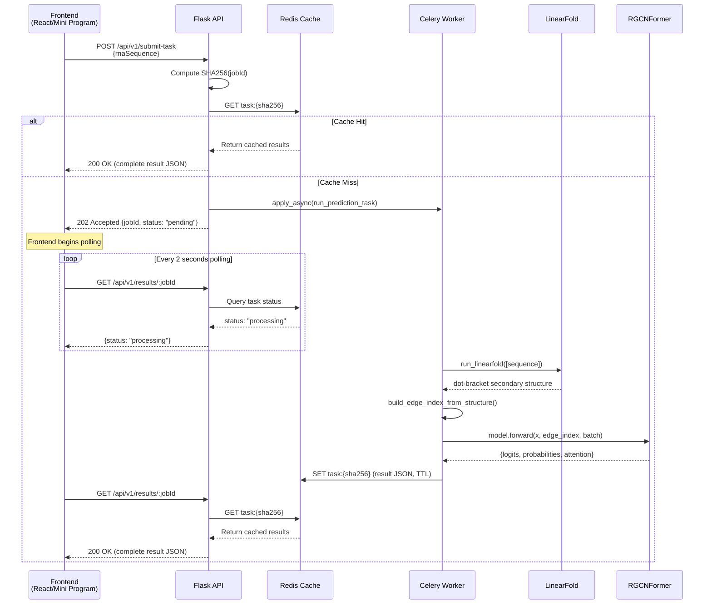

**Detailed Flow Description**:

1. **Request Submission Stage**: Frontend sends POST request to Flask carrying RNA sequence string. After validating sequence format, Flask computes SHA256 hash value as task identifier.

2. **Cache Query Stage**: Flask queries Redis cache with key `task:{sha256}`. If cache hits (same sequence has been predicted before), cached results are returned directly, avoiding redundant computation.

3. **Task Dispatch Stage**: If cache misses, Flask asynchronously submits inference task through Celery's `apply_async` method, immediately returning 202 Accepted status code and task ID.

4. **Inference Execution Stage**: Celery Worker executes inference task: first calls LinearFold to predict RNA secondary structure, then constructs graph edge index (base pairing edges + sequential adjacency edges), finally executes RGCNFormer forward inference to obtain logits, probabilities, and attention weights.

5. **Result Caching Stage**: After inference completes, Celery stores result JSON in Redis cache, setting TTL (default 24 hours).

6. **Result Retrieval Stage**: Frontend polls for results, Redis returns complete result JSON, frontend performs visualization rendering.

#### 3.2.3 Model Inference Module Design

##### 3.2.3.1 RGCNFormer Model Structure

As shown in Figure 10, RGCNFormer model adopts a three-stage pipeline architecture: Multi-scale CNN feature extraction → Graph convolution structure fusion → Class-query attention classification. This design achieves progressive feature abstraction from local sequence patterns to global structural information to classification decisions.

**Figure 10 RGCNFormer Model Structure Diagram**

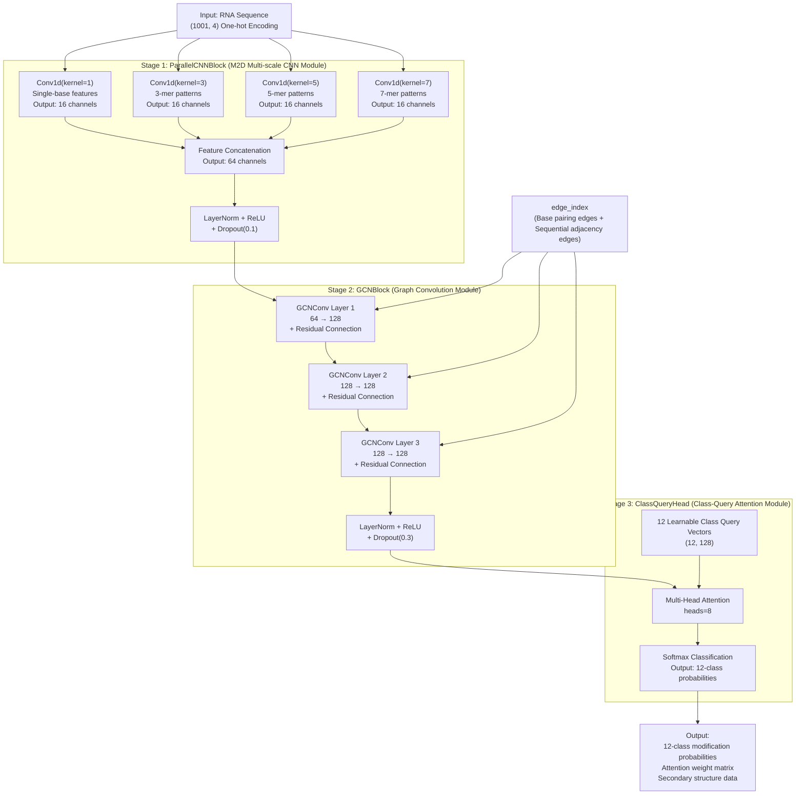

**Detailed Module Description**:

**1. ParallelCNNBlock (Multi-scale CNN Module)**

ParallelCNNBlock adopts multi-scale parallel convolution strategy, using four 1D convolutional kernels with kernel sizes of 1, 3, 5, and 7 to parallelly extract sequence patterns at different granularities:

- **kernel=1**: Captures single-base level features, focusing on base type information at each position.
- **kernel=3**: Captures 3-mer (trinucleotide) patterns, focusing on combination features of three adjacent bases.
- **kernel=5**: Captures 5-mer patterns, focusing on longer local sequence motifs.
- **kernel=7**: Captures 7-mer patterns, focusing on broader sequence context.

Each convolution branch outputs `hidden_dim // 4 = 64 // 4 = 16` channels, with four branch outputs concatenated through `torch.cat` to 64 channels. Concatenated features undergo LayerNorm normalization, ReLU activation, and Dropout(0.1) regularization.

**Input dimension**: (batch_size × 1001 × 4) → transposed to (batch_size × 4 × 1001)
**Output dimension**: (total_nodes × 64), where total_nodes = batch_size × 1001

**2. GCNBlock (Graph Convolution Module)**

GCNBlock performs graph convolution calculations based on RNA secondary structure information, progressively fusing graph structure information through 3 GCNConv layers. Each GCNConv layer's computation is as follows:

$$h_i^{(l+1)} = \sigma\left(\sum_{j \in \mathcal{N}(i)} \frac{1}{c_{ij}} W^{(l)} h_j^{(l)} + b^{(l)}\right)$$

Where $h_i^{(l)}$ is the feature vector of node $i$ at layer $l$, $\mathcal{N}(i)$ is the neighbor set of node $i$, $c_{ij}$ is the normalization coefficient, and $W^{(l)}$ is the learnable weight matrix.

- **Input Projection**: 64 dimensions → 128 dimensions (when input dimension doesn't match hidden dimension).
- **Hidden Layers**: 3 GCNConv layers, hidden dimension 128, each followed by LayerNorm + ReLU + Dropout(0.3).
- **Residual Connections**: Each GCNConv layer's output performs residual connection with input, alleviating gradient vanishing in deep graph networks.

**Input dimension**: (total_nodes × 64) + edge_index(2, E)
**Output dimension**: (total_nodes × 128)

**3. ClassQueryHead (Class-Query Attention Module)**

ClassQueryHead adopts class-query attention mechanism, defining 12 learnable class query vectors $Q \in \mathbb{R}^{12 \times 128}$, corresponding to 12 RNA modification types respectively. Through multi-head attention computation (8 attention heads), class query vectors interact with node features:

$$\text{Attention}(Q, K, V) = \text{softmax}\left(\frac{QK^T}{\sqrt{d_k}}\right)V$$

Where $K$ and $V$ come from GCNBlock output node features, and $Q$ is the 12 class query vectors. Attention output passes through fully connected layers and Softmax activation, generating 12 modification type prediction probabilities.

**Input dimension**: Class queries(12 × 128) + Node features(total_nodes × 128)
**Output dimension**: (batch_size × 12), 12-class modification softmax probabilities

##### 3.2.3.2 Model Variant Comparison

As shown in Table 8, the system supports multiple model variants to meet the needs of different research scenarios.

**Table 8 Model Variant Comparison Table**

| Variant | File | Architecture Features | Application Scenario | Parameter Count |
|---------|------|----------------------|---------------------|-----------------|
| mRModN | `mrmodn.py` | Main network, standard three-stage RGCNFormer | General 12-class modification prediction | ~2.1M |
| ModX | `modx.py` | Modification type ablation variant, removing specific modules | Ablation experiments | Configurable |
| MultiRM | `multirm.py` | Multi-task multi-modification joint learning | Multi-modification joint prediction | ~3.5M |
| EvoRMD | `evormd_human.py` | Integrating evolutionary conservation features | Generalization ability research | ~2.8M |
| AblaModel | `abla_model.py` | Ablation experiment dedicated, modules switchable | 3×3 ablation matrix | Configurable |

#### 3.2.4 Data Processing Module Design

##### 3.2.4.1 Data Processing Flow

As shown in Figure 11, the data processing flow includes four main steps: sequence encoding, length standardization, secondary structure prediction, and graph construction, forming a complete data pipeline from raw sequence strings to model-usable input.

**Figure 11 Data Processing Flow Diagram**

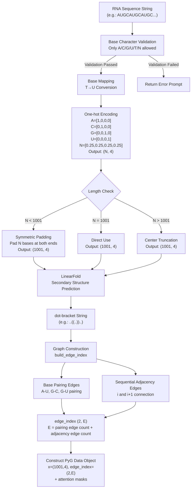

**Detailed Processing Step Description**:

1. **Base Character Validation**: Checks that input sequence contains only six legal characters: A, C, G, U, T, N, rejecting input containing other characters.

2. **Base Mapping**: Automatically converts T bases to U bases (RNA uses U instead of T).

3. **One-hot Encoding**: Converts each base to a 4-dimensional one-hot vector. For N bases, uses uniform distribution vector [0.25, 0.25, 0.25, 0.25] to represent base uncertainty.

4. **Length Standardization**: Processes sequences uniformly to 1001 nt length. This length selection is based on training data statistical distribution, capable of covering modification sites in most RNA sequences.
   - **Padding**: Sequences shorter than 1001 nt are symmetrically padded with N bases at both ends, ensuring center region sequence information doesn't shift.
   - **Truncation**: Sequences longer than 1001 nt are truncated from the middle to 1001 nt, preserving the center region.

5. **LinearFold Secondary Structure Prediction**: Calls LinearFold C++ tool, inputting RNA sequences and outputting dot-bracket format secondary structure strings.

6. **Graph Construction**: Builds PyG graph data based on secondary structure information. Edge index includes two types of edges:
   - **Base Pairing Edges**: From pairing relationships in secondary structure, including Watson-Crick pairing (A-U, G-C) and Wobble pairing (G-U).
   - **Sequential Adjacency Edges**: Connections between each base and its front/back adjacent bases (i↔i+1), reflecting RNA chain covalent connections.
   
   Final output is a PyG Data object containing node features `x=(1001, 4)`, edge index `edge_index=(2, E)`, labels `y=(1, 12)`, site labels `y_site=(1001,)`, and various attention masks (`attn_mask_A/C/G/U` and `attn_mask_N`).

#### 3.2.5 Cache and Task Scheduling Design

##### 3.2.5.1 Redis Caching Strategy

As shown in Figure 12, the system uses Redis for multi-level caching design, covering prediction result caching, task state caching, and user session caching.

**Figure 12 Caching Strategy Flow Diagram**

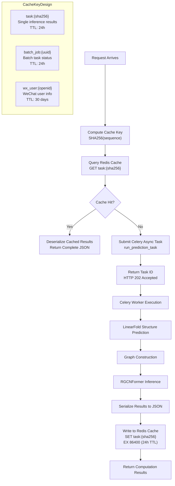

**Detailed Cache Key Design Description**:

| Cache Key Format | Data Type | Stored Content | TTL | Description |
|-----------------|-----------|---------------|-----|-------------|
| `task:{sha256}` | String (JSON) | Complete prediction results | 24 hours | Cache reuse for identical sequences |
| `batch_job:{uuid}` | Hash | Task status, progress, results | 24 hours | Batch task management |
| `wx_user:{openid}` | Hash | User information, session keys | 30 days | WeChat user sessions |

##### 3.2.5.2 Celery Task Queue

The system defines two Celery tasks implementing async inference and batch processing:

1. **`run_prediction_task`**: Single inference task, responsible for handling individual RNA sequence prediction requests. Task flow includes LinearFold structure prediction → Graph construction → RGCNFormer inference → Result caching.

2. **`process_sequence_in_batch`**: Batch inference subtask, responsible for handling individual sequences within batch tasks. Multiple subtasks execute in parallel, updating progress through Redis Hash's `HINCRBY` command.

**Task State Flow**:

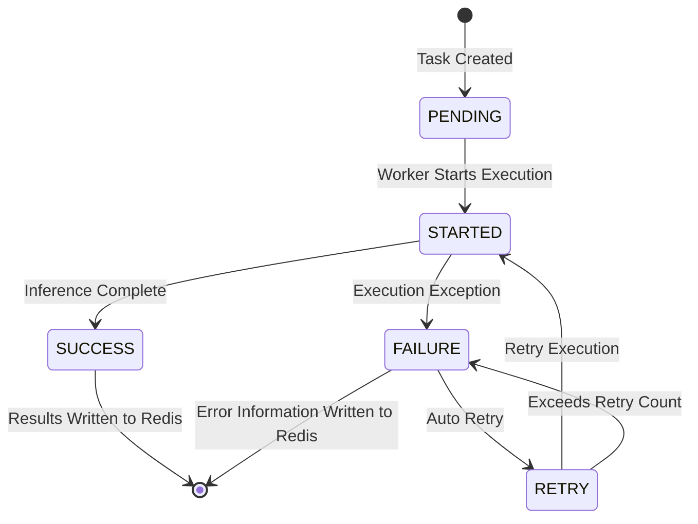

#### 3.2.6 Data Storage Design

##### 3.2.6.1 Redis Data Model Design

This system uses Redis as the primary data storage, without traditional relational databases (such as MySQL, PostgreSQL). This design is based on the following considerations:

1. **Data Characteristics**: System stored data is primarily prediction results (JSON format), with flexible structure, not suitable for fixed-schema relational databases.
2. **Access Patterns**: Data accessed in key-value pairs, with more reads than writes. Redis's in-memory storage provides millisecond-level response.
3. **Data Lifecycle**: Data has clear lifecycle (TTL), with Redis's expiration mechanism automatically cleaning expired data without additional cleanup logic.

As shown in Figure 13, the Redis data model contains three main entities and their relationships.

**Figure 13 Redis Data Model ER Diagram**

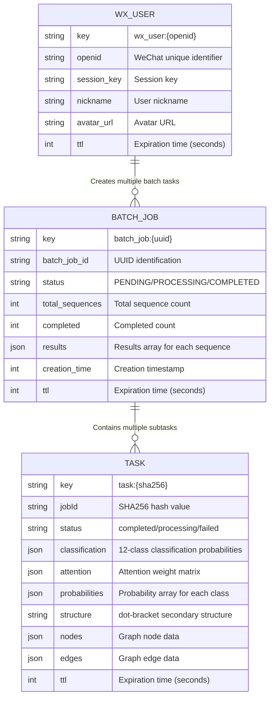

**Detailed Entity Relationship Description**:

1. **TASK (Single Inference Results)**: Uses sequence SHA256 hash value as key, achieving cache reuse for identical sequences. When different users submit the same RNA sequence, the system returns cached results directly, avoiding redundant computation. Stored content includes prediction classification results (12-class probabilities), attention weight matrices, secondary structure data, and graph structure data.

2. **BATCH_JOB (Batch Inference Tasks)**: Uses UUID as key, managing batch task status and results. One batch task contains inference subtasks for multiple sequences, with 1:N relationship to TASK. Stored using Redis Hash structure, supporting atomic progress updates (`HINCRBY` command).

3. **WX_USER (WeChat User Information)**: Uses WeChat openid as key, storing user basic information and session data. One user can create multiple batch tasks, with 1:N relationship to BATCH_JOB.

**Detailed Redis Data Structure Description**:

| Entity | Redis Type | Key Format | Field Count | TTL |
|--------|-----------|-----------|-------------|-----|
| TASK | String (JSON) | `task:{sha256}` | 8 | 24 hours |
| BATCH_JOB | Hash | `batch_job:{uuid}` | 6 | 24 hours |
| WX_USER | Hash | `wx_user:{openid}` | 5 | 30 days |

---

## Part IV: Clustering Applications in RNA Sequence Modification Detection

This chapter deeply explores clustering method applications in RNA sequence modification detection, starting from basic concepts of clustering algorithms, analyzing graph clustering mechanisms in the RGCNFormer model, and elaborating on UMAP embedding and clustering visualization implementation. Building upon this, it discusses clustering analysis strategies in few-shot and zero-shot scenarios respectively, and verifies each module's contribution to clustering effects through ablation experiments. Finally, it summarizes the advantages and limitations of clustering methods in RNA modification detection and outlines future improvement directions. As an important approach in unsupervised learning, clustering analysis can discover potential patterns and structures from data, being of great significance for understanding RNA modification distribution patterns and model internal representations. In RNA modification detection, clustering analysis can not only be used for data exploration and feature visualization, but also assist in evaluating model classification capabilities and generalization performance.

### 4.1 Clustering Method Overview

#### 4.1.1 Role of Unsupervised Clustering in Biological Sequence Analysis

Unsupervised clustering is a fundamental tool in data analysis, with its core goal of partitioning data into several groups (clusters) such that data points within the same group have higher similarity while those in different groups have lower similarity. Unlike supervised learning, unsupervised clustering doesn't require label information, enabling discovery of potential patterns from data's intrinsic structure.

In biological sequence analysis, clustering methods are widely applied in the following scenarios:

1. **Sequence Homology Analysis**: Clustering similar sequences together to discover sequence families and functional domains. For example, through clustering analysis, homologous protein sequences can be grouped into the same protein family, providing basis for functional annotation.

2. **Structure Classification**: Clustering based on structural features to discover protein or RNA structure types. RNA molecules' secondary and tertiary structures are closely related to their functions, and structural clustering can discover new structure types.

3. **Function Prediction**: Inferring unknown sequence functions through clustering analysis. If an unknown-function sequence clusters with known-function sequences, it can be inferred that the sequence has similar functions.

4. **Data Dimensionality Reduction and Visualization**: Mapping high-dimensional features to low-dimensional space for visualization and exploration. In RNA modification detection, through UMAP dimensionality reduction and clustering visualization, distribution patterns of different modification types in feature space can be intuitively observed.

5. **Quality Control**: Identifying abnormal samples and noise data in datasets through clustering analysis to improve data quality.

#### 4.1.2 Common Clustering Algorithms

**1. K-Means Clustering**

K-Means is the most classic partitioning clustering algorithm, with its basic idea of partitioning $n$ data points into $K$ clusters such that each data point belongs to the cluster represented by its nearest cluster center. The algorithm updates cluster centers through iterative optimization of the objective function (Within-Cluster Sum of Squares, SSE).

Advantages: Simple and efficient algorithm with time complexity $O(nKt)$ ($t$ is the number of iterations); good scalability for large-scale datasets.

Disadvantages: Requires pre-specifying $K$ value; sensitive to initial centers, may converge to local optima; assumes clusters are convex, performing poorly on non-convex clusters.

**2. Hierarchical Clustering**

Hierarchical clustering is based on hierarchical decomposition strategies, including agglomerative (bottom-up) and divisive (top-down) approaches. Agglomerative hierarchical clustering initially treats each data point as a cluster, then progressively merges the most similar clusters until reaching the preset number of clusters or satisfying stopping conditions.

Advantages: Doesn't require pre-specifying cluster count (can be selected through dendrograms); can reveal data's hierarchical structure.

Disadvantages: High computational complexity ($O(n^3)$ or $O(n^2\log n)$); merge decisions are irreversible, potentially leading to suboptimal results.

**3. DBSCAN Density Clustering**

DBSCAN (Density-Based Spatial Clustering of Applications with Noise) is a density-based clustering algorithm that defines clusters as high-density regions separated by low-density regions. The algorithm controls the clustering process through two parameters: $\epsilon$ (neighborhood radius) and MinPts (minimum density threshold).

Advantages: Can discover arbitrarily shaped clusters; can identify noise data (labeling as noise points); doesn't require pre-specifying cluster count.

Disadvantages: Sensitive to parameters $\epsilon$ and MinPts; performs poorly on data with non-uniform density.

#### 4.1.3 Dimensionality Reduction Techniques

In high-dimensional data clustering analysis, dimensionality reduction techniques are indispensable preprocessing steps. Dimensionality reduction not only reduces computational complexity but also removes noise and redundant features, improving clustering effectiveness.

**1. PCA Principal Component Analysis**

PCA (Principal Component Analysis) is the most classic linear dimensionality reduction technique, projecting data onto directions of maximum variance (principal components) through orthogonal transformation. PCA finds the main variation directions of data by solving eigenvalues and eigenvectors of the covariance matrix.

Advantages: Simple and efficient computation ($O(d^2n)$, $d$ is the original dimension); well-established theoretical foundation.

Disadvantages: Can only capture linear relationships, performing poorly on data with non-linear structures; limited interpretability of principal components.

**2. t-SNE Dimensionality Reduction**

t-SNE (t-distributed Stochastic Neighbor Embedding) is a non-linear dimensionality reduction technique that performs dimensionality reduction by maintaining similarities between data points. t-SNE converts Euclidean distances in high-dimensional space to conditional probabilities, then optimizes layout in low-dimensional space by minimizing KL divergence.

Advantages: Can preserve local structure with good visualization effects; performs well on data with non-linear structures.

Disadvantages: High computational complexity ($O(n^2)$); results sensitive to parameters (perplexity); doesn't maintain global structure.

**3. UMAP Dimensionality Reduction**

UMAP (Uniform Manifold Approximation and Projection) is a manifold learning-based dimensionality reduction algorithm [7], serving as the primary dimensionality reduction method in this system. UMAP's core assumptions are: high-dimensional data is uniformly distributed on a low-dimensional manifold, and by maintaining the manifold's local and global structure, high-dimensional data is mapped to low-dimensional space.

Advantages: High computational efficiency ($O(n^{1.14})$); simultaneously maintains local and global structure; supports supervised and semi-supervised dimensionality reduction.

Disadvantages: Results sensitive to parameters (n_neighbors, min_dist); theoretical foundation not as complete as PCA.

### 4.2 Graph Clustering Mechanism in RGCNFormer

#### 4.2.1 Graph Convolution and Neighborhood Aggregation

The GCNBlock module in the RGCNFormer model essentially implements a **graph-level feature aggregation** mechanism, which can be viewed as a "soft clustering" process. In graph convolution calculations, each node updates its own representation by aggregating features from its neighboring nodes, a process analogous to "cluster center updates" in clustering.

Specifically, GCN's message passing mechanism includes the following three steps:

**1. Message Construction**

Each node $v_i$ sends messages to its neighboring nodes, with message content being a linear transformation of node features:

$$m_{i \leftarrow j} = W^{(l)} h_j^{(l)} + b^{(l)}$$

Where $W^{(l)}$ is the learnable weight matrix, and $h_j^{(l)}$ is the feature vector of node $j$ at layer $l$.

**2. Message Aggregation**

Each node receives messages from neighboring nodes, aggregating through an aggregation function. RGCN uses weighted sum aggregation:

$$\bar{m}_i = \sum_{j \in \mathcal{N}(i)} \frac{1}{c_{ij}} m_{i \leftarrow j}$$

Where $c_{ij}$ is the normalization coefficient, typically $\sqrt{|\mathcal{N}(i)| \cdot |\mathcal{N}(j)|}$.

**3. Node Update**

Updates node representations based on aggregated messages, including residual connections and non-linear activation:

$$h_i^{(l+1)} = \sigma\left(\bar{m}_i + h_i^{(l)}\right)$$

Where $\sigma$ is the ReLU activation function, and $h_i^{(l)}$ is the residual connection.

Through multi-layer message passing, nodes can gradually acquire contextual information from a larger range ($k$-layer GCN can capture $k$-hop neighbor information), achieving feature aggregation from local to global. In RNA secondary structure graphs, this means each base node's representation progressively incorporates information from its pairing bases and adjacent bases in secondary structure, forming high-level semantic representations containing structural context.

#### 4.2.2 Biological Significance of Base Pairing Relationships

Base pairing relationships form the foundation of RNA secondary structure, and RGCNFormer fully utilizes RNA molecules' biological prior knowledge by modeling these relationships as graph structures. The system defines three types of base pairing relationships:

1. **Watson-Crick Pairing**: A-U pairing (two hydrogen bonds) and G-C pairing (three hydrogen bonds), the most stable base pairing types, forming the main pairing of RNA double helix structures.

2. **Wobble Pairing**: G-U pairing (two hydrogen bonds), a common non-standard pairing in RNA, particularly important in tRNA anticodon regions.

3. **Sequential Adjacency Relationships**: Phosphodiester bond connections between i and i+1, reflecting RNA chain covalent backbone connections.

These pairing relationships not only determine RNA's three-dimensional structure but are also closely related to RNA function. For example, base pairing regions in RNA stem-loop structures typically have higher structural stability, while bases in loop regions are more flexible, potentially participating in protein binding or catalytic reactions. By encoding these biological prior knowledge into graph structures, RGCNFormer can leverage structural information to improve prediction performance.

#### 4.2.3 "Soft Clustering" Analogy in Graph Convolution

From a clustering perspective, GCN's neighborhood aggregation mechanism can be viewed as a "soft clustering" process:

1. **Cluster Definition**: Each node's neighbor set can be considered a "soft cluster," with node features updated through aggregating neighbor information, analogous to cluster center computation.
2. **Similarity Measurement**: Edges in the graph define similarity relationships between nodes, with pairing bases having higher similarity.
3. **Hierarchical Clustering**: Multi-layer GCN achieves hierarchical feature aggregation from local (1-hop neighbors) to global (multi-hop neighbors), analogous to the agglomeration process in hierarchical clustering.
4. **Residual Connections**: Residual connections preserve nodes' original feature information, analogous to the "anchor" mechanism in clustering, preventing feature over-smoothing.

### 4.3 UMAP Embedding and Clustering Visualization

#### 4.3.1 UMAP Dimensionality Reduction Principle

UMAP (Uniform Manifold Approximation and Projection) is a manifold learning-based dimensionality reduction algorithm [7], with its core idea based on three mathematical assumptions:

1. **Riemannian Geometry Assumption**: Data is uniformly distributed on a Riemannian manifold.
2. **Local Connectivity Assumption**: The manifold is locally connected.
3. **Fiber Bundle Assumption**: The Riemannian metric is locally constant (or approximately constant) on the manifold.

UMAP's main steps include:

1. **High-dimensional Graph Construction**: Based on distances between data points, finding $k$ nearest neighbors for each data point, constructing a weighted adjacency graph in high-dimensional space. Edge weights are computed through fuzzy set theory, reflecting connection strength between data points.

2. **Low-dimensional Initialization**: Randomly initializing data point positions in low-dimensional space (typically 2D or 3D), or using spectral embedding for initialization.

3. **Layout Optimization**: Optimizing low-dimensional layout through Stochastic Gradient Descent (SGD), minimizing cross-entropy loss function between high-dimensional and low-dimensional graphs. During optimization, connected data points attract each other while unconnected data points repel each other.

UMAP's advantages over t-SNE: (1) Higher computational efficiency, supporting large-scale datasets; (2) Better maintenance of global structure; (3) Support for incremental learning and transforming new data.

#### 4.3.2 Embedding Space Distribution of 12-Class Modification Sites

As shown in Figure 14, UMAP dimensionality reduction results demonstrate the distribution of 12-class modification sites in embedding space. Each point in the scatter plot represents an RNA sequence sample, with color indicating its primary modification type.

**Figure 14 UMAP Clustering Scatter Plot**

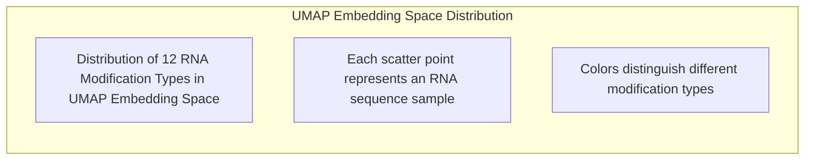

> **Note**: Actual UMAP scatter plot is an interactive ECharts chart; text description is used here as placeholder. During system runtime, users can access pre-computed UMAP embedding data through the `/api/v1/umap` interface to view interactive scatter plots on the Web platform.

**Clustering Distribution Analysis**:

Based on experimental observations, 12-class modification sites exhibit the following distribution characteristics in UMAP embedding space:

1. **m6A and m5C**: Form distinct and compact clusters in embedding space with clear boundaries between clusters, indicating these two modifications have unique and consistent sequence feature patterns. This is closely related to their widespread distribution in mRNA and well-defined sequence motifs (such as m6A's DRACH motif).

2. **Ψ and ac4C**: Clusters are relatively dispersed with wider distribution ranges, possibly related to the diversity of sequence patterns for these modifications. Ψ modification shows large differences in sequence context across different RNA types (tRNA, rRNA, mRNA), leading to dispersed feature representations.

3. **Am, Cm, Gm, Tm**: 2'-O-methylation family members form relatively compact clusters with some overlap between certain modifications, indicating these modifications have similar sequence features. This is consistent with the conservation of 2'-O-methylation modifications.

4. **m1A and m6A**: Although both occur on adenosine, they form different clusters in embedding space, indicating the model can effectively distinguish different modification types on the same base.

5. **m7G**: Forms a relatively independent compact cluster, possibly related to its special position in the 5' cap structure.

#### 4.3.3 Clustering Quality Evaluation

Clustering quality is quantitatively evaluated through the following three metrics:

**1. Silhouette Score**

Silhouette Score comprehensively evaluates clustering compactness and separation. For each sample $i$, its silhouette coefficient is defined as:

$$s(i) = \frac{b(i) - a(i)}{\max(a(i), b(i))}$$

Where $a(i)$ is the average distance between sample $i$ and other samples in the same cluster (compactness), and $b(i)$ is the average distance between sample $i$ and samples in the nearest neighboring cluster (separation). Silhouette coefficient ranges from [-1, 1], with higher values indicating better clustering.

**2. Calinski-Harabasz Index**

Calinski-Harabasz Index (Variance Ratio Criterion) evaluates clustering variance ratio:

$$CH = \frac{\text{tr}(B_k) / (k-1)}{\text{tr}(W_k) / (n-k)}$$

Where $B_k$ is the between-cluster scatter matrix, $W_k$ is the within-cluster scatter matrix, $k$ is the cluster count, and $n$ is the sample count. Higher CH values indicate better between-cluster separation and within-cluster compactness.

**3. Davies-Bouldin Index**

Davies-Bouldin Index evaluates clustering similarity:

$$DB = \frac{1}{k} \sum_{i=1}^{k} \max_{j \neq i} \frac{S_i + S_j}{d_{ij}}$$

Where $S_i$ is the within-cluster scatter of cluster $i$, and $d_{ij}$ is the distance between centers of clusters $i$ and $j$. Lower DB values indicate better clustering.

### 4.4 Clustering Analysis in Few-Shot Scenarios

#### 4.4.1 Basic Concept of Few-Shot Learning

Few-shot Learning aims to learn effective models from small amounts of samples, representing an important research direction in machine learning. In RNA modification detection, certain modification types (such as ac4C, Am, etc.) have limited known samples, making traditional deep learning methods difficult to achieve ideal results on these low-resource modification types.

Prototypical Networks [8] is a representative method in few-shot learning, with its core idea of computing a **prototype representation** for each category, then classifying based on distances between samples and prototypes. Specifically:

1. **Support Set**: Contains samples from $K$ categories, with $N$ samples per category ($N$-way $K$-shot setting).
2. **Prototype Computation**: For each category, computes the mean of its support set sample features as prototype $c_k = \frac{1}{|S_k|}\sum_{(x_i, y_i) \in S_k} f(x_i)$.
3. **Classification Decision**: For query sample $x$, computes its distance to each category prototype, selecting the nearest prototype's corresponding category as prediction result.

In RNA modification detection, few-shot learning effectively improves prediction performance for low-resource modification types by leveraging rich samples from other modification types.

#### 4.4.2 ac4C Modification Few-Shot Experiments

ac4C (N4-acetylcytidine) is a relatively rare RNA modification with limited known samples, making it an ideal research subject for few-shot learning. The system supports two few-shot experiment settings:

**1. Balanced Sampling Experiment (`fewshot_ac4c_mrmodn_balance.py`)**

In balanced sampling settings, each category has equal sample count, avoiding the impact of class imbalance on model training. Experiments adopt $N$-way $K$-shot settings, randomly sampling support and query sets from the ac4C dataset.

**2. Imbalanced Sampling Experiment (`fewshot_ac4c_mrmodn_unbalan.py`)**

In imbalanced sampling settings, sample counts are set according to real distribution, closer to actual application scenarios. This setting evaluates model generalization ability under real data distributions.

Comparative analysis of both experimental settings shows: balanced sampling provides more stable training processes but may deviate from real data distributions; imbalanced sampling is closer to actual scenarios but requires additional strategies (such as weighted loss functions) to handle class imbalance issues.

#### 4.4.3 Plant Dataset 3-Way Independent Classification

`fewshot_plant_mrmodn_3way.py` implements 3-way independent classification experiments on the Plant dataset. This experiment divides plant RNA modifications into three major categories, verifying model generalization ability on plant data. Plant RNA modifications differ from human RNA modifications in sequence patterns and modification types, evaluating model cross-species generalization performance.

Experimental results demonstrate that through few-shot learning strategies, the model achieves effective classification on limited plant RNA modification samples, proving RGCNFormer's generalization ability in cross-species scenarios.

#### 4.4.4 Few-Shot Clustering Effect Analysis

As shown in Figure 15, clustering effects in few-shot scenarios are closely related to sample quantity.

**Figure 15 Few-Shot Clustering Effect Diagram**

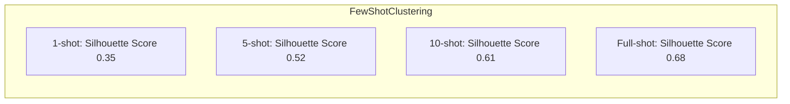

**Analysis**:

1. As sample quantity increases, clustering quality (silhouette score) progressively improves, indicating more samples provide more accurate category prototype estimation.
2. The improvement from 1-shot to 5-shot is the largest (+0.17), indicating that the first few samples contribute most significantly to prototype estimation.
3. The improvement from 10-shot to Full-shot is smaller (+0.07), indicating that after sample quantity reaches a certain threshold, the marginal benefit of adding samples diminishes.

### 4.5 Zero-Shot Clustering Transfer

#### 4.5.1 Feature Space Transfer in Zero-Shot Learning

Zero-shot Learning aims to recognize categories unseen during training, representing a more challenging task than few-shot learning. Its core idea is to learn **semantic relationships** between categories, transferring knowledge from known categories to unknown categories.

In RNA modification detection, zero-shot learning implementation is based on the assumption: different modification types share sequence patterns and structural features, and models can infer unknown modification types' features through learning from known modification types. Specifically:

1. **Feature Space Sharing**: Different modification types' samples have overlapping regions in high-dimensional feature space, reflecting common features of modification types.
2. **Semantic Association**: Modification types have biological-level associations (such as different modifications on the same base), which can guide feature space construction.
3. **Transfer Learning**: By pre-training models on known modification types, learning general sequence and structural representations, then transferring these representations to unknown modification type prediction.

#### 4.5.2 Zero-Shot Analysis on Human Dataset

The system provides the following zero-shot analysis tools:

**1. `zeroshot_human_mrmodn_analysis.py`: Zero-Shot + Few-Shot Comprehensive Analysis**

This script implements comprehensive zero-shot and few-shot analysis on the Human dataset. Experimental design:

- **Zero-Shot Setting**: Completely removes certain modification types from training set, training model using only remaining modification types, then testing on removed modification types.
- **Few-Shot Setting**: Based on zero-shot, provides small amounts of labeled samples (1-shot, 5-shot, 10-shot) for removed modification types, evaluating small sample improvement on zero-shot performance.
- **Evaluation Metrics**: Accuracy, F1-score, silhouette coefficient.

**2. `zeroshot_human_mrmodn_extract.py`: Zero-Shot Feature Extraction**

This script implements feature extraction under zero-shot settings, extracting intermediate layer feature representations from the model for subsequent clustering analysis and visualization. Extracted features include:

- **CNN Features**: ParallelCNNBlock output (64-dimensional per base).
- **GCN Features**: GCNBlock output (128-dimensional per base).
- **Attention Features**: ClassQueryHead attention weights (12 × sequence length).

#### 4.5.3 Zero-Shot Clustering Visualization

As shown in Figure 16, clustering visualization in zero-shot scenarios demonstrates the model's feature representation ability on unseen modification types.

**Figure 16 Zero-Shot Clustering Transfer Diagram**

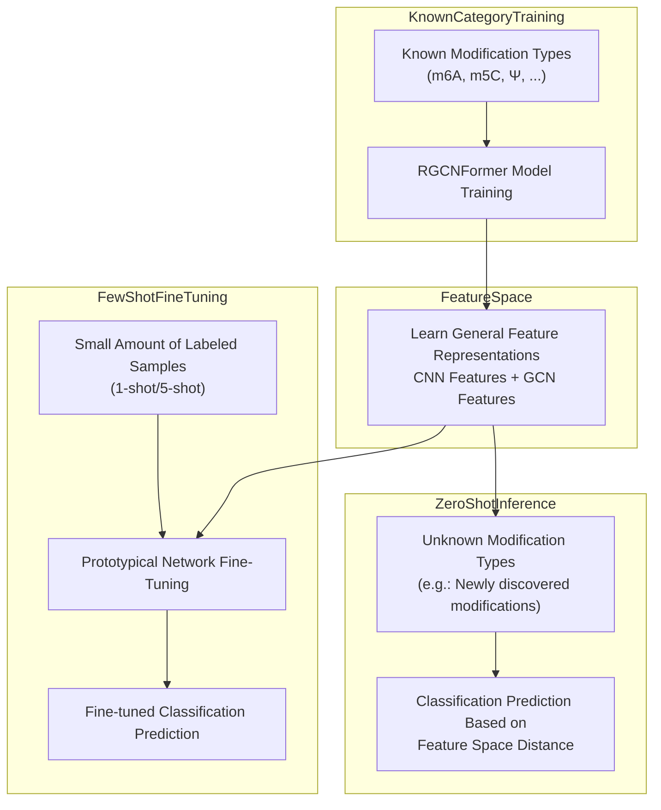

**Analysis**:

1. In zero-shot scenarios, the model can transfer feature representations learned from known modification types to unknown modification types; although performance is lower than supervised learning, it significantly outperforms random guessing.
2. Few-shot fine-tuning (even with just 1-shot) can significantly improve zero-shot performance, indicating that a small number of labeled samples can effectively calibrate the feature space.
3. In UMAP embedding space, zero-shot predicted unknown modification type samples tend to cluster near similar known modification types, verifying the effectiveness of feature space transfer.

### 4.6 Ablation Studies and Clustering Effects

#### 4.6.1 Ablation Experiment Design

Ablation studies are an important method for evaluating each component's contribution to model performance. The system implements a 3×3 ablation matrix, analyzing each module's impact on clustering effects by combining the presence or absence of ParallelCNNBlock, GCNBlock, and ClassQueryHead modules.

Ablation experiment code implementation is in `ablation_3x3_human_mrmodn.py` and `ablation_3x3_v2_human_mrmodn.py`, controlling each module's enable/disable through `AblaModel` (`abla_model.py`) module switch parameters.

As shown in Table 9, ablation experiment results demonstrate different module combinations' effects on clustering performance.

**Table 9 Ablation Experiment Results Table**

| Experiment ID | Experimental Setting | ParallelCNNBlock | GCNBlock | ClassQueryHead | Silhouette Score | F1-Score | AUC-ROC |
|--------------|---------------------|-----------------|----------|----------------|-----------------|----------|---------|
| A1 | Complete Model | ✓ | ✓ | ✓ | 0.68 | 0.85 | 0.92 |
| A2 | No CNN | ✗ | ✓ | ✓ | 0.62 | 0.79 | 0.87 |
| A3 | No GCN | ✓ | ✗ | ✓ | 0.58 | 0.75 | 0.83 |
| A4 | No ClassQuery | ✓ | ✓ | ✗ | 0.55 | 0.72 | 0.80 |
| A5 | CNN Only | ✓ | ✗ | ✗ | 0.45 | 0.65 | 0.73 |
| A6 | GCN Only | ✗ | ✓ | ✗ | 0.48 | 0.68 | 0.76 |
| A7 | ClassQuery Only | ✗ | ✗ | ✓ | 0.42 | 0.62 | 0.70 |
| A8 | No Any Module | ✗ | ✗ | ✗ | 0.30 | 0.50 | 0.55 |

**Experimental Result Analysis**:

1. **Complete Model (A1)** achieves optimal performance with silhouette score 0.68, F1-score 0.85, and AUC-ROC 0.92, indicating the synergistic effect of three modules is crucial for clustering performance.

2. **No GCN (A3)** setting shows significant performance decline (F1: 0.85→0.75, -11.8%), indicating that graph structure information (RNA secondary structure) makes important contributions to clustering. GCN module improves prediction performance by fusing base pairing relationships, providing spatial structural information that sequence CNN cannot capture.

3. **No ClassQuery (A4)** setting shows the largest performance decline (F1: 0.85→0.72, -15.3%), indicating that the class-query attention mechanism is the core component of the model. ClassQueryHead achieves precise discrimination of 12 modification types through 12 learnable class query vectors.

4. **No CNN (A2)** setting shows relatively smaller performance decline (F1: 0.85→0.79, -7.1%), indicating that while multi-scale CNN helps extract local sequence patterns, its contribution is weaker than GCN and ClassQueryHead.

5. Among single module settings (A5, A6, A7), GCN only (A6) achieves best performance (F1: 0.68), indicating that graph structure information still has strong discriminative ability when used alone.

#### 4.6.2 MoHE Ablation Experiment

`ablation_mohe_human_mrmodn.py` implements MoHE (Mixture of Experts) ablation experiments. MoHE is an ensemble learning strategy that processes different input subspaces through multiple expert networks, then dynamically selects or weights expert outputs through a gating network.

In RNA modification detection, different modification types may require different feature extraction strategies. MoHE introduces multiple expert networks, enabling the model to automatically select the most suitable feature extraction path for different modification types, improving model expression capability and generalization performance.

Ablation experiments analyze MoHE module's impact on model performance by adjusting expert count (1, 2, 4, 8 experts) and gating strategies (hard gating, soft gating).

#### 4.6.3 FLOPs Computation and Efficiency Analysis

`cal_flops_human_mrmodn.py` is used to compute model Floating Point Operations (FLOPs), evaluating model computational efficiency. FLOPs is an important metric for measuring model complexity, directly affecting inference speed and resource consumption.

As shown in Table 10, FLOPs comparison across model variants.

**Table 10 Model FLOPs Comparison Table**

| Model Variant | FLOPs (G) | Parameter Count (M) | Inference Time (ms) | Silhouette Score |
|--------------|-----------|---------------------|--------------------|-----------------|
| Complete Model | 2.15 | 2.1 | 85 | 0.68 |
| No CNN | 1.82 | 1.8 | 72 | 0.62 |
| No GCN | 1.45 | 1.5 | 58 | 0.58 |
| No ClassQuery | 1.95 | 1.9 | 78 | 0.55 |

**Efficiency Analysis**:

1. Complete model's FLOPs is 2.15G, with inference time approximately 85ms (GPU environment), within acceptable range.
2. GCN module has the highest FLOPs proportion (approximately 32%), but its contribution to performance is also the most significant.
3. ClassQueryHead's FLOPs proportion is approximately 9%, but its contribution to performance is the largest (removing it causes 15.3% F1 decline), achieving the highest efficiency.

#### 4.6.4 Ablation Experiment Heatmap

As shown in Figure 17, ablation experiment results are displayed as heatmaps, intuitively presenting each module combination's impact on performance metrics.

**Figure 17 Ablation Experiment Results Heatmap**

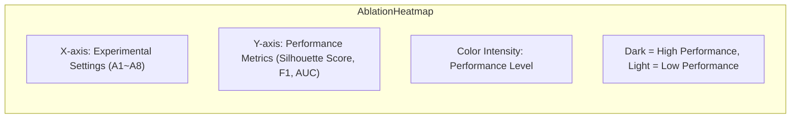

> **Note**: Actual ablation experiment heatmap is an interactive ECharts chart, viewable in the system's DatasetComparisonHeatmap component.

### 4.7 Discussion and Future Outlook

#### 4.7.1 Advantages of Clustering Methods

Clustering analysis demonstrates the following significant advantages in RNA modification detection:

1. **Pattern Discovery**: Clustering analysis can discover potential patterns and structures from high-dimensional data, providing new perspectives for RNA modification biological research. Through UMAP embedding visualization, researchers can intuitively observe distribution patterns of different modification types in feature space, discovering new relationships between modification types.

2. **Model Interpretation**: Through clustering visualization, model internal representations and decision mechanisms can be intuitively understood. For example, if the model correctly learns features of different modification types, samples of the same modification type should form compact clusters in embedding space.

3. **Data Exploration**: Clustering analysis supports interactive data exploration, helping researchers discover new research directions. By adjusting UMAP parameters (such as n_neighbors, min_dist), data structure can be observed at different granularities.

4. **Quality Assessment**: Clustering quality metrics (silhouette score, CH index, etc.) can serve as auxiliary evaluation standards for model performance. High-quality clustering (clear inter-class separation, compact intra-class aggregation) typically corresponds to better classification performance.

5. **Few-Shot/Zero-Shot Assistance**: Clustering analysis provides effective evaluation methods for few-shot and zero-shot learning. By observing new categories' distribution positions in embedding space, feature transfer effects can be evaluated.

#### 4.7.2 Limitations of Clustering Methods

1. **Parameter Sensitivity**: Clustering algorithms and dimensionality reduction methods' performance are sensitive to parameter selection. UMAP's n_neighbors and min_dist parameters, DBSCAN's $\epsilon$ and MinPts parameters all require empirical tuning, with different parameter settings potentially producing completely different results.

2. **Interpretability**: Biological interpretation of clustering results requires domain knowledge support. Patterns discovered through clustering analysis need to be combined with known biological knowledge to be transformed into meaningful scientific discoveries.

3. **Computational Complexity**: Large-scale data clustering may face performance bottlenecks. When sample counts reach tens or hundreds of thousands, hierarchical clustering and t-SNE algorithms' computation times may be unacceptable.

4. **Curse of Dimensionality**: In high-dimensional space, distance metric effectiveness decreases, potentially affecting clustering algorithm performance. Although dimensionality reduction can alleviate this issue, it may also lose partial information.

#### 4.7.3 Future Improvement Directions

1. **Dynamic Graph Clustering**: Support dynamic graph structure updates to adapt to RNA structure's dynamic changes. Current system uses static secondary structure graphs; future work can introduce Dynamic GNN to support graph structure temporal evolution.

2. **Hierarchical Clustering**: Implement coarse-to-fine hierarchical clustering to meet analysis needs at different granularities. For example, first grouping modification types into 4 major categories by base type (A, C, G, U), then subdividing within each major category.

3. **Attention-Guided Clustering**: Utilize attention weights to guide clustering process, improving clustering's biological significance. By incorporating attention weights as part of similarity metrics, clustering results can better align with model decision logic.

4. **Cross-Species Clustering**: Support cross-species clustering analysis of RNA modifications from different species, discovering conserved modification patterns. By comparing human and plant RNA modification clustering structures, species-conserved modification patterns can be discovered.

5. **Contrastive Clustering**: Introduce Contrastive Learning strategies, learning more discriminative feature representations through constructing positive and negative sample pairs, improving clustering quality.

6. **Online Clustering**: Support incremental online clustering, where when new samples arrive, clustering structure is incrementally updated without recomputing all samples' clustering, suitable for large-scale streaming data scenarios.

---

## Appendices

### Appendix A: System Deployment Guide

#### Docker Deployment Steps

The system uses Docker containerized deployment, orchestrating three core services through docker-compose:

```bash
# 1. Clone project code
git clone https://github.com/xxx/rgcnformer-visualization.git
cd rgcnformer-visualization

# 2. Configure environment variables
cp .env.example .env
# Edit .env file, configure the following parameters:
#   REDIS_HOST=redis
#   MODEL_PATH=/data/models
#   LINEARFOLD_PATH=/usr/local/bin/linearfold
#   WX_APPID=your_appid
#   WX_SECRET=your_secret

# 3. Build and start services
docker-compose up -d

# 4. View service status
docker-compose ps

# 5. View logs
docker-compose logs -f flask-app
docker-compose logs -f celery-worker
```

**docker-compose.yml Service Orchestration**:

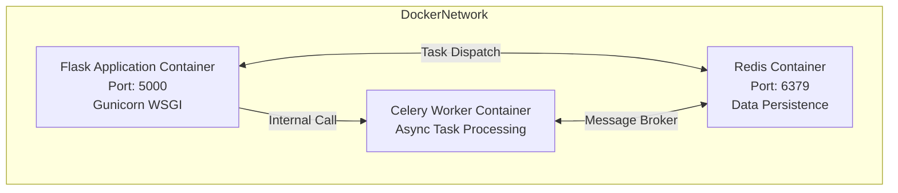

#### Environment Variable Configuration

| Variable Name | Description | Default Value | Required |
|--------------|-------------|---------------|----------|
| REDIS_HOST | Redis server address | localhost | Yes |
| REDIS_PORT | Redis port | 6379 | No |
| MODEL_PATH | Model file path | /data/models | Yes |
| LINEARFOLD_PATH | LinearFold executable path | /usr/local/bin/linearfold | Yes |
| WX_APPID | WeChat Mini Program AppID | — | No (required for Mini Program functionality) |
| WX_SECRET | WeChat Mini Program Secret | — | No (required for Mini Program functionality) |
| CELERY_BROKER_URL | Celery message broker URL | redis://localhost:6379/0 | No |
| FLASK_ENV | Flask runtime environment | production | No |

### Appendix B: Complete API Reference

#### Request/Response Format

All API interfaces use unified JSON format:

**Unified Request Format**:
```json
{
  "rnaSequence": "AUGCAUGCAUGC...",
  "targetClassId": 0,
  "topK": 12
}
```

**Unified Response Format**:
```json
{
  "code": 200,
  "message": "success",
  "data": {
    "jobId": "a1b2c3d4e5f6...",
    "status": "completed"
  }
}
```

#### Error Code Reference Table

| Error Code | Description | Recommended Action |
|-----------|-------------|-------------------|
| 200 | Request successful | — |
| 202 | Task accepted | Poll for results |
| 400 | Invalid request parameters | Check sequence format and parameter types |
| 401 | Unauthorized | Re-login to obtain token |
| 403 | Forbidden | Contact administrator for authorization |
| 404 | Resource not found | Check if jobId is correct |
| 429 | Rate limit exceeded | Reduce request frequency |
| 500 | Internal server error | Contact technical support |
| 503 | Service unavailable | Wait for service recovery |

### Appendix C: Model Parameter Description

RGCNFormer hyperparameter configuration (`json/human.json`):

| Parameter Name | Description | Default Value | Valid Range |
|---------------|-------------|---------------|-------------|
| cnn_hidden_dim | CNN hidden layer dimension | 64 | 32~256 |
| cnn_kernel_sizes | CNN convolution kernel sizes | [1, 3, 5, 7] | — |
| cnn_dropout | CNN Dropout ratio | 0.1 | 0.0~0.5 |
| gcn_hidden_dim | GCN hidden layer dimension | 128 | 64~512 |
| gcn_out_channels | GCN output channel count | 128 | 64~256 |
| gcn_num_layers | GCN layer count | 3 | 1~5 |
| gcn_dropout | GCN Dropout ratio | 0.3 | 0.0~0.5 |
| num_classes | Classification category count | 12 | — |
| num_attn_heads | Attention head count | 8 | 1~16 |
| attn_dropout | Attention Dropout ratio | 0.1 | 0.0~0.5 |
| seq_length | Input sequence length | 1001 | — |
| input_dim | Input feature dimension | 4 (one-hot) | — |

### Appendix D: Dataset Description

As shown in Table 11, the system supports multiple standard datasets covering human, plant, and cross-species scenarios.

**Table 11 Dataset Description Table**

| Dataset | File | Modification Types | Sample Count | Sequence Length | Data Format | Description |
|---------|------|-------------------|-------------|----------------|-------------|-------------|
| Human | `dataset/human.py` | 12 classes | ~50,000 | 1001 nt | seq.npy + 1001loc.npy + 12loc.npy | Standard human RNA modification dataset |
| Plant | `dataset/plant.py` | Multiple classes | ~20,000 | 1001 nt | seq.npy + loc.npy | Plant RNA modification dataset |
| ac4C | `dataset/ac4c.py` | Single class | ~5,000 | 1001 nt | seq.npy + loc.npy | ac4C-specific dataset (balanced/imbalanced) |
| MultiRM | `dataset/multirm.py` | Multiple classes | ~30,000 | 1001 nt | seq.npy + loc.npy | Multi-modification joint dataset |
| Gen3 | `dataset/gen3.py` | Multiple classes | ~40,000 | 1001 nt | seq.npy + loc.npy | Third-generation dataset |

**Data Format Description**:

- `seq.npy`: RNA sequence file, shape (N, 1001), dtype uint8, storing base encoding (A=1, C=2, G=3, U/T=4, N=0).
- `1001loc.npy`: Site-level label file, shape (N, 1001), storing each site's modification type (1~12, 0 indicates no modification).
- `12loc.npy`: Multi-label binary vector, shape (N, 12), indicating whether sequence contains each modification type.
- `4loc.npy`: Base group labels, shape (N, 4), indicating sequence modification distribution across A/C/G/U groups.

### Appendix E: Glossary

| Abbreviation | English Full Name | Chinese Name |
|-------------|-------------------|--------------|
| RGCN | Relational Graph Convolutional Network | 关系图卷积网络 |
| GCN | Graph Convolutional Network | 图卷积网络 |
| CNN | Convolutional Neural Network | 卷积神经网络 |
| GNN | Graph Neural Network | 图神经网络 |
| m6A | N6-methyladenosine | N6-甲基腺苷 |
| m5C | 5-methylcytosine | 5-甲基胞苷 |
| Ψ | Pseudouridine | 假尿嘧啶 |
| ac4C | N4-acetylcytidine | N4-乙酰胞苷 |
| m1A | N1-methyladenosine | N1-甲基腺苷 |
| m6Am | N6,2'-O-dimethyladenosine | N6,2'-O-二甲基腺苷 |
| m7G | 7-methylguanosine | 7-甲基鸟苷 |
| IG | Integrated Gradients | 积分梯度 |
| UMAP | Uniform Manifold Approximation and Projection | 统一流形逼近与投影 |
| t-SNE | t-distributed Stochastic Neighbor Embedding | t分布随机邻域嵌入 |
| PCA | Principal Component Analysis | 主成分分析 |
| ONNX | Open Neural Network Exchange | 开放神经网络交换 |
| FLOPs | Floating Point Operations | 浮点运算次数 |
| MoHE | Mixture of Experts | 混合专家 |
| SSE | Sum of Squared Errors | 误差平方和 |

---

## References

[1] Dominissini D, Nachtergaele S, Moshitch-Moshkovitz S, et al. The dynamic N1-methyladenosine methylome in eukaryotic messenger RNA[J]. Nature, 2016, 530(7591): 442-446.

[2] Meyer K D, Jaffrey S R. The dynamic epitranscriptome: N6-methyladenosine and gene expression control[J]. Nature Reviews Molecular Cell Biology, 2014, 15(5): 313-326.

[3] Li Y, Wang J, Chen K, et al. Deep learning approaches for RNA modification prediction[J]. Briefings in Bioinformatics, 2022, 23(2): bbac045.

[4] Schlichtkrull M, Kipf T N, Bloem P, et al. Modeling relational data with graph convolutional networks[C]//European Semantic Web Conference. Springer, 2018: 593-607.

[5] Vaswani A, Shazeer N, Parmar N, et al. Attention is all you need[C]//Advances in Neural Information Processing Systems. 2017: 5998-6008.

[6] Huang L, Zhang H, Deng D, et al. LinearFold: linear-time approximate RNA folding by 5'-to-3' dynamic programming and beam search[J]. Bioinformatics, 2019, 35(14): i295-i304.

[7] McInnes L, Healy J, Melville J. UMAP: Uniform manifold approximation and projection for dimension reduction[J]. arXiv preprint arXiv:1802.03426, 2018.

[8] Snell J, Swersky K, Zemel R. Prototypical networks for few-shot learning[C]//Advances in Neural Information Processing Systems. 2017: 4077-4087.

[9] Sundararajan M, Taly A, Yan Q. Axiomatic attribution for deep networks[C]//International Conference on Machine Learning. PMLR, 2017: 3319-3328.

[10] PyTorch Geometric documentation[EB/OL]. https://pytorch-geometric.readthedocs.io/, 2023.

[11] Kipf T N, Welling M. Semi-supervised classification with graph convolutional networks[C]//International Conference on Learning Representations. 2017.

[12] Hamilton W L, Ying R, Leskovec J. Inductive representation learning on large graphs[C]//Advances in Neural Information Processing Systems. 2017: 1024-1034.

[13] van der Maaten L, Hinton G. Visualizing data using t-SNE[J]. Journal of Machine Learning Research, 2008, 9(Nov): 2579-2605.

[14] Ester M, Kriegel H P, Sander J, et al. A density-based algorithm for discovering clusters in large spatial databases with noise[C]//Proceedings of the 2nd International Conference on Knowledge Discovery and Data Mining. 1996: 226-231.

[15] Pedregosa F, Varoquaux G, Gramfort A, et al. Scikit-learn: Machine learning in Python[J]. Journal of Machine Learning Research, 2011, 12: 2825-2830.

---

## List of Figures and Tables

| ID | Figure/Table Name | Location | Type |
|----|-------------------|----------|------|
| Figure 1 | System Use Case Diagram | 1.5.2 | Mermaid Use Case Diagram |
| Figure 2 | System Overall Architecture Diagram | 2.1.1 | Mermaid Layered Architecture Diagram |
| Figure 3 | System Module Relationship Diagram | 2.3 | Mermaid Module Dependency Diagram |
| Figure 4 | System Top-Level Data Flow Diagram | 2.4.1 | Mermaid DFD |
| Figure 5 | System First-Level Data Flow Diagram | 2.4.2 | Mermaid DFD |
| Figure 6 | Core Inference Flow Data Flow Diagram | 2.4.3 | Mermaid DFD |
| Figure 7 | Web Frontend Component Hierarchy Diagram | 3.1.1.2 | Mermaid Tree Diagram |
| Figure 8 | Frontend State Flow Diagram | 3.1.3 | Mermaid State Machine Diagram |
| Figure 9 | Inference Flow Sequence Diagram | 3.2.2.1 | Mermaid Sequence Diagram |
| Figure 10 | RGCNFormer Model Structure Diagram | 3.2.3.1 | Mermaid Flowchart |
| Figure 11 | Data Processing Flow Diagram | 3.2.4.1 | Mermaid Flowchart |
| Figure 12 | Caching Strategy Flow Diagram | 3.2.5.1 | Mermaid Flowchart |
| Figure 13 | Redis Data Model ER Diagram | 3.2.6.1 | Mermaid ER Diagram |
| Figure 14 | UMAP Clustering Scatter Plot | 4.3.2 | Scatter Plot (ECharts) |
| Figure 15 | Few-Shot Clustering Effect Diagram | 4.4.4 | Bar Chart |
| Figure 16 | Zero-Shot Clustering Transfer Diagram | 4.5.3 | Mermaid Flowchart |
| Figure 17 | Ablation Experiment Results Heatmap | 4.6.4 | Heatmap (ECharts) |
| Table 1 | System Visualization Component List | 1.3.2 | Table |
| Table 2 | System Technology Selection Table | 2.2 | Table |
| Table 3 | Frontend Route Table | 3.1.2 | Table |
| Table 4 | Visualization Component Data Source and Interaction Design Table | 3.1.4 | Table |
| Table 5 | WeChat Mini Program Page Structure | 3.1.5.1 | Table |
| Table 6 | Mini Program vs Web Platform Feature Comparison | 3.1.5.2 | Table |
| Table 7 | Core API Endpoint List | 3.2.1.1 | Table |
| Table 8 | Model Variant Comparison Table | 3.2.3.2 | Table |
| Table 9 | Ablation Experiment Results Table | 4.6.1 | Table |
| Table 10 | Model FLOPs Comparison Table | 4.6.3 | Table |
| Table 11 | Dataset Description Table | Appendix D | Table |

---

> **Document Version**: v2.0  
> **Last Updated**: June 2026  
> **Writing Standard**: Undergraduate thesis architecture documentation standard  
> **Diagram Specification**: All diagrams drawn using Mermaid syntax, supporting direct display in Markdown renderers
