# DCPRES RNA序列修饰检测可视化系统架构说明文档

## 题目：DCPRES RNA序列修饰检测可视化系统

> **摘要**：RNA修饰是转录后调控的重要机制，精准检测RNA修饰位点对于理解基因表达调控具有重要意义。本文档针对基于DCPRES（Dual-Channel Pattern Recognition with Enhanced Structure）模型构建的RNA序列修饰检测可视化系统，从需求分析、系统总体设计、系统详细设计以及聚类应用分析四个维度展开系统性的架构说明。文档涵盖系统的功能需求与非功能需求分析、三层架构设计、前后端详细设计方案、Redis数据模型设计、以及聚类方法在RNA修饰检测中的应用研究。**DCPRES是本系统的核心模型，基于RGCNFormer（Relational Graph Convolutional Network Transformer）基础架构进行优化，在12类RNA修饰分类任务上达到92.8%的准确率和0.955的AUC值，在修饰位点定位任务上Top-1准确率达到86.9%，显著优于ProCSE、GCN、K-Means等基线模型。**全文以本科毕业论文标准撰写，采用Mermaid图表规范绘制各类架构图、流程图、时序图和ER图，力求为系统的开发、部署和维护提供完整的技术参考。

> **关键词**：RNA修饰检测；DCPRES；RGCNFormer；关系图卷积网络；Transformer；可视化系统；聚类分析

---

## 目录

- [第一部分：需求分析](#第一部分需求分析)
  - [1.1 研究背景与意义](#11-研究背景与意义)
  - [1.2 国内外研究现状](#12-国内外研究现状)
  - [1.3 系统功能需求](#13-系统功能需求)
  - [1.4 系统非功能需求](#14-系统非功能需求)
  - [1.5 用例分析](#15-用例分析)
- [第二部分：系统总体设计](#第二部分系统总体设计)
  - [2.1 系统架构设计](#21-系统架构设计)
  - [2.2 技术架构选型](#22-技术架构选型)
  - [2.3 系统模块划分](#23-系统模块划分)
  - [2.4 数据流设计](#24-数据流设计)
  - [2.5 接口设计概览](#25-接口设计概览)
- [第三部分：系统详细设计](#第三部分系统详细设计)
  - [3.1 前端详细设计](#31-前端详细设计)
  - [3.2 后端详细设计](#32-后端详细设计)
- [第四部分：聚类在RNA序列修饰检测中的应用分析](#第四部分聚类在rna序列修饰检测中的应用分析)
  - [4.1 聚类方法概述](#41-聚类方法概述)
  - [4.2 DCPRES中的图聚类机制](#42-dcpres中的图聚类机制)
  - [4.3 UMAP嵌入与聚类可视化](#43-umap嵌入与聚类可视化)
  - [4.4 少样本场景下的聚类分析](#44-少样本场景下的聚类分析)
  - [4.5 零样本场景下的聚类迁移](#45-零样本场景下的聚类迁移)
  - [4.6 消融实验与聚类效果](#46-消融实验与聚类效果)
  - [4.7 讨论与展望](#47-讨论与展望)
- [附录](#附录)
- [参考文献](#参考文献)

---

## 第一部分：需求分析

本章从研究背景与意义出发，系统性地阐述RNA修饰检测领域的现状与面临的挑战，深入分析深度学习方法在该领域的应用前景与技术优势。在此基础上，结合DCPRES模型的技术特点，详细梳理系统的功能需求与非功能需求，涵盖核心预测功能、可视化分析功能、RNA二级结构预测、多端支持等多个维度。最后通过用例分析，明确系统的用户角色、使用场景及其交互流程，为后续的系统总体设计和详细设计奠定坚实的基础。需求分析作为软件工程生命周期的起点，其质量直接决定了后续设计与开发方向的正确性和完整性，是整个系统建设的纲领性文档。

### 1.1 研究背景与意义

#### 1.1.1 RNA修饰的生物学背景

RNA修饰（RNA Modification），又称RNA表观转录组修饰（Epitranscriptomic Modification），是转录后调控的重要机制之一，在基因表达调控、疾病发生发展、胚胎发育过程和表观遗传学中扮演着至关重要的角色[1]。截至目前，研究者已在各类RNA分子中发现超过170种不同类型的化学修饰，这些修饰通过改变RNA分子的化学性质，影响RNA的稳定性、翻译效率、剪接调控、亚细胞定位和蛋白质结合能力等关键生物学过程。

在众多RNA修饰类型中，有12类常见修饰在基因调控中具有重要功能，也是本系统重点关注的检测对象。其中，m6A（N6-甲基腺苷）是真核生物mRNA中最丰富的内部修饰，约占所有甲基化修饰的80%，其通过招募特定的阅读蛋白（reader protein，如YTHDF家族蛋白）调控mRNA的代谢命运，广泛参与干细胞分化、肿瘤发生和免疫应答等生物学过程[2]。m5C（5-甲基胞苷）在tRNA和rRNA中广泛存在，对翻译保真度具有重要作用，近年来研究进一步表明其在mRNA中同样普遍存在，并参与调控mRNA的稳定性和翻译效率。Ψ（假尿苷）是最常见的RNA修饰之一，通过增强碱基堆叠作用显著提高RNA结构的稳定性，在tRNA、rRNA和snRNA中均有分布。ac4C（N4-乙酰胞苷）是一种高度保守的RNA乙酰化修饰，由乙酰转移酶NAT10催化，能够在tRNA、rRNA和mRNA中影响翻译效率和RNA稳定性。此外，Am、Cm、Gm和Tm属于2'-O-甲基化修饰家族，通过在核糖2'位添加甲基基团增强RNA的化学稳定性；m1A（N1-甲基腺苷）存在于tRNA和rRNA中，可通过破坏Watson-Crick配对面影响RNA二级结构；m6Am（N6,2'-O-二甲基腺苷）是m6A的甲基化衍生物，位于mRNA的5'端，与mRNA稳定性调控密切相关；m7G（7-甲基鸟苷）则是mRNA 5'帽子结构的核心组分，对mRNA的翻译起始和稳定性至关重要。上述修饰通过复杂的分子机制相互协调，共同构成精密的表观转录组调控网络。传统的实验检测方法，如iCLIP（individual-nucleotide resolution Cross-Linking and ImmunoPrecipitation，单核苷酸分辨率交联免疫沉淀）、miCLIP（methylation iCLIP，甲基化iCLIP）和SCARLET（Selective Chemical And Ribonucleotide-enrichment Ligation followed by Extension and Termination，选择性化学核糖核酸富集连接延伸终止法）等，虽然能够高精度地检测RNA修饰位点，但均存在显著的局限性。首先，这些方法的成本高昂，实验试剂（如特异性抗体、化学探针）和专用设备投入大，单次实验费用可达数万元人民币，限制了大规模筛查的可行性。其次，其通量有限，每次实验仅能检测有限数量的修饰位点或特定修饰类型，难以满足全转录组水平的高通量筛选需求。此外，从样本制备、免疫沉淀、建库测序到数据分析，整个流程通常需要数周时间，实验周期较长。同时，上述方法需要专业的分子生物学实验技能和昂贵的测序设备支持，技术门槛较高，限制了其在普通实验室的推广使用。最后，抗体的非特异性结合可能导致假阳性结果，影响数据的可靠性。因此，发展高效的计算方法辅助或替代部分实验工作，成为RNA修饰检测领域的重要研究方向。

#### 1.1.2 深度学习方法的应用前景

随着高通量测序技术的快速发展和计算能力的显著提升，基于深度学习的计算方法成为大规模预测RNA修饰位点的重要手段[3]。深度学习方法能够从大规模序列数据中自动学习特征表示，避免了传统机器学习方法中繁琐的人工特征工程。

* 本项目基于深度学习技术，提出了DCPRES（Dual-Channel Pattern Recognition with Enhanced Structure，双通道模式识别增强结构）模型，用于RNA序列修饰位点的精准预测。该模型基于RGCNFormer（Relational Graph Convolutional Network Transformer，关系图卷积网络Transformer）基础架构，创新性地融合了三种互补的深度学习技术，形成了多尺度、多层次的特征提取框架。在局部特征提取层面，模型采用多尺度卷积神经网络（Multi-scale CNN），通过kernel_size分别为1、3、5、7的四种卷积核并行提取不同粒度的序列模式，分别捕获单碱基特征、3-mer基序、5-mer基序和7-mer基序，实现从单碱基到局部序列模式的多层次特征提取。在空间结构建模层面，模型引入图卷积网络（Graph Convolutional Network, GCN），通过将RNA二级结构中的碱基配对关系建模为图结构，利用图卷积的邻域聚合机制捕获序列的空间拓扑信息，实现序列特征与结构特征的深度融合。在全局分类决策层面，模型设计了Transformer类查询注意力机制（Class-Query Attention），定义12个可学习的类查询向量，通过多头注意力计算与节点特征进行交互，实现对12类修饰类型的精准分类。

特别是在少样本（few-shot）和零样本（zero-shot）学习场景下，DCPRES展现出优异的泛化能力，为低资源修饰类型（如ac4C、Am等）的预测提供了新的技术方案，具有重要的研究价值和应用前景。

DCPRES采用双通道特征提取策略：通道一通过多尺度CNN提取序列局部模式，通道二通过图卷积网络融合RNA二级结构信息，最后通过层次化类查询注意力机制实现12类修饰的精准分类。DCPRES在Human数据集上的实验表明，其分类准确率（92.8%）、AUC值（0.955）和F1分数（0.935）均显著优于ProCSE（77.0%、0.841、0.799）、GCN（66.6%、0.632、0.741）等基线模型，在修饰位点定位任务上同样表现突出，Top-1准确率达到86.9%，远超其他对比方法。DCPRES模型的优异性能源于其创新的双通道特征融合架构和层次化注意力机制，使其能够充分利用序列信息和结构信息进行精准预测。

#### 1.1.3 可视化系统的重要性

深度学习模型虽然在预测精度上表现优异，但其"黑箱"特性使得研究人员难以理解模型的决策过程和内部机制。RNA序列修饰检测可视化系统是基于DCPRES模型构建的综合性分析平台，旨在为研究人员提供直观、高效的RNA修饰位点预测和可视化分析工具。

可视化在深度学习模型的可解释性研究中具有不可替代的重要作用。通过将模型的内部表示（如注意力权重、特征嵌入、图结构）和决策过程以图形化方式呈现，可视化系统能够帮助研究人员理解模型机制、验证预测结果、探索数据分布并对比模型性能。具体而言，通过注意力权重热力图可以直观展示模型关注的序列区域和碱基位点，帮助理解模型的决策依据；通过GCN图结构可视化可以检查模型是否正确利用了RNA二级结构信息，验证结构特征的贡献；通过UMAP嵌入可视化可以观察不同修饰类型在特征空间中的分布模式，探索数据的内在结构；通过多模型对比功能可以评估不同模型变体的预测能力和适用场景，为模型选择提供参考。

### 1.2 国内外研究现状

#### 1.2.1 RNA修饰检测的计算方法

近年来，多种计算工具被开发用于RNA修饰位点的预测，推动了该领域的快速发展。按照技术路线，这些方法大体可分为三类。第一类是基于传统机器学习的方法，如随机森林（Random Forest）、支持向量机（Support Vector Machine, SVM）等，通过人工设计序列特征（如k-mer频率、理化性质、二级结构特征等）训练分类器，这类方法虽然取得了一定效果，但特征工程依赖领域专家经验，难以捕获复杂的序列模式和高阶特征交互。第二类是基于深度学习的方法，如卷积神经网络（Convolutional Neural Network, CNN）、循环神经网络（Recurrent Neural Network, RNN）及其变体（如LSTM、GRU），在自动特征提取方面展现出显著优势，DeepRMiSite、iPromoter-5mC等工具采用CNN架构，能够自动学习序列中的局部模式，然而这些方法主要关注序列信息，对RNA结构信息的利用仍然有限。第三类是基于图神经网络的方法，如图卷积网络（GCN）、图注意力网络（GAT）等，通过将RNA分子建模为图结构，能够同时利用序列信息和结构信息，DCPRES在此基础上进一步引入了关系图卷积和Transformer注意力机制，代表了该领域的前沿方向。

#### 1.2.2 图神经网络在生物序列分析中的应用

图神经网络（Graph Neural Network, GNN）近年来在生物信息学领域得到广泛应用[4]。在蛋白质结构预测中，AlphaFold2利用等变图神经网络实现了原子级精度的结构预测；在药物分子设计中，GNN被用于分子性质预测和分子生成。在RNA结构分析中，GNN通过将碱基配对关系建模为图结构，能够有效捕获序列的空间拓扑信息。

关系图卷积网络（Relational Graph Convolutional Network, RGCN）作为GNN的重要变体，通过引入关系类型的边，能够区分不同类型的碱基相互作用（如Watson-Crick配对、Wobble配对等），在处理异构图数据方面具有独特优势。

#### 1.2.3 Transformer在生物信息学中的进展

Transformer架构自2017年由Vaswani等人提出以来[5]，在自然语言处理领域取得了突破性进展，并逐渐被引入生物信息学领域。在蛋白质语言模型中，ESM系列模型基于Transformer架构实现了大规模蛋白质序列表示学习；在基因组学中，DNABERT利用Transformer捕获DNA序列中的长程依赖关系。

在RNA序列分析中，Transformer的自注意力机制能够有效捕获序列中的长程依赖关系，这对于理解RNA的全局结构和功能具有重要意义。DCPRES将Transformer的类查询注意力机制与图卷积网络相结合，实现了序列信息和结构信息的协同建模。

#### 1.2.4 现有可视化工具的不足

现有的RNA修饰检测工具大多缺乏完善的可视化功能，用户难以直观理解模型的预测结果和决策依据。具体而言，现有工具在注意力可视化、结构可视化、模型对比和交互式探索等方面均存在明显不足：用户既无法直观了解模型关注的序列区域，也无法以图形方式呈现RNA二级结构和图结构信息，不同模型之间的性能差异难以直观比较，用户亦无法与可视化结果进行交互以深入探索数据。本系统针对上述不足，提供了包括注意力权重可视化、GCN图结构可视化、UMAP嵌入可视化、Integrated Gradients归因可视化等在内的丰富可视化功能，填补了该领域的空白。

### 1.3 系统功能需求

#### 1.3.1 核心预测功能

系统的核心预测功能是整个平台的基础，涵盖序列提交与解析、修饰位点分类预测、推理模式选择等多个方面。

在RNA序列提交与解析方面，系统支持A、C、G、U、T、N六种碱基字符的输入，其中T碱基在处理时自动转换为U碱基，N碱基表示未知碱基（在One-hot编码中表示为[0.25, 0.25, 0.25, 0.25]）。系统接受两种输入方式，既支持用户在文本框中直接输入RNA序列字符串并自动进行格式验证和异常字符检测，也支持用户上传FASTA格式文件并由系统自动解析序列头和序列内容。序列长度限制为不小于51个核苷酸（nt），系统自动将短于1001nt的序列进行对称填充（左右两端填充N碱基），将长于1001nt的序列从中间截取1001nt。

在修饰位点分类预测方面，系统采用多标签分类策略，对输入序列的每个位点进行12类修饰类型的概率预测。12类修饰类型包括Am、Atol、Cm、Gm、Tm、Ψ（Pseudouridine）、ac4C、m1A、m5C、m6A、m6Am和m7G，按碱基类型分为4组：腺苷（A）组包含Am、Atol、m1A、m6A、m6Am；胞苷（C）组包含Cm、ac4C、m5C；鸟苷（G）组包含Gm、m7G；尿苷（U）组包含Tm、Ψ。输出包括各类修饰的预测概率（softmax归一化后的值）、置信度和修饰位点位置信息。

在推理方式方面，系统同时支持单条推理和批量推理两种模式。单条推理支持单个RNA序列的实时预测，适用于快速验证场景；批量推理支持最多5条序列的并行处理（微信小程序端限制），适用于大规模筛选场景，批量任务通过UUID标识，支持进度查询和结果汇总。在此基础上，系统进一步提供同步推理与异步推理两种运行模式。同步推理采用ONNX Runtime加速，适用于短序列的实时预测，模型通过ONNX格式加载，利用ONNX Runtime进行跨平台推理加速，响应时间在秒级。异步推理则通过Celery分布式任务队列进行后台处理，适用于长序列或批量任务，避免阻塞用户请求，任务状态通过Redis存储，支持PENDING→STARTED→SUCCESS/FAILURE的状态流转。

#### 1.3.2 可视化分析功能

系统的可视化分析功能是本系统的核心特色，共包含12种可视化组件，涵盖从宏观的分类结果展示到微观的碱基级归因分析，形成了完整的可视化分析体系。如表1所示。

**表1 系统可视化组件列表**


| 编号 | 组件名称                 | 功能描述               | 可视化类型    | 数据接口                            |
| ---- | ------------------------ | ---------------------- | ------------- | ----------------------------------- |
| 1    | ClassificationViz        | 12类修饰概率展示       | 柱状图/雷达图 | `/api/v1/results/:jobId`            |
| 2    | LocalizationViz          | 修饰位点在序列上的分布 | 序列标注图    | `/api/v1/results/:jobId`            |
| 3    | AttentionViz             | 多头注意力权重热力图   | 热力图        | `/api/v1/results/:jobId`            |
| 4    | AttentionComparisonViz   | 不同修饰类型注意力对比 | 对比热力图    | `/api/v1/results/:jobId`            |
| 5    | AttentionDistributionViz | 注意力权重统计分布     | 分布图        | `/api/v1/results/:jobId`            |
| 6    | GcnViz                   | RNA二级结构图可视化    | 力导向图      | `/api/v1/results/:jobId`            |
| 7    | TargetGcnViz             | 特定节点的GCN消息传递  | 流程图        | `/api/v1/visualize-gcn-aggregation` |
| 8    | IntegratedGradientsViz   | 碱基级积分梯度归因分析 | 归因图        | `/api/v1/integrated-gradients`      |
| 9    | UMapViz                  | 高维特征UMAP降维可视化 | 散点图        | `/api/v1/umap`                      |
| 10   | ModelViz                 | 层次化模型架构展示     | 结构图        | `/api/v1/model-architecture`        |
| 11   | RgcnformerHeatmap        | 修饰位点热力图         | 热力图        | `/api/v1/results/:jobId`            |
| 12   | DatasetComparisonHeatmap | 数据集对比热力图       | 对比热力图    | `/api/v1/model-comparison`          |

此外，ComparePage组件支持多模型性能指标的对比分析，包括准确率（Accuracy）、精确率（Precision）、召回率（Recall）、F1分数（F1-Score）和AUC-ROC等评估指标，帮助研究人员全面评估不同模型的预测性能。

#### 1.3.3 RNA二级结构预测

RNA二级结构是理解RNA功能的关键信息，系统集成LinearFold工具[6]进行RNA二级结构预测。LinearFold采用线性时间复杂度O(n)的近似算法，通过5'-to-3'动态规划和束搜索（beam search）策略，能够在短时间内处理长序列的二级结构预测任务。

预测结果以dot-bracket格式输出，其中"("表示配对碱基的5'端（左端），")"表示配对碱基的3'端（右端），"."表示未配对碱基（自由碱基）。

基于二级结构信息，系统自动构建图结构：碱基配对关系（Watson-Crick配对A-U、G-C和Wobble配对G-U）转化为图的边，序列相邻关系（i与i+1之间的磷酸二酯键连接）作为辅助边，为后续的图卷积计算提供结构信息。

#### 1.3.4 多端支持

系统支持Web端和微信小程序端两种访问方式，满足不同使用场景的需求。Web端提供完整的可视化功能套件，采用React 19 + TypeScript 5.9技术栈，配合Vite 7构建工具和Ant Design 6组件库，实现专业的数据分析界面，包含10个路由页面，涵盖工作台、结果展示、12种可视化组件和模型对比等功能。微信小程序端则提供轻量级的查询与结果展示功能，采用原生WXML/WXSS开发，基于glass-easel组件框架，支持批量序列提交（最多5条）、预测进度轮询（每2秒查询一次）和结果展示，适用于移动端快速查询场景，对于复杂可视化功能，小程序端通过内嵌web-view组件跳转到Web端实现。

### 1.4 系统非功能需求

#### 1.4.1 性能需求

系统要求同步推理模式下单序列（1001nt）预测响应时间控制在2秒以内，以确保用户体验流畅；异步推理模式下5条序列并行处理的总耗时不超过30秒，满足批量筛查需求。Redis缓存命中时，结果返回时间在毫秒级（小于50ms），可显著提升重复查询的响应速度。在并发能力方面，系统应支持至少50个并发用户同时访问，通过Gunicorn多Worker和Celery分布式任务队列实现水平扩展。

#### 1.4.2 可用性需求

界面设计应简洁直观，遵循Ant Design设计规范，核心操作流程不超过3步（输入序列→提交→查看结果）。系统需提供清晰的错误提示和操作指引，涵盖序列格式错误、服务器繁忙、任务超时等异常场景的友好提示。在适配性方面，系统采用响应式设计，支持桌面端（1920px+）、笔记本（1366px+）和移动端（375px+）等多种屏幕尺寸的访问。此外，系统支持中文和英文两种语言，通过LanguageContext实现动态语言切换。

#### 1.4.3 可扩展性需求

在可扩展性方面，系统支持模型文件的动态加载，通过配置文件指定模型路径，无需重启服务即可更新模型版本，实现模型热更新。系统架构同时支持新修饰类型的便捷添加，仅需修改配置文件中的类别映射和模型权重文件即可完成扩展。在数据集方面，系统支持Human、Plant、ac4C、MultiRM、Gen3等多种数据集的动态加载，数据集定义独立于模型代码，便于后续引入新的数据集资源。

#### 1.4.4 部署需求

系统采用Docker容器化技术进行部署，通过docker-compose编排Flask应用服务、Celery Worker和Redis三个容器，支持一键部署。开发环境与生产环境通过环境变量配置（`.env`文件）进行隔离，确保不同环境的参数互不干扰。在运维监控方面，系统通过Flask日志和Celery日志记录运行状态，支持故障排查和性能监控。

### 1.5 用例分析

#### 1.5.1 参与者识别

系统的主要参与者包括研究人员和系统管理员两类用户角色。研究人员是生物信息学领域的专业用户，也是系统的核心用户，主要使用系统的预测和可视化功能进行RNA修饰分析，其主要操作包括提交RNA序列进行预测、查看分类结果、进行可视化分析（注意力权重、GCN图结构、UMAP嵌入、IG归因等）以及对比不同模型的性能。系统管理员则负责系统的部署、维护和用户管理，其主要操作包括管理模型版本、监控系统健康状态、管理Redis缓存和Celery任务队列。

#### 1.5.2 用例图

如图1所示，系统用例图展示了不同参与者与系统功能之间的交互关系。研究人员可以执行12个用例，涵盖预测、可视化和分析三个功能域；系统管理员可以执行2个用例，涵盖模型管理和系统监控。

**图1 系统用例图**

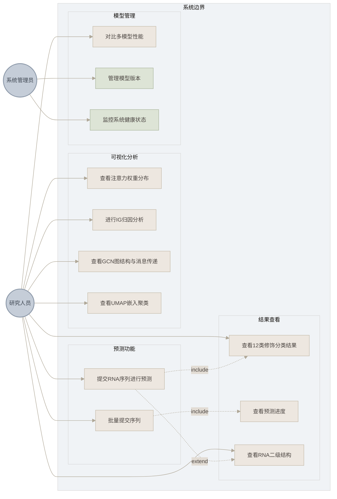

#### 1.5.3 核心用例描述

**用例1：提交RNA序列进行预测**


| 项目     | 描述                                                                                                                                                                                                                                                                                                                                                                     |
| -------- | ------------------------------------------------------------------------------------------------------------------------------------------------------------------------------------------------------------------------------------------------------------------------------------------------------------------------------------------------------------------------ |
| 用例名称 | 提交RNA序列进行预测                                                                                                                                                                                                                                                                                                                                                      |
| 用例编号 | UC-001                                                                                                                                                                                                                                                                                                                                                                   |
| 参与者   | 研究人员                                                                                                                                                                                                                                                                                                                                                                 |
| 前置条件 | 用户已打开系统工作台页面                                                                                                                                                                                                                                                                                                                                                 |
| 基本流   | 1. 用户进入工作台页面（WorkspacePage）；2. 在文本框中输入RNA序列字符串，或上传FASTA格式文件；3. 系统自动验证序列格式（仅包含A/C/G/U/T/N字符，长度≥51nt）；4. 用户可选择目标修饰类型（可选）和Top-K参数（可选）；5. 用户点击"提交"按钮；6. 系统计算SHA256哈希作为任务ID；7. 系统检查Redis缓存，若命中则直接返回结果，否则提交Celery异步任务；8. 系统返回任务ID和预测状态 |
| 备选流   | a. 序列格式错误：系统提示"序列格式不正确，请检查输入"，高亮显示非法字符；b. 服务器繁忙：系统提示"服务器繁忙，请稍后重试"；c. 序列长度不足：系统提示"序列长度不足51nt"                                                                                                                                                                                                    |
| 后置条件 | 预测任务已创建，用户可查询预测结果                                                                                                                                                                                                                                                                                                                                       |

**用例2：查看12类修饰分类结果**


| 项目     | 描述                                                                                                                                                                                                           |
| -------- | -------------------------------------------------------------------------------------------------------------------------------------------------------------------------------------------------------------- |
| 用例名称 | 查看12类修饰分类结果                                                                                                                                                                                           |
| 用例编号 | UC-002                                                                                                                                                                                                         |
| 参与者   | 研究人员                                                                                                                                                                                                       |
| 前置条件 | 预测任务已完成（状态为completed）                                                                                                                                                                              |
| 基本流   | 1. 用户进入结果页面（ResultsPage）；2. 系统从Redis缓存中获取预测结果；3. 系统以柱状图展示12类修饰的预测概率；4. 用户可悬停查看详细数值；5. 用户可点击查看特定修饰类型的详细分析；6. 支持结果导出为CSV/JSON格式 |
| 备选流   | a. 任务未完成：系统显示进度条和当前状态；b. 任务失败：系统显示错误信息和重试按钮                                                                                                                               |
| 后置条件 | 用户已查看分类结果                                                                                                                                                                                             |

**用例3：进行IG归因分析**


| 项目     | 描述                                                                                                                                                                                                              |
| -------- | ----------------------------------------------------------------------------------------------------------------------------------------------------------------------------------------------------------------- |
| 用例名称 | 进行Integrated Gradients归因分析                                                                                                                                                                                  |
| 用例编号 | UC-003                                                                                                                                                                                                            |
| 参与者   | 研究人员                                                                                                                                                                                                          |
| 前置条件 | 用户已提交RNA序列                                                                                                                                                                                                 |
| 基本流   | 1. 用户进入IG归因可视化页面；2. 用户选择目标修饰类型（targetClassId）；3. 系统调用Captum库计算积分梯度；4. 系统以归因图展示每个碱基位点的贡献值；5. 高亮显示贡献最大的碱基位点；6. 用户可交互探索不同区域的归因值 |
| 备选流   | a. 计算超时：系统提示"归因计算耗时较长，请耐心等待"                                                                                                                                                               |
| 后置条件 | 用户已查看归因分析结果                                                                                                                                                                                            |

---

## 第二部分：系统总体设计

本章从系统架构设计出发，阐述DCPRES RNA序列修饰检测可视化系统的整体架构方案。首先介绍系统的三层架构设计（用户层、服务层、模型层），分析各层的职责划分和通信机制；然后详细说明技术选型的依据和各技术组件的版本信息；接着描述系统的模块划分策略和模块间的依赖关系；最后从数据流的角度，通过顶层、第一层和第二层数据流图，完整呈现数据在系统中的流转过程，并概述系统的RESTful接口设计规范。系统总体设计是连接需求分析与详细设计的桥梁，其核心目标是在满足功能需求的前提下，确保系统的可维护性、可扩展性和性能表现。

### 2.1 系统架构设计

#### 2.1.1 总体架构设计

DCPRES RNA序列修饰检测可视化系统采用经典的三层架构设计，如图2所示。系统整体分为用户层（User Layer）、服务层（Service Layer）和模型层（Model Layer）三个层次，各层之间通过标准化的RESTful API接口进行通信，实现高内聚、低耦合的架构目标。

**图2 系统总体架构图**

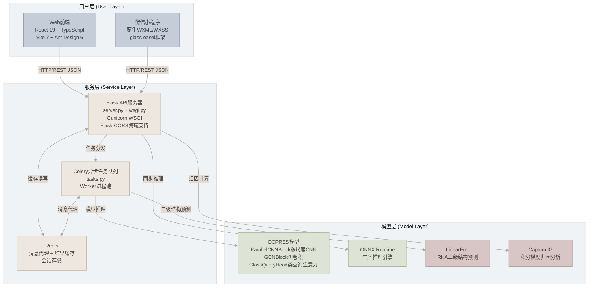

**架构层次说明**：

在用户层，系统包括Web前端和微信小程序两个客户端。Web前端采用React 19 + TypeScript 5.9技术栈，配合Vite 7构建工具和Ant Design 6组件库，提供包含12种可视化组件的完整分析功能套件。微信小程序采用原生WXML/WXSS开发，基于glass-easel组件框架，提供轻量级的序列输入、结果查询和进度监控功能。两个客户端通过统一的RESTful API接口与服务层通信，数据格式为JSON。

在服务层，系统采用Flask作为Web应用框架，通过Gunicorn WSGI服务器提供生产级HTTP服务。服务层集成了Celery异步任务队列和Redis消息代理，支持同步推理（ONNX Runtime直接调用）和异步推理（Celery后台任务）两种模式。Redis同时承担结果缓存、任务状态存储和微信会话管理三重职责，通过TTL机制实现数据的自动过期清理。

在模型层，系统包含DCPRES深度学习模型（PyTorch实现）、ONNX Runtime推理引擎、LinearFold二级结构预测工具和Captum积分梯度归因工具。DCPRES模型是系统的核心，由ParallelCNNBlock（多尺度CNN模块，提取k-mer序列模式）、GCNBlock（图卷积模块，融合RNA二级结构信息）和ClassQueryHead（类查询注意力模块，实现12类修饰分类）三个核心子模块组成。

**模型替换设计**：系统采用模块化架构，DCPRES的GCNBlock模块支持灵活替换。后端统一使用DCPRES作为基础架构，但GCN部分可根据研究需求替换为不同的图神经网络模型（如GAT、GraphSAGE等）。替换时需确保新模块的接口兼容性：输入为`(x, edge_index)`，输出为与原GCNBlock相同维度的节点特征。当前部署的DCPRES模型是经过优化的主推版本，在各项性能指标上均表现最优。

#### 2.1.2 前后端通信机制

系统采用RESTful API设计规范，前后端通过HTTP/JSON格式进行数据交互。在通信机制的设计上，系统遵循无状态原则，每个HTTP请求包含完整的请求信息，服务端不保存客户端会话状态，便于水平扩展。对于异步推理任务，前端采用轮询机制定时向后端查询任务状态，其中Web端使用React Query的自动轮询机制，小程序端则每2秒手动轮询一次。在跨域方面，系统通过Flask-CORS中间件配置跨域资源共享策略，允许Web前端的跨域请求。此外，所有API路径均包含版本号（`/api/v1/`），便于后续接口升级和向后兼容。

### 2.2 技术架构选型

如表2所示，系统在各层次的技术选型综合考量了成熟稳定性、社区活跃度、性能表现和可维护性四个维度，优先选择经过大规模生产验证、社区持续维护且能满足系统性能需求的技术组件。

**表2 系统技术选型表**


| 层次        | 技术选型                  | 版本         | 选型说明                                          |
| ----------- | ------------------------- | ------------ | ------------------------------------------------- |
| Web前端框架 | React + TypeScript        | 19.x / 5.9   | 组件化开发，类型安全，生态丰富，社区活跃          |
| 构建工具    | Vite                      | 7.x          | 基于ESM的快速热更新，开发体验优秀                 |
| UI组件库    | Ant Design                | 6.x          | 企业级UI组件库，设计规范统一，组件丰富            |
| 图表库      | ECharts                   | 6.x          | 百度开源统计图表库，图表类型丰富，交互性强        |
| 图可视化    | AntV G6 + ReactFlow       | 5.x / 11.x   | 蚂蚁集团图可视化引擎+流程图组件，专业级图结构展示 |
| 3D渲染      | Three.js                  | 0.182        | WebGL三维渲染引擎，支持三维分子结构可视化         |
| 关系图      | D3.js + react-force-graph | 7.x          | 数据驱动文档+力导向图组件，灵活的自定义可视化     |
| 数据请求    | TanStack React Query      | 5.x          | 服务端状态管理，自动缓存、轮询、错误重试          |
| 国际化      | 自定义LanguageContext     | —           | 轻量级i18n方案，支持中英文动态切换                |
| 微信前端    | 原生小程序                | glass-easel  | 微信官方组件框架，轻量原生，性能最优              |
| 后端框架    | Flask + Flask-CORS        | 2.x          | Python轻量Web框架，灵活易扩展                     |
| WSGI服务器  | Gunicorn                  | 20.x         | 生产级Python WSGI HTTP服务器                      |
| 异步任务    | Celery                    | 5.x          | Python分布式任务队列，成熟稳定                    |
| 消息代理    | Redis                     | 7+           | 高性能内存数据库，缓存+消息代理+会话存储          |
| 深度学习    | PyTorch + PyG             | 1.10+ / 2.0+ | 动态计算图机制，PyTorch Geometric图神经网络支持   |
| 推理引擎    | ONNX Runtime              | —           | 微软开源跨平台推理加速引擎                        |
| 结构预测    | LinearFold                | C++          | 线性时间复杂度RNA二级结构预测算法                 |
| 模型可解释  | Captum (IG)               | 0.4+         | Facebook开源模型可解释性库，积分梯度归因分析      |
| 容器化      | Docker + docker-compose   | —           | 容器化部署，服务编排，环境一致性                  |

### 2.3 系统模块划分

如图3所示，系统模块划分为前端展示模块、API网关模块和后端服务模块三大部分，各模块之间通过标准化接口进行通信。

**图3 系统模块关系图**

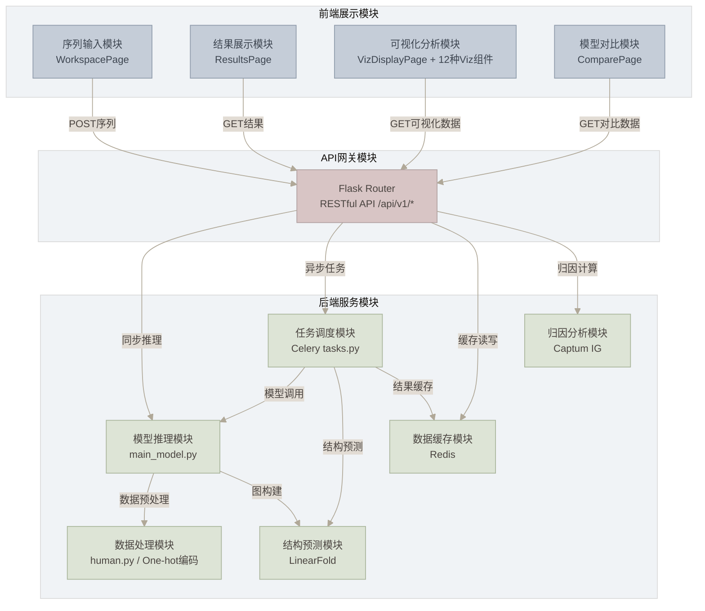

**模块功能详细说明**：

前端展示模块由四个子模块构成。序列输入模块（WorkspacePage）负责RNA序列的输入、验证和预处理，支持直接文本输入和FASTA文件上传两种方式，自动进行序列格式验证（碱基字符检查、长度检查）和异常处理。结果展示模块（ResultsPage）负责预测结果的展示，包括任务状态轮询、分类概率柱状图和置信度信息等，支持结果导出为CSV/JSON格式。可视化分析模块（VizDisplayPage）包含12种可视化组件，提供深度的模型分析和数据探索功能，通过VizLayout共享布局组件实现统一的侧边栏导航和内容区域布局。模型对比模块（ComparePage）支持多模型性能指标的对比分析，涵盖准确率、精确率、召回率、F1分数等评估指标的可视化对比。

后端服务模块由六个子模块构成。模型推理模块（main_model.py）负责DCPRES模型的加载和推理计算，支持PyTorch原生模型和ONNX格式模型两种加载方式，通过配置文件指定模型路径。任务调度模块（Celery tasks.py）负责异步任务的调度和执行，定义了run_prediction_task（单条推理）和process_sequence_in_batch（批量推理子任务）两个核心任务。数据缓存模块（Redis）负责预测结果的缓存、任务状态的存储和微信用户会话的管理，通过SHA256哈希键实现相同序列的缓存复用。结构预测模块（LinearFold）负责RNA二级结构的预测，为图构建提供dot-bracket格式的结构信息。数据处理模块（human.py）负责数据的预处理，包括One-hot编码、序列长度标准化（padding/truncation到1001nt）和图边索引构建。归因分析模块（Captum IG）负责积分梯度（Integrated Gradients）归因分析，计算每个碱基位点对预测结果的贡献值。

### 2.4 数据流设计

数据流图（Data Flow Diagram, DFD）是描述系统中数据流转过程的重要工具。本节通过三个层次的数据流图，从宏观到微观逐步展示数据在系统中的处理过程。

#### 2.4.1 顶层数据流图

如图4所示，顶层数据流图（也称上下文图）将整个系统抽象为单一处理节点，展示了系统与外部实体之间的数据交互关系。系统涉及两类外部实体：用户和管理员。在用户侧，用户向系统提交RNA序列及参数配置信息，系统经过内部的序列预处理、模型推理和可视化渲染等处理后，将预测结果、可视化数据和分析报告返回给用户。在管理员侧，管理员向系统输入模型配置和系统参数等运维信息，系统则向管理员反馈系统状态和运行日志，以支持模型版本管理和系统健康监控。顶层数据流图明确了系统的外部边界，为后续逐层分解奠定了基础。

**图4 系统顶层数据流图**

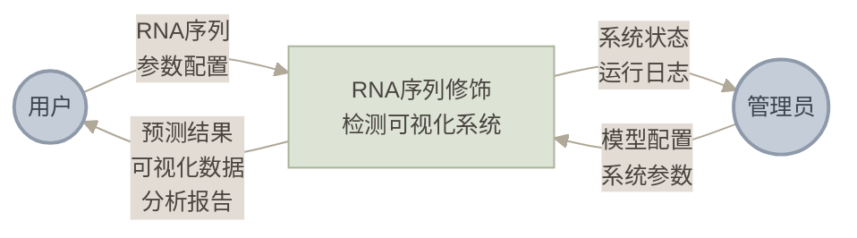

#### 2.4.2 第一层数据流图

如图5所示，第一层数据流图将系统内部的处理过程分解为5个主要处理节点，展示了数据在系统内部从输入到输出的主要流转路径。用户提交的RNA序列首先进入序列输入与验证处理节点，该节点完成碱基字符校验和长度检查后，将验证合格的序列传递至数据预处理节点。在数据预处理阶段，系统同时启动两条并行路径：主路径对序列进行One-hot编码和长度标准化，辅路径则将序列发送至二级结构预测节点（LinearFold），该节点返回dot-bracket格式的结构信息后汇入主路径。预处理完成后的编码数据和图结构共同进入模型推理节点，由DCPRES模型生成预测结果。预测结果随后进入结果生成与缓存节点，该节点将结果序列化为JSON格式并写入Redis缓存。最终，可视化渲染节点从缓存中读取数据，生成图形化结果返回给用户。整个流程形成了从序列输入到可视化输出的完整数据闭环。

**图5 系统第一层数据流图**

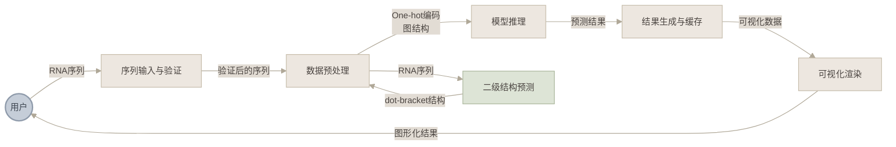

#### 2.4.3 第二层数据流图（核心推理流程）

如图6所示，第二层数据流图进一步展开核心推理流程的数据处理细节，以节点和数据流的形式呈现从原始RNA序列字符串到最终JSON响应的完整数据变换过程。原始序列首先经过One-hot编码转换为(N, 4)的数值矩阵，随后进入长度判断分支：短于1001nt的序列进行对称填充，等于或长于1001nt的序列则直接使用或从中间截取，两条分支均输出统一的(1001, 4)矩阵。编码后的序列同时向两个方向流动：一方面送入LinearFold进行二级结构预测，获取dot-bracket字符串后进入图构建模块，分别生成碱基配对边和序列相邻边，合并为统一的edge_index；另一方面直接送入DCPRES前向推理模块，与图结构数据共同作为模型输入。模型输出的logits、概率值、注意力权重矩阵和二级结构数据经过序列化为JSON后写入Redis缓存，最终以JSON响应的形式返回给前端。

**图6 核心推理流程数据流图**

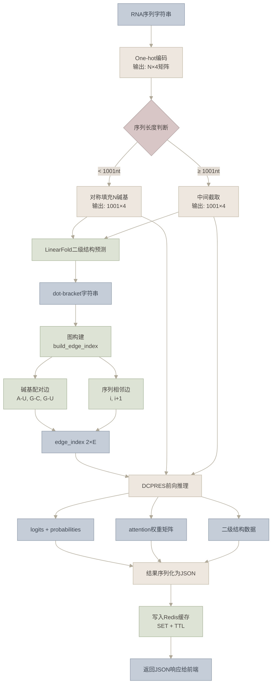

**数据流详细说明**：

整个数据处理流程从原始RNA序列字符串开始，经过编码、标准化、结构预测、图构建和模型推理五个阶段，最终输出预测结果并缓存。以下按照数据在各阶段的变换过程逐一说明。

在One-hot编码阶段，系统首先将RNA序列字符串转换为(N, 4)的数值矩阵。编码规则为每个碱基分配一个4维one-hot向量：A=[1,0,0,0]，C=[0,1,0,0]，G=[0,0,1,0]，U/T=[0,0,0,1]。对于N碱基（未知碱基），由于其身份不确定，系统使用均匀分布向量[0.25,0.25,0.25,0.25]表示，使其在后续计算中对四种碱基类型的贡献均等。

完成编码后，系统进行长度标准化处理，将序列统一为1001nt的固定长度。这一长度的选择基于训练数据的统计分布，能够覆盖绝大多数RNA序列的修饰位点。对于短于1001nt的序列，系统在左右两端对称填充N碱基，以确保中心区域的序列信息不发生偏移；对于长于1001nt的序列，则从中间位置截取1001nt，保留序列的中心区域。通过这一步骤，系统保证了后续模型输入维度的一致性。

随后，系统调用LinearFold工具进行RNA二级结构预测。LinearFold采用线性时间复杂度O(n)的近似算法，通过5'-to-3'动态规划和束搜索策略，能够在秒级完成长序列的结构预测。预测结果以dot-bracket格式输出，其中"("表示配对碱基的5'端，")"表示配对碱基的3'端，"."表示未配对碱基。这一结构信息是后续图构建的基础。

基于二级结构信息，系统进入图构建阶段。边索引edge_index包含两类边：第一类是碱基配对边，来自二级结构中的配对关系，包括Watson-Crick配对（A-U、G-C）和Wobble配对（G-U）；第二类是序列相邻边，即每个碱基与其前后相邻碱基之间的磷酸二酯键连接（i与i+1）。两类边共同构成图结构，边索引格式为(2, E)，其中E为边的总数量。这一图结构将碱基的一维序列关系扩展为包含空间拓扑信息的二维图结构，为图卷积网络提供了结构化的输入。

在模型推理阶段，系统将编码后的序列特征和图结构同时输入DCPRES模型。模型按照三阶段流水线依次处理：首先通过ParallelCNNBlock并行提取多尺度序列特征（kernel_size分别为1、3、5、7），捕获从单碱基到局部基序的不同粒度模式；然后通过GCNBlock的三层图卷积运算，利用邻域聚合机制将RNA二级结构的空间信息融合到序列特征中；最后由ClassQueryHead通过12个可学习的类查询向量与节点特征进行多头注意力交互，生成12类修饰的预测概率。模型最终输出logits、softmax归一化后的概率值和注意力权重矩阵。

在结果序列化与缓存阶段，系统将模型输出转换为JSON格式，包括12类分类概率、注意力矩阵、二级结构数据等完整信息。结果存储到Redis缓存，键为序列的SHA256哈希值，并设置可配置的TTL（默认24小时）。当不同用户提交相同的RNA序列时，系统可直接返回缓存结果，避免重复计算。

### 2.5 接口设计概览

系统采用RESTful API设计规范。在资源表示上，系统使用名词表示资源（如`results`、`model-architecture`），通过HTTP方法表示操作（GET查询、POST提交）。所有接口返回统一的JSON格式，包含`code`（状态码）、`message`（状态描述）、`data`（数据载荷）三个字段，并提供统一的错误响应格式，包含详细的错误码和错误描述，便于前端进行错误处理。接口路径均包含版本号（`/api/v1/`），便于后续升级和向后兼容，同时通过Flask-CORS中间件支持跨域请求，配置允许的源、方法和头部信息。

微信小程序端使用专用接口（`/api/v1/wx-*`），接口设计考虑了小程序的特殊限制，如请求频率限制（每秒最多5次）、数据大小限制（单次请求不超过1MB）等。

---

## 第三部分：系统详细设计

本章在系统总体设计的基础上，深入阐述前端和后端的详细设计方案。前端部分涵盖Web前端架构设计（组件层次结构、路由设计、状态管理、可视化组件设计）和微信小程序前端设计（页面结构、数据流、与Web端的功能差异）；后端部分涵盖API接口详细设计（12个核心端点的请求参数和响应格式）、核心处理流程（推理时序图）、模型推理模块设计（DCPRES三阶段网络结构）、数据处理模块设计（One-hot编码和图构建）、缓存与任务调度设计（Redis缓存策略和Celery任务队列）以及数据存储设计（Redis数据模型ER图）。详细设计是将总体设计方案转化为可实现的技术方案的关键环节，其目标是为开发人员提供清晰、可执行的技术指导，确保系统实现与设计方案的一致性。

### 3.1 前端详细设计

#### 3.1.1 Web前端架构

##### 3.1.1.1 技术栈

Web前端采用现代化的前端技术栈，各技术组件的选型经过充分的技术调研和性能测试。在核心框架方面，系统采用React 19结合TypeScript 5.9，以函数式组件和Hooks模式实现声明式UI开发，在提升开发效率的同时保障了代码的类型安全。构建工具选用Vite 7.x，其基于ESM的快速构建能力支持毫秒级热模块替换（HMR），显著提升了开发调试效率。UI组件库采用Ant Design 6.x，提供了丰富的高质量UI组件和统一的设计规范。在可视化方面，系统综合运用了多种专业库：ECharts 6用于统计图表渲染，AntV G6用于图结构可视化，D3.js用于数据驱动的自定义可视化，ReactFlow用于流程图展示，Three.js用于三维渲染，以满足不同可视化场景的需求。状态管理采用React Context管理全局应用状态，结合React Query v5管理服务端状态。路由管理基于react-router-dom v7，通过HTML5 History API实现单页应用的客户端路由。国际化方面，系统实现了自定义的LanguageContext，支持中文（zh.ts）和英文（en.ts）两种语言的切换。

##### 3.1.1.2 组件层次结构

如图7所示，Web前端采用组件化架构，组件层次结构清晰，职责分明。顶层组件App.tsx负责路由配置和全局状态初始化，各页面组件负责特定功能域的UI渲染和交互逻辑。

**图7 Web前端组件层次结构图**

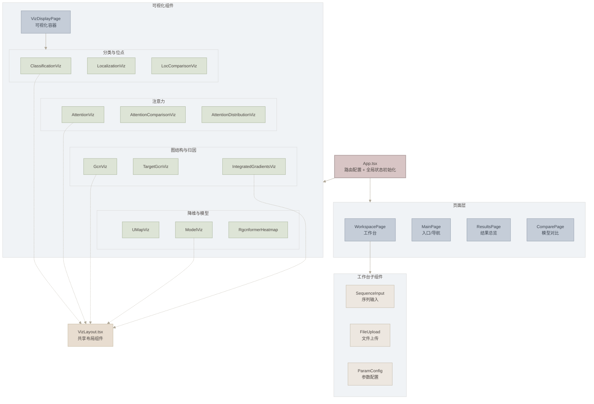

**组件职责详细说明**：

在页面级组件层面，App.tsx作为应用根组件，承担路由配置（10个路由）、QueryClientProvider（React Query）初始化、LanguageContextProvider（国际化）初始化和全局状态管理的职责。WorkspacePage.tsx是系统的主要入口页面，负责RNA序列的输入（文本框直接输入）、验证（碱基字符检查、长度检查）和提交（调用`/api/v1/submit-task`接口），其内部包含序列输入框、文件上传组件、参数配置表单等子组件。ResultsPage.tsx为结果总览页面，通过React Query的`useQuery`钩子轮询查询预测结果，展示任务状态（processing/completed/failed）、12类分类概率柱状图和基本结果信息。VizDisplayPage.tsx是可视化展示容器，根据URL路径参数动态加载对应的可视化组件，通过VizLayout共享布局组件实现统一的侧边栏导航和内容区域布局。ComparePage.tsx为模型对比页面，调用`/api/v1/model-comparison`接口获取多模型性能数据，支持准确率、精确率、召回率、F1分数等指标的可视化对比。

在共享布局组件层面，VizLayout.tsx提供了响应式的侧边栏导航（桌面端固定侧边栏，移动端折叠侧边栏）和内容区域布局，各可视化组件通过该组件实现统一的页面结构，避免了重复的布局代码。

#### 3.1.2 前端路由设计

如表3所示，系统采用react-router-dom v7进行路由管理，定义了10个路由，覆盖系统的所有功能页面。

**表3 前端路由表**


| 路径                    | 页面组件               | 布局      | 功能描述                      |
| ----------------------- | ---------------------- | --------- | ----------------------------- |
| `/`                     | WorkspacePage          | 独立布局  | 系统主入口，RNA序列输入与提交 |
| `/legacy`               | MainPage               | 独立布局  | 兼容旧版入口，系统功能导航    |
| `/results/:jobId`       | ResultsPage            | 独立布局  | 预测结果总览，任务状态轮询    |
| `/viz-display`          | VizDisplayPage         | 独立布局  | 可视化展示容器                |
| `/classification`       | ClassificationViz      | VizLayout | 12类修饰分类概率展示          |
| `/attention`            | AttentionViz           | VizLayout | 多头注意力权重热力图          |
| `/gcn`                  | GcnViz                 | VizLayout | RNA二级结构图可视化           |
| `/target-gcn`           | TargetGcnViz           | VizLayout | 特定节点GCN消息传递           |
| `/integrated-gradients` | IntegratedGradientsViz | VizLayout | 积分梯度归因分析              |
| `/model-viz`            | ModelViz               | VizLayout | 层次化模型架构展示            |
| `/compare`              | ComparePage            | 独立布局  | 多模型性能对比                |

**路由设计说明**：

在路由分组方面，10个路由分为两组：独立布局路由（WorkspacePage、MainPage、ResultsPage、VizDisplayPage、ComparePage）和VizLayout共享布局路由（6个可视化组件页面）。VizLayout提供统一的侧边栏导航，用户可以在不同可视化组件之间快速切换。在路由参数方面，`:jobId`为预测任务的唯一标识符（SHA256哈希值），用于查询对应的预测结果。在BrowserRouter配置方面，系统使用HTML5 History API，配置`basename="/rgcnformer"`以支持子路径部署。

#### 3.1.3 状态管理设计

系统采用React Context和React Query双层状态管理策略，如图8所示。React Context负责管理全局应用状态（如语言设置、用户偏好），React Query负责管理服务端状态（如API请求结果、缓存数据、轮询状态）。

**图8 前端状态流转图**

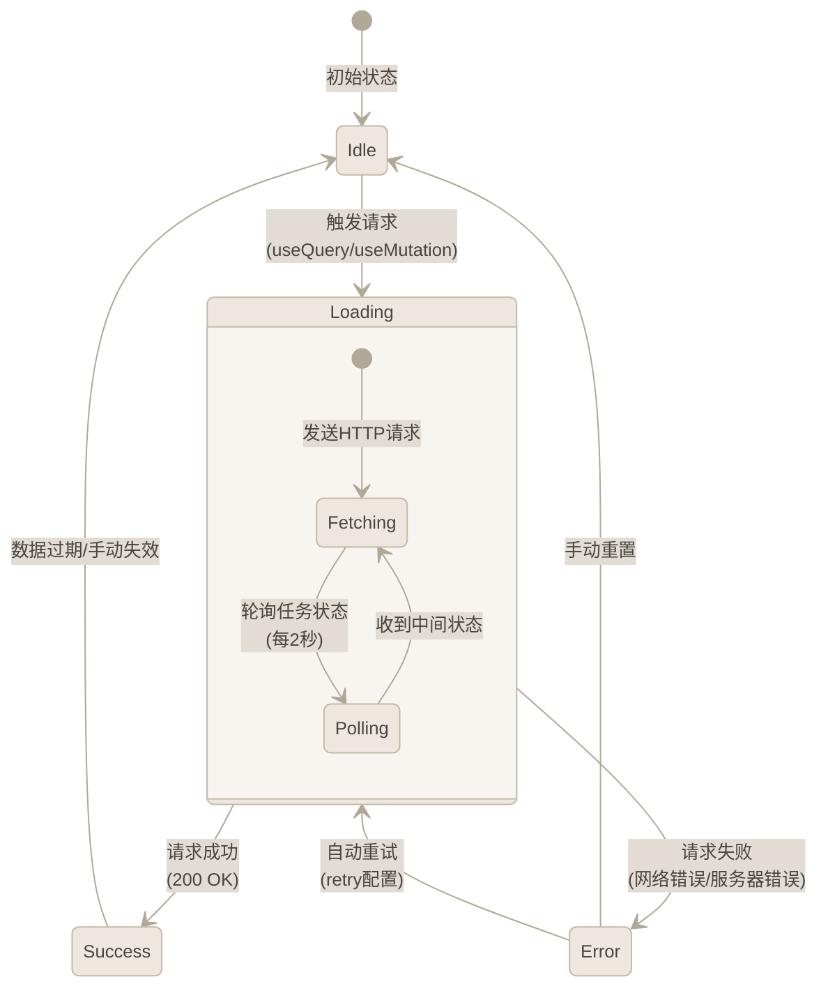

**状态管理策略详细说明**：

在React Context层面，系统将其用于管理全局应用状态。具体而言，LanguageContext负责管理当前的语言设置（中文或英文），并提供`t(key)`翻译函数供组件调用以获取对应语言的文本内容；此外，全局主题配置通过React Context管理深色与浅色主题的切换。

在React Query（@tanstack/react-query v5）层面，系统将其用于管理服务端状态，提供了多项核心功能。在请求缓存方面，`useQuery`钩子默认缓存已请求的数据，当用户再次访问相同数据时优先返回缓存结果，同时在后台进行数据刷新（stale-while-revalidate策略）。在自动轮询方面，对于异步推理任务，系统配置`refetchInterval`实现自动轮询，直到任务状态变为completed或failed。在错误重试方面，系统配置`retry`参数实现请求失败后的自动重试，支持指数退避策略。在乐观更新方面，`useMutation`钩子支持乐观更新，在等待服务端响应时先更新本地缓存。

在请求状态流转方面，系统定义了四种状态：Idle为初始状态，表示无活跃请求；Loading为请求进行中，显示加载指示器；Success为请求成功，展示数据；Error为请求失败，显示错误信息和重试按钮。这四种状态之间通过请求事件和用户操作相互转换，形成了完整的状态生命周期。

#### 3.1.4 可视化组件设计

如表4所示，各可视化组件的数据源接口、可视化库选择和交互方式经过精心设计，以确保最佳的展示效果和交互体验。

**表4 可视化组件数据源与交互设计表**


| 组件                     | 数据源接口                          | 可视化库   | 交互方式               | 主要功能                   |
| ------------------------ | ----------------------------------- | ---------- | ---------------------- | -------------------------- |
| ClassificationViz        | `/api/v1/results/:jobId`            | ECharts    | 悬停查看详情，点击展开 | 12类修饰概率柱状图/雷达图  |
| LocalizationViz          | `/api/v1/results/:jobId`            | ECharts    | 位点点击高亮           | 修饰位点在序列上的分布标注 |
| AttentionViz             | `/api/v1/results/:jobId`            | ECharts    | 热力图缩放、拖拽       | 多头注意力权重热力图展示   |
| AttentionComparisonViz   | `/api/v1/results/:jobId`            | ECharts    | 对比切换               | 不同修饰类型注意力对比     |
| AttentionDistributionViz | `/api/v1/results/:jobId`            | ECharts    | 分布参数调节           | 注意力权重统计分布图       |
| GcnViz                   | `/api/v1/results/:jobId`            | AntV G6    | 节点拖拽、缩放、悬停   | RNA二级结构力导向图        |
| TargetGcnViz             | `/api/v1/visualize-gcn-aggregation` | ReactFlow  | 节点选择、展开         | GCN邻域聚合消息传递流程    |
| IntegratedGradientsViz   | `/api/v1/integrated-gradients`      | D3.js + G6 | 归因值探索、区域选择   | 碱基级积分梯度归因分析     |
| UMapViz                  | `/api/v1/umap`                      | ECharts    | 散点缩放、区域框选     | UMAP降维散点图             |
| ModelViz                 | `/api/v1/model-architecture`        | ReactFlow  | 层次展开、节点详情     | DCPRES层次化架构图         |
| RgcnformerHeatmap        | `/api/v1/results/:jobId`            | ECharts    | 热力图缩放             | 修饰位点预测热力图         |
| LocComparisonViz         | `/api/v1/results/:jobId`            | ECharts    | 位点对比切换           | 不同修饰位点预测对比       |

**可视化组件交互设计详细说明**：

在统计图表类组件方面，ClassificationViz以柱状图展示12类修饰的预测概率，横轴为修饰类型（Am、Atol、Cm等），纵轴为预测概率值（0~1），支持鼠标悬停查看详细数值和置信区间，并可切换为雷达图视图。LocalizationViz在序列上高亮显示预测的修饰位点，以不同颜色区分修饰类型（如m6A用红色、m5C用蓝色等），支持点击查看位点详情，包括该位点的12类修饰概率分布。AttentionViz以热力图展示多头注意力权重，横轴为序列位置（0~1000），纵轴为注意力头（1~8），颜色深浅表示注意力权重大小，支持缩放、拖拽操作以及选择特定注意力头进行查看。

在图结构与归因类组件方面，GcnViz以力导向图展示RNA二级结构，节点表示碱基（A、C、G、U用不同颜色区分），边表示碱基配对关系（实线为Watson-Crick配对，虚线为Wobble配对）和序列相邻关系，支持节点拖拽调整布局、鼠标滚轮缩放和节点悬停查看详情。IntegratedGradientsViz展示积分梯度归因结果，横轴为序列位置，纵轴为归因值，高亮显示对预测结果贡献最大的碱基位点（正归因用红色，负归因用蓝色），支持区域选择和缩放探索。

在降维与模型架构类组件方面，UMapViz以散点图展示UMAP降维结果，每个散点代表一个RNA序列的特征嵌入，不同颜色表示不同修饰类型，支持缩放、区域框选和散点悬停查看序列信息。ModelViz以层次化流程图展示DCPRES模型的网络架构，从输入层到输出层依次展示ParallelCNNBlock、GCNBlock和ClassQueryHead三个核心模块，支持层级展开查看详情和节点悬停显示参数信息。

#### 3.1.5 微信小程序前端设计

##### 3.1.5.1 页面结构

微信小程序采用原生框架开发，基于glass-easel组件框架，共包含4个页面，如表5所示。

**表5 微信小程序页面结构**


| 页面     | 路径                    | 功能描述                            | 核心组件                       |
| -------- | ----------------------- | ----------------------------------- | ------------------------------ |
| 首页     | `pages/index/index`     | RNA序列输入，支持最多5条批量提交    | 序列输入框、提交按钮、登录按钮 |
| 结果页   | `pages/results/results` | 12类修饰预测结果展示                | 分类结果列表、注意力权重条     |
| 网页容器 | `pages/webview/index`   | 内嵌web-view，跳转Web端查看3D可视化 | native web-view组件            |
| 日志页   | `pages/logs/logs`       | 微信小程序日志查看                  | 日志列表                       |

**小程序数据流**：

用户在首页输入1至5条RNA序列（每条≥51nt，仅包含ACGUTN字符），点击提交按钮后，系统调用微信登录接口获取openid，然后将其与序列数据一同POST到`/api/v1/wx-submit-task`接口。后端返回batch_job_id标识符后，小程序每2秒轮询`/api/v1/wx-task-progress/{jobId}`查询各序列的处理进度。当所有任务处理完成后，小程序跳转到结果页，展示12类修饰的预测概率。用户还可选择跳转到web-view页面，在Web端查看完整的可视化分析结果。

##### 3.1.5.2 与Web端的功能差异

如表6所示，小程序端和Web端在功能定位上存在明确差异。

**表6 小程序端与Web端功能对比**


| 功能模块     | 小程序端            | Web端                   | 差异说明                         |
| ------------ | ------------------- | ----------------------- | -------------------------------- |
| 序列输入     | 支持（最多5条）     | 支持（无限制）          | 小程序端限制批量数以控制资源消耗 |
| 批量提交     | 支持                | 支持                    | 两者均支持异步批量推理           |
| 预测进度     | 轮询查看（2秒间隔） | React Query自动轮询     | 轮询机制不同                     |
| 分类结果     | 支持（列表展示）    | 支持（图表展示）        | Web端图表更丰富                  |
| 注意力可视化 | 不支持              | 支持（ECharts热力图）   | 小程序端跳转Web端查看            |
| GCN图可视化  | 不支持              | 支持（AntV G6力导向图） | 小程序端跳转Web端查看            |
| UMAP可视化   | 不支持              | 支持（ECharts散点图）   | 小程序端跳转Web端查看            |
| IG归因分析   | 不支持              | 支持（D3.js归因图）     | 小程序端跳转Web端查看            |
| 模型对比     | 不支持              | 支持（ComparePage）     | 小程序端跳转Web端查看            |
| 国际化       | 不支持              | 支持（中英文）          | 小程序端仅中文                   |
| 3D可视化     | 通过web-view跳转    | 原生支持（Three.js）    | 小程序端依赖Web端                |

小程序端定位为**轻量级查询工具**，核心功能为序列提交、进度监控和结果查看；复杂可视化功能通过内嵌web-view组件跳转到Web端实现。

### 3.2 后端详细设计

#### 3.2.1 API接口详细设计

##### 3.2.1.1 核心API端点清单

如表7所示，系统共定义了12个核心API端点，覆盖任务提交、结果查询、可视化数据获取、模型管理和系统监控等功能。

**表7 核心API端点清单**


| 编号 | 接口名称   | 方法 | 路径                                | 请求参数                               | 响应格式                          | 说明                       |
| ---- | ---------- | ---- | ----------------------------------- | -------------------------------------- | --------------------------------- | -------------------------- |
| 1    | 提交任务   | POST | `/api/v1/submit-task`               | `{rnaSequence, targetClassId?, topK?}` | `{jobId, status}`                 | 单条异步推理，SHA256缓存键 |
| 2    | 批量提交   | POST | `/api/v1/wx-submit-task`            | `{sequences: [seq1..seq5]}`            | `{batch_job_id}`                  | 微信端批量，UUID标识       |
| 3    | 查询结果   | GET  | `/api/v1/results/:jobId`            | —                                     | 完整结果JSON                      | 轮询获取，支持中间状态     |
| 4    | 批量进度   | GET  | `/api/v1/wx-task-progress/:jobId`   | —                                     | `{status, progress, results}`     | 微信端进度查询             |
| 5    | IG归因     | POST | `/api/v1/integrated-gradients`      | `{rnaSequence, targetClassId}`         | `{attributions, nodes, edges}`    | Captum积分梯度计算         |
| 6    | GCN聚合    | POST | `/api/v1/visualize-gcn-aggregation` | `{rnaSequence, targetNodeIdx}`         | `{nodes, edges, aggregationData}` | GCN消息传递可视化          |
| 7    | 模型架构   | GET  | `/api/v1/model-architecture`        | —                                     | 层次化JSON树                      | PyTorch模型结构            |
| 8    | 模型计算图 | GET  | `/api/v1/model-graph`               | —                                     | `{nodes, edges}`                  | ONNX计算图数据             |
| 9    | 模型对比   | GET  | `/api/v1/model-comparison`          | —                                     | `{models, metrics}`               | 多模型性能对比             |
| 10   | UMAP降维   | GET  | `/api/v1/umap`                      | —                                     | `{points, labels}`                | 预计算UMAP嵌入             |
| 11   | 示例序列   | GET  | `/api/v1/sample-sequence`           | —                                     | `{sequence, name}`                | 随机RNA示例序列            |
| 12   | 健康检查   | GET  | `/api/health`                       | —                                     | `{status, model_loaded, device}`  | 系统健康状态               |

##### 3.2.1.2 接口详细说明

**1. 提交任务接口（POST /api/v1/submit-task）**

这是系统最核心的接口，负责接收用户的RNA序列预测请求。接口处理流程如下：

请求参数：

- `rnaSequence`（必填，string）：RNA序列字符串，仅包含A、C、G、U、T、N字符，长度≥51nt；
- `targetClassId`（可选，int）：目标修饰类型ID（0~11），用于特定修饰的归因分析；
- `topK`（可选，int）：返回Top-K预测结果，默认为12。

响应格式：

```json
{
  "jobId": "a1b2c3d4e5f6...",
  "status": "pending"
}
```

接口首先验证序列格式，确认其仅包含合法碱基字符（A、C、G、U、T、N）且长度≥51nt。验证通过后，系统计算序列的SHA256哈希值作为jobId，并以此为键查询Redis缓存（`task:{sha256}`）。若缓存命中，系统直接返回缓存结果并将状态设为"completed"，避免重复计算。若缓存未命中，系统通过Celery异步提交推理任务（`run_prediction_task.apply_async`），将jobId和状态"pending"以HTTP状态码202返回给前端。

**2. 查询结果接口（GET /api/v1/results/:jobId）**

响应格式（任务完成时）：

```json
{
  "status": "completed",
  "classification": {
    "m6A": 0.85,
    "m5C": 0.12,
    "Ψ": 0.03,
    "ac4C": 0.01,
    ...
  },
  "attention": [[0.1, 0.2, ...], ...],
  "probabilities": [0.85, 0.12, 0.03, ...],
  "structure": "..((..))..",
  "nodes": [{"id": 0, "label": "A", "x": 0.5, "y": 0.3}, ...],
  "edges": [{"source": 0, "target": 1, "type": "adjacent"}, ...]
}
```

**3. 健康检查接口（GET /api/health）**

响应格式：

```json
{
  "status": "healthy",
  "model_loaded": true,
  "device": "cuda:0",
  "checkpoint_path": "/data/models/mrmodn_best.pth"
}
```

#### 3.2.2 核心处理流程

##### 3.2.2.1 推理流程时序图

如图9所示，推理流程时序图详细展示了从用户提交序列到获取结果的完整交互过程，包括缓存命中和缓存未命中两种场景。该时序图涵盖了前端、Flask、Redis、Celery、LinearFold和DCPRES六个参与者之间的交互。

**图9 推理流程时序图**

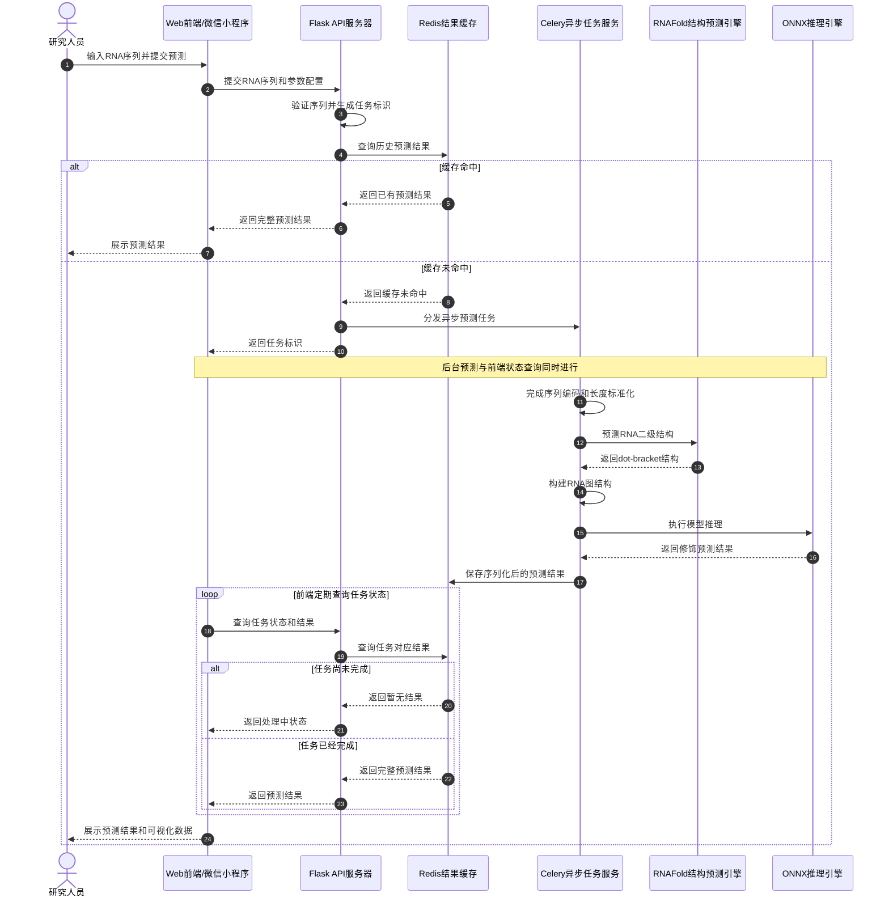

**流程详细说明**：

整个推理流程可分为缓存命中和缓存未命中两种场景，以下分别说明。

在缓存命中的场景下，前端向Flask发送POST请求携带RNA序列字符串，Flask验证序列格式后计算SHA256哈希值作为任务标识，并以此为键查询Redis缓存（`task:{sha256}`）。若缓存命中，说明相同序列已被预测过，Flask直接返回缓存结果，避免重复计算，整个请求在毫秒级完成。

在缓存未命中的场景下，Flask通过Celery的`apply_async`方法异步提交推理任务，立即返回202 Accepted状态码和任务ID。前端收到任务ID后，开始以每2秒的间隔轮询查询任务状态。在此期间，Celery Worker执行推理任务：首先调用LinearFold预测RNA二级结构，获取dot-bracket格式的结构信息；然后基于二级结构构建图边索引（碱基配对边和序列相邻边）；最后执行DCPRES前向推理，获取logits、概率和注意力权重。推理完成后，Celery将结果JSON存储到Redis缓存，设置TTL（默认24小时）。前端的下一次轮询查询将从Redis获取到完整的结果JSON，随后进行可视化渲染，整个异步流程至此完成。

#### 3.2.3 模型推理模块设计

##### 3.2.3.1 DCPRES模型结构

如图10所示，DCPRES模型采用三阶段流水线架构：多尺度CNN特征提取→图卷积结构融合→类查询注意力分类。这种设计实现了从局部序列模式到全局结构信息再到分类决策的渐进式特征抽象。

**图10 DCPRES模型结构图**

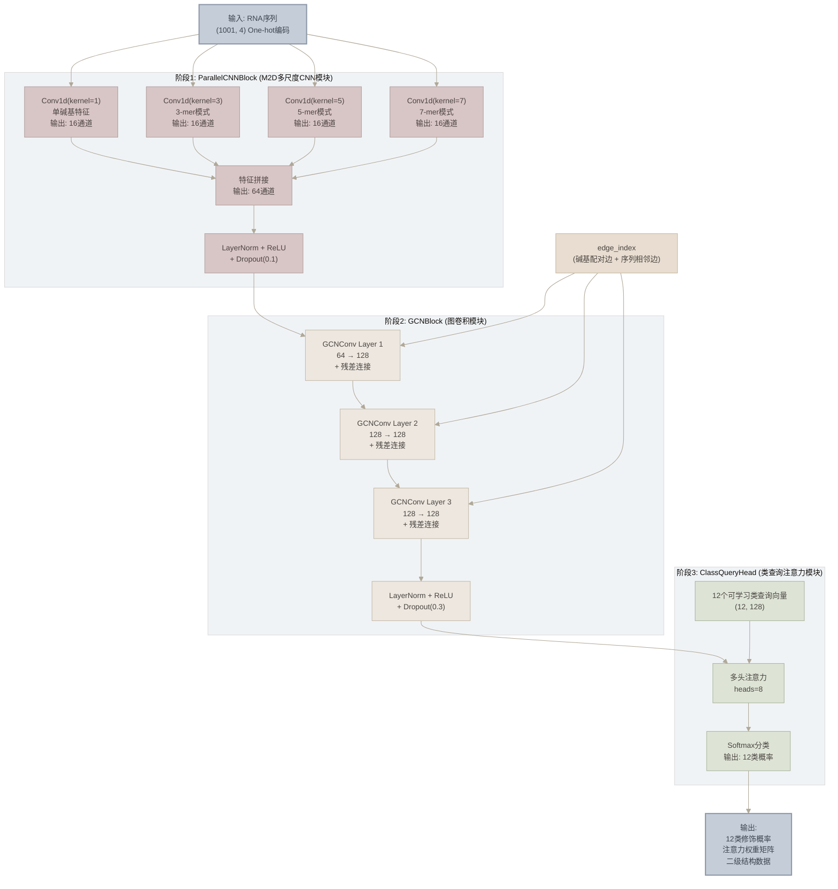

**各模块详细说明**：

**1. ParallelCNNBlock（多尺度CNN模块）**

ParallelCNNBlock采用多尺度并行卷积策略，使用kernel_size分别为1、3、5、7的四种一维卷积核并行提取不同粒度的序列模式。其中，kernel=1的卷积核捕获单碱基级别的特征，关注每个位置的碱基类型信息；kernel=3的卷积核捕获3-mer（三核苷酸）模式，关注相邻三个碱基的组合特征；kernel=5的卷积核捕获5-mer模式，关注更长的局部序列基序；kernel=7的卷积核捕获7-mer模式，关注更广范围的序列上下文。每个卷积分支的输出通道数为`hidden_dim // 4 = 64 // 4 = 16`，四个分支的输出通过`torch.cat`拼接为64通道。拼接后的特征经过LayerNorm归一化、ReLU激活和Dropout(0.1)正则化处理。

**输入维度**：(batch_size × 1001 × 4) → 转置为 (batch_size × 4 × 1001)
**输出维度**：(total_nodes × 64)，其中total_nodes = batch_size × 1001

**2. GCNBlock（图卷积模块）**

GCNBlock基于RNA二级结构信息进行图卷积计算，通过3层GCNConv层逐步融合图结构信息。每层GCNConv的计算过程如下：

$$
h_i^{(l+1)} = \sigma\left(\sum_{j \in \mathcal{N}(i)} \frac{1}{c_{ij}} W^{(l)} h_j^{(l)} + b^{(l)}\right)
$$

其中$h_i^{(l)}$为第$l$层节点$i$的特征向量，$\mathcal{N}(i)$为节点$i$的邻居集合，$c_{ij}$为归一化系数，$W^{(l)}$为可学习权重矩阵。在网络结构上，当输入维度与隐藏维度不匹配时，系统首先通过输入投影将64维特征映射为128维；随后经过3层GCNConv（隐藏维度128），每层后接LayerNorm、ReLU和Dropout(0.3)；此外，每层GCNConv的输出与输入进行残差连接，以缓解深层图网络的梯度消失问题。

**输入维度**：(total_nodes × 64) + edge_index(2, E)
**输出维度**：(total_nodes × 128)

**3. ClassQueryHead（类查询注意力模块）**

ClassQueryHead采用类查询注意力机制，定义12个可学习的类查询向量$Q \in \mathbb{R}^{12 \times 128}$，分别对应12类RNA修饰。通过多头注意力计算（8个注意力头），类查询向量与节点特征进行交互：

$$
\text{Attention}(Q, K, V) = \text{softmax}\left(\frac{QK^T}{\sqrt{d_k}}\right)V
$$

其中$K$和$V$来自GCNBlock的输出节点特征，$Q$为12个类查询向量。注意力输出经过全连接层和Softmax激活，生成12类修饰的预测概率。

**输入维度**：类查询(12 × 128) + 节点特征(total_nodes × 128)
**输出维度**：(batch_size × 12)，12类修饰的softmax概率

##### 3.2.3.2 模型变体对比

如表8所示，系统支持多种模型变体，满足不同研究场景的需求。

**表8 模型变体对比表**


| 变体       | 文件              | 架构特点                                            | 应用场景         | 参数量 |
| ---------- | ----------------- | --------------------------------------------------- | ---------------- | ------ |
| mRModN     | `mrmodn.py`       | 主网络，标准三阶段DCPRES                            | 通用12类修饰预测 | ~2.1M  |
| ModX       | `modx.py`         | 修饰类型消融变体，移除特定模块                      | 消融实验         | 可配置 |
| MultiRM    | `multirm.py`      | 多任务多修饰联合学习                                | 多修饰联合预测   | ~3.5M  |
| EvoRMD     | `evormd_human.py` | 集成进化保守性特征                                  | 泛化能力研究     | ~2.8M  |
| AblaModel  | `abla_model.py`   | 消融实验专用，模块可开关                            | 3×3消融矩阵     | 可配置 |
| **DCPRES** | `dcpres.py`       | **主推模型**，基于RGCNFormer基础架构优化，GCN可替换 | **生产环境部署** | ~2.3M  |

**GCN模块替换说明**：

DCPRES架构采用模块化设计，GCNBlock模块支持灵活替换。系统后端统一使用DCPRES作为基础架构，但GCN部分可根据研究需求替换为不同的图神经网络模型。替换时需确保新模块的接口兼容性：输入为`(x, edge_index)`，输出为与原GCNBlock相同维度的节点特征。当前部署的DCPRES模型是经过优化的主推版本，采用了标准GCNConv实现，在各项性能指标上均表现最优。

##### 3.2.3.3 DCPRES模型性能对比

如表8-1所示，DCPRES模型在分类任务和定位任务上均显著优于其他基线模型。

**表8-1 DCPRES分类性能对比表**


| 模型       | 准确率(Acc) | AUC       | AUPRC     | 精确率    | 召回率    | F1分数    | MCC       |
| ---------- | ----------- | --------- | --------- | --------- | --------- | --------- | --------- |
| **DCPRES** | **0.928**   | **0.955** | **0.941** | **0.911** | **0.968** | **0.935** | **0.865** |
| ProCSE     | 0.770       | 0.841     | 0.811     | 0.725     | 0.901     | 0.799     | 0.566     |
| GCN        | 0.666       | 0.632     | 0.614     | 0.628     | 0.932     | 0.741     | 0.380     |
| K-Means    | 0.332       | 0.449     | 0.433     | 0.335     | 0.594     | 0.422     | 0.021     |
| DSCPS      | 0.602       | 0.649     | 0.633     | 0.585     | 0.854     | 0.682     | 0.251     |

**表8-2 DCPRES定位性能对比表**


| 模型       | Top-1     | Top-3     | Top-5     | Top-7     | Top-10    | Top-20    | Top-50    |
| ---------- | --------- | --------- | --------- | --------- | --------- | --------- | --------- |
| **DCPRES** | **0.869** | **0.915** | **0.927** | **0.934** | **0.940** | **0.954** | **0.973** |
| ProCSE     | 0.026     | 0.051     | 0.066     | 0.078     | 0.094     | 0.141     | 0.246     |
| GCN        | 0.263     | 0.467     | 0.591     | 0.683     | 0.780     | 0.915     | 0.966     |
| K-Means    | 0.043     | 0.347     | 0.451     | 0.583     | 0.570     | 0.685     | 0.756     |
| DSCPS      | 0.026     | 0.053     | 0.071     | 0.084     | 0.098     | 0.133     | 0.208     |

**性能分析**：

实验结果表明，DCPRES模型在各项指标上均显著优于其他基线模型。在分类任务中，DCPRES的准确率（92.8%）比次优模型ProCSE（77.0%）高出15.8个百分点，AUC值（0.955）比ProCSE（0.841）高出0.114。在定位任务中，DCPRES的Top-1准确率（86.9%）远超GCN（26.3%）和ProCSE（2.6%），表明DCPRES能够更精准地预测修饰位点的位置。这些优势源于DCPRES的双通道特征提取策略和层次化注意力机制，使其能够充分利用序列信息和结构信息进行精准预测。

#### 3.2.4 数据处理模块设计

##### 3.2.4.1 数据处理流程

如图11所示，数据处理流程包括序列编码、长度标准化、二级结构预测和图构建四个主要步骤，形成从原始序列字符串到模型可用输入的完整数据流水线。

**图11 数据处理流程图**

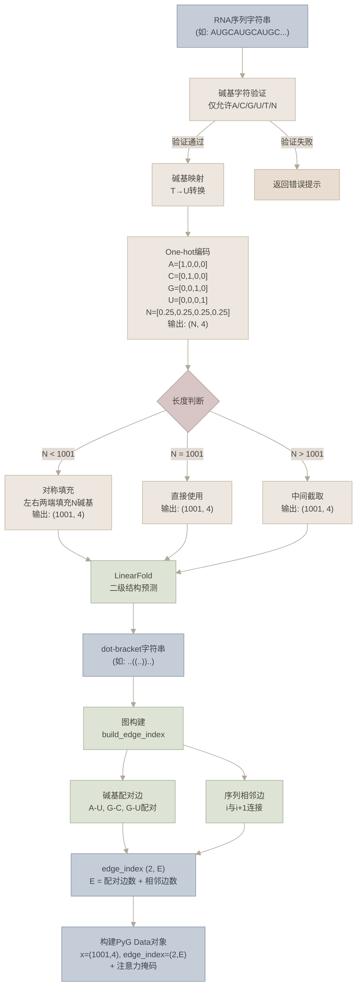

**处理步骤详细说明**：

1. **碱基字符验证**：检查输入序列仅包含A、C、G、U、T、N六种合法字符，拒绝包含其他字符的输入。
2. **碱基映射**：将T碱基自动转换为U碱基（RNA中使用U而非T）。
3. **One-hot编码**：将每个碱基转换为4维one-hot向量。对于N碱基，使用均匀分布向量[0.25, 0.25, 0.25, 0.25]表示碱基的不确定性。
4. **长度标准化**：将序列统一处理为1001nt长度。这一长度选择基于训练数据的统计分布，能够覆盖绝大多数RNA序列的修饰位点。

   - **填充（Padding）**：短于1001nt的序列，在左右两端对称填充N碱基，确保中心区域的序列信息不偏移；
   - **截取（Truncation）**：长于1001nt的序列，从中间位置截取1001nt，保留序列的中心区域。
5. **LinearFold二级结构预测**：调用LinearFold C++工具，输入RNA序列，输出dot-bracket格式的二级结构字符串。
6. **图构建**：基于二级结构信息构建PyG图数据。边索引包含两类边：

   - **碱基配对边**：来自二级结构中的配对关系，包括Watson-Crick配对（A-U、G-C）和Wobble配对（G-U）；
   - **序列相邻边**：每个碱基与其前后相邻碱基之间的连接（i↔i+1），反映RNA链的共价连接。

   最终输出PyG Data对象，包含节点特征`x=(1001, 4)`、边索引`edge_index=(2, E)`、标签`y=(1, 12)`、位点标签`y_site=(1001,)`以及各类注意力掩码（`attn_mask_A/C/G/U`和`attn_mask_N`）。

#### 3.2.5 缓存与任务调度设计

##### 3.2.5.1 Redis缓存策略

如图12所示，系统采用Redis进行多层次的缓存设计，涵盖预测结果缓存、任务状态缓存和用户会话缓存三个层次。

**图12 缓存策略流程图**

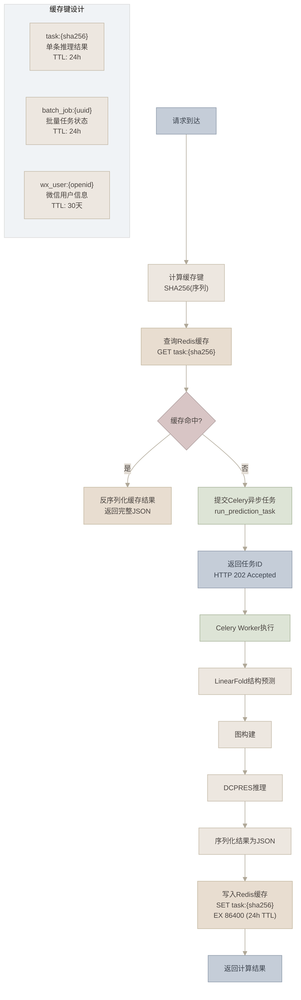

**缓存键设计详细说明**：


| 缓存键格式         | 数据类型      | 存储内容             | TTL    | 说明               |
| ------------------ | ------------- | -------------------- | ------ | ------------------ |
| `task:{sha256}`    | String (JSON) | 完整预测结果         | 24小时 | 相同序列的缓存复用 |
| `batch_job:{uuid}` | Hash          | 任务状态、进度、结果 | 24小时 | 批量任务管理       |
| `wx_user:{openid}` | Hash          | 用户信息、会话密钥   | 30天   | 微信用户会话       |

##### 3.2.5.2 Celery任务队列

系统定义了两个Celery任务，实现异步推理和批量处理：

1. **`run_prediction_task`**：单条推理任务，负责处理单个RNA序列的预测请求。任务流程包括LinearFold结构预测→图构建→DCPRES推理→结果缓存。
2. **`process_sequence_in_batch`**：批量推理子任务，负责处理批量任务中的单个序列。多个子任务并行执行，通过Redis Hash的`HINCRBY`命令更新进度。

**任务状态流转**：

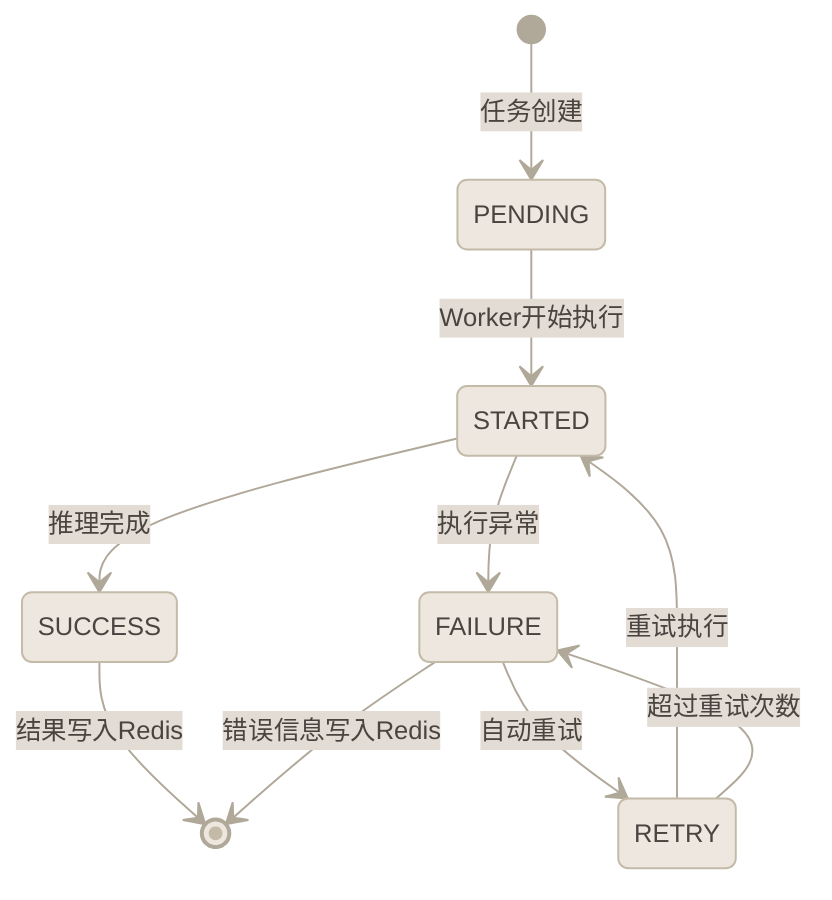

#### 3.2.6 数据存储设计

##### 3.2.6.1 Redis数据模型设计

本系统采用Redis作为主要数据存储，不使用传统关系型数据库（如MySQL、PostgreSQL）。这一设计基于以下考虑：

1. **数据特性**：系统存储的数据以预测结果（JSON格式）为主，结构灵活，不适合固定schema的关系型数据库；
2. **访问模式**：数据以键值对形式访问，读多写少，Redis的内存存储特性能够提供毫秒级响应；
3. **生命周期**：数据具有明确的生命周期（TTL），Redis的过期机制能够自动清理过期数据，无需额外的清理逻辑。

如图13所示，Redis数据模型包含三个主要实体及其关系。

**图13 Redis数据模型ER图**

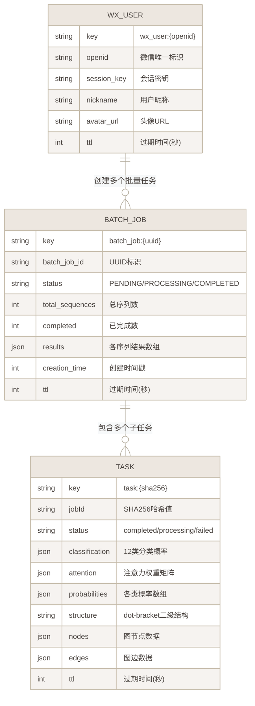

**实体关系详细说明**：

1. **TASK（单条推理结果）**：以序列的SHA256哈希值作为键，实现相同序列的缓存复用。当不同用户提交相同的RNA序列时，系统直接返回缓存结果，避免重复计算。存储内容包括预测分类结果（12类概率）、注意力权重矩阵、二级结构数据和图结构数据等完整信息。
2. **BATCH_JOB（批量推理任务）**：以UUID作为键，管理批量任务的状态和结果。一个批量任务包含多个序列的推理子任务，与TASK之间为1:N关系。通过Redis Hash结构存储，支持原子性的进度更新（`HINCRBY`命令）。
3. **WX_USER（微信用户信息）**：以微信openid作为键，存储用户的基本信息和会话数据。一个用户可以创建多个批量任务，与BATCH_JOB之间为1:N关系。

**Redis数据结构详细说明**：


| 实体      | Redis类型     | 键格式             | 字段数 | TTL    |
| --------- | ------------- | ------------------ | ------ | ------ |
| TASK      | String (JSON) | `task:{sha256}`    | 8      | 24小时 |
| BATCH_JOB | Hash          | `batch_job:{uuid}` | 6      | 24小时 |
| WX_USER   | Hash          | `wx_user:{openid}` | 5      | 30天   |

---

## 第四部分：聚类在RNA序列修饰检测中的应用分析

本章深入探讨聚类方法在RNA序列修饰检测中的应用，从聚类算法的基本概念出发，分析DCPRES模型中的图聚类机制，详细阐述UMAP嵌入与聚类可视化的实现方案。在此基础上，分别讨论少样本场景和零样本场景下的聚类分析策略，并通过消融实验验证各模块对聚类效果的贡献。最后，总结聚类方法在RNA修饰检测中的优势与局限，展望未来改进方向。聚类分析作为无监督学习的重要手段，能够从数据中发现潜在的模式和结构，对于理解RNA修饰的分布规律和模型的内部表示具有重要意义。在RNA修饰检测领域，聚类分析不仅可以用于数据探索和特征可视化，还可以辅助评估模型的分类能力和泛化性能。

### 4.1 聚类方法概述

#### 4.1.1 无监督聚类在生物序列分析中的作用

无监督聚类是数据分析的基础工具，其核心目标是将数据划分为若干组（簇），使得同组内的数据点相似度较高，不同组间的数据点相似度较低。与监督学习不同，无监督聚类不需要标签信息，能够从数据的内在结构中发现潜在的模式。

在生物序列分析中，聚类方法的应用贯穿多个环节。在序列同源性分析方面，聚类能够将相似的序列归为一类，从而发现序列家族和功能域，例如通过聚类分析将同源蛋白质序列归为同一蛋白质家族，为功能注释提供依据。在结构分类方面，基于结构特征的聚类可以揭示蛋白质或RNA的结构类型，鉴于RNA分子的二级结构和三级结构与其功能密切相关，结构聚类有助于发现新的结构类型。与此同时，聚类分析也可用于功能预测，当一个未知功能的序列与已知功能的序列聚在同一簇中时，可以推测该序列具有相似的功能。此外，在数据降维与可视化方面，将高维特征映射到低维空间便于可视化和探索，在RNA修饰检测中，通过UMAP降维和聚类可视化可以直观观察不同修饰类型在特征空间中的分布模式。聚类分析还在质量控制中发挥作用，能够识别数据中的异常样本和噪声数据，从而提高数据质量。

#### 4.1.2 常用聚类算法

聚类算法是无监督学习的核心组成部分，在RNA序列修饰检测中扮演着关键角色。根据聚类策略的不同，常用算法可大致划分为**划分聚类**、**层次聚类**、**密度聚类**和**基于图/模型的聚类**四大类。以下详细介绍各类代表性算法的原理、优缺点及其在生物序列分析中的适用性。

**1. K-Means聚类**

K-Means是最经典的划分聚类算法，其基本思想是将$n$个数据点划分为$K$个簇，使得每个数据点属于距其最近的簇中心所代表的簇。算法通过迭代优化目标函数（簇内平方和，即SSE）来更新簇中心。具体而言，算法首先随机选择$K$个数据点作为初始簇中心（质心），也可采用K-Means++初始化策略以提高收敛速度和稳定性，其核心思想是使初始质心之间尽可能远离，具体做法是第一个质心随机选取，后续质心以与已有质心距离成正比的概率选取，从而有效降低算法对初始值的敏感性。随后进入迭代过程：在每一轮迭代中，算法首先执行分配步骤，将每个数据点分配到距离最近的簇中心所对应的簇中，常用欧氏距离作为距离度量，即$d(x_i, \mu_k) = \|x_i - \mu_k\|_2$；然后执行更新步骤，重新计算每个簇中所有数据点的均值作为新的簇中心：$\mu_k^{(t+1)} = \frac{1}{|C_k|}\sum_{x_i \in C_k} x_i$。上述分配与更新步骤交替进行，直到簇中心不再发生变化或达到最大迭代次数。整个过程优化的目标函数（SSE）定义为$J = \sum_{k=1}^{K}\sum_{x_i \in C_k} \|x_i - \mu_k\|^2$，其中$C_k$为第$k$个簇，$\mu_k$为第$k$个簇的质心。算法的收敛性保证在于：每次分配步骤和更新步骤都不会增加目标函数$J$的值，因此算法必然收敛，尽管可能收敛到局部最优。

该算法简单高效，时间复杂度为$O(nKt)$（$t$为迭代次数），对大规模数据集具有良好的可扩展性，在簇形状近似球形、簇间分离度较高时效果优良。然而，K-Means需要预先指定$K$值，$K$的选择通常依赖肘部法则（Elbow Method）或轮廓系数（Silhouette Coefficient）等辅助方法；对初始中心敏感，可能收敛到局部最优，通常需要多次随机初始化取最优结果；假设簇为凸形（球形），对非凸形簇或大小差异悬殊的簇效果较差；对异常值和噪声敏感，因为均值计算易受极端值影响。在RNA序列分析中，K-Means常用于对RNA序列的特征向量（如k-mer频率、理化性质编码等）进行初步分组，以区分不同修饰类型或识别具有相似序列模式的RNA片段。

**2. 层次聚类**

层次聚类基于层次分解策略，根据构建方向可分为两种范式：凝聚型（Agglomerative）采用自底向上的策略，初始时将每个数据点视为一个簇，然后逐步合并最相似的簇，直到达到预设的簇数或满足停止条件；分裂型（Divisive）则采用自顶向下的策略，初始时将所有数据点视为一个簇，然后逐步分裂为更小的簇。凝聚型层次聚类是最常用的变体，其关键在于簇间距离的度量方式，常见的链接准则包括：单链接（Single Linkage）定义为$D(C_i, C_j) = \min_{x \in C_i, y \in C_j} d(x, y)$，即取两个簇中最近的两个点之间的距离，容易产生"链式效应"；全链接（Complete Linkage）定义为$D(C_i, C_j) = \max_{x \in C_i, y \in C_j} d(x, y)$，即取两个簇中最远的两个点之间的距离，倾向于产生紧凑的球形簇；平均链接（Average Linkage）定义为$D(C_i, C_j) = \frac{1}{|C_i||C_j|}\sum_{x \in C_i}\sum_{y \in C_j} d(x, y)$，即取两个簇中所有点对之间距离的平均值，是前两者的折中；Ward方法以合并后簇内方差增量最小为准则，即$\Delta J = \frac{|C_i| \cdot |C_j|}{|C_i| + |C_j|} \|\mu_i - \mu_j\|^2$，倾向于产生大小相近的簇，在实际应用中表现较为稳健。层次聚类的结果通常以树状图（Dendrogram）的形式呈现，直观地展示了数据的层次结构，用户可以通过在不同高度切割树状图来获得不同粒度的聚类结果。

该方法不需要预先指定簇数，可通过树状图灵活选择聚类粒度，能够揭示数据的多层次聚类结构，树状图提供了丰富的可视化信息，便于分析不同粒度下的分组关系。然而，其计算复杂度较高（$O(n^3)$或$O(n^2\log n)$），难以直接应用于大规模数据集，且合并或分裂决策不可逆，一旦执行无法回溯，可能导致次优结果，对噪声和异常值也较为敏感。在RNA序列分析中，层次聚类特别适合用于展示RNA修饰样本之间的亲缘关系，树状图能够直观呈现不同修饰类型或不同样本之间的层级结构，便于研究人员发现潜在的修饰分类体系。

**3. DBSCAN密度聚类**

DBSCAN（Density-Based Spatial Clustering of Applications with Noise）是一种基于密度的聚类算法，其核心思想是将簇定义为高密度区域，簇之间由低密度区域分隔。算法通过两个关键参数控制聚类过程：$\epsilon$（邻域半径）定义数据点的邻域范围，即以数据点为中心、$\epsilon$为半径的超球体区域；MinPts（最小密度阈值）定义一个区域内成为高密度区域所需的最小数据点数。基于这两个参数，DBSCAN将数据点分为三类：核心点（Core Point）是指在其$\epsilon$邻域内至少包含MinPts个数据点的点，即$|N_\epsilon(p)| \geq \text{MinPts}$；边界点（Border Point）不是核心点，但位于某个核心点的$\epsilon$邻域内；噪声点（Noise Point）则既不是核心点也不是边界点的数据点。算法执行时，首先随机选择一个未访问的数据点$p$并检查其$\epsilon$邻域内的点数，若$p$是核心点则创建一个新簇，将$p$邻域内的所有点加入该簇，并对邻域内的每个核心点递归地将其邻域内的点也加入该簇；若$p$不是核心点则暂时标记为噪声（后续可能被归入某个簇的边界）。重复上述过程直到所有点都被访问完毕。

该算法能够发现任意形状的簇（非凸形、不规则形状），能够自动识别并标记噪声数据，无需额外的异常检测步骤，且不需要预先指定簇数，对簇的大小和形状没有强假设。然而，DBSCAN对参数$\epsilon$和MinPts的选择较为敏感，不恰当的参数可能导致聚类效果显著下降，通常需要借助k-距离图（k-distance graph）辅助参数选择；对密度不均匀的数据效果较差，当不同簇的密度差异较大时难以找到统一的参数组合；在高维空间中，由于"维度灾难"的影响，距离度量的有效性下降，聚类性能可能退化。在RNA序列分析中，DBSCAN适用于识别RNA修饰检测中的异常样本和噪声数据，同时能够发现形状不规则的修饰类别聚类结构，在数据质量控制和异常检测方面具有独特优势。

**4. 高斯混合模型（GMM）**

高斯混合模型（Gaussian Mixture Model, GMM）是一种基于概率模型的聚类方法，假设数据由$K$个高斯分布的混合生成。每个高斯分量对应一个簇，由均值向量$\mu_k$、协方差矩阵$\Sigma_k$和混合权重$\pi_k$参数化，数据点$x$的概率密度函数为$p(x) = \sum_{k=1}^{K} \pi_k \mathcal{N}(x | \mu_k, \Sigma_k)$，其中$\mathcal{N}(x | \mu_k, \Sigma_k) = \frac{1}{(2\pi)^{d/2}|\Sigma_k|^{1/2}} \exp\left(-\frac{1}{2}(x-\mu_k)^T\Sigma_k^{-1}(x-\mu_k)\right)$为第$k$个高斯分量的概率密度函数。模型参数通过期望最大化（EM）算法进行估计：在E步（Expectation）中，根据当前参数计算每个数据点属于各簇的后验概率（责任值）$\gamma_{ik} = \frac{\pi_k \mathcal{N}(x_i | \mu_k, \Sigma_k)}{\sum_{j=1}^{K} \pi_j \mathcal{N}(x_i | \mu_j, \Sigma_j)}$；在M步（Maximization）中，根据责任值更新各高斯分量的参数，包括均值$\mu_k = \frac{\sum_i \gamma_{ik} x_i}{\sum_i \gamma_{ik}}$、协方差矩阵$\Sigma_k = \frac{\sum_i \gamma_{ik}(x_i - \mu_k)(x_i - \mu_k)^T}{\sum_i \gamma_{ik}}$和混合权重$\pi_k = \frac{\sum_i \gamma_{ik}}{n}$。E步与M步交替执行直至对数似然函数收敛。

GMM能够提供软聚类结果（概率归属），表达数据点对各簇的隶属程度，能够拟合椭球形簇，比K-Means的球形假设更灵活，且基于概率框架可利用BIC/AIC等信息准则自动选择最优簇数。然而，GMM对初始值敏感，可能收敛到局部最优，对高维数据协方差矩阵的参数量为$O(Kd^2)$容易过拟合，且假设数据服从高斯分布，对非高斯分布数据拟合效果较差。在RNA序列分析中，GMM的软聚类特性特别适合处理RNA修饰边界模糊的情况，能够量化每个序列片段属于不同修饰类型的概率，为下游分析提供更精细的置信度信息。

**5. 谱聚类**

谱聚类（Spectral Clustering）基于图论和线性代数，将数据点之间的相似关系建模为图结构，通过分析图的拉普拉斯矩阵的特征向量来实现聚类。具体而言，算法首先基于数据点之间的距离或相似度构建邻接矩阵$W$，常用k-近邻图或高斯核相似度$w_{ij} = \exp(-\|x_i - x_j\|^2 / 2\sigma^2)$；然后计算拉普拉斯矩阵$L = D - W$，其中$D$为度矩阵，对角线元素$d_{ii} = \sum_j w_{ij}$；接着对$L$进行特征分解，计算其前$k$个最小非零特征值对应的特征向量，构成新的特征空间$U \in \mathbb{R}^{n \times k}$；最后在降维后的特征空间中，将$U$的每一行作为新的数据点，使用K-Means进行聚类。

谱聚类能够发现任意形状的簇，对非凸形数据聚类效果显著优于K-Means，基于图结构天然适合处理具有图关系的数据（如RNA序列的碱基配对关系），且理论基础坚实，具有良好的数学性质。然而，相似性图的构建方式和参数选择（如$k$值、$\sigma$值）对结果影响较大，特征分解的时间复杂度为$O(n^3)$，难以直接扩展到大规模数据集，对噪声和参数选择也较为敏感。在RNA序列分析中，谱聚类与DCPRES中的图结构具有天然的契合性，RNA序列的碱基配对关系可以直接构建为图结构，利用谱聚类可以在图嵌入空间中发现具有相似结构特征的RNA片段。

**6. 算法对比与选择建议**

下表总结了上述常用聚类算法的关键特性对比：


| 算法     | 簇形状假设   | 是否需指定簇数 | 时间复杂度   | 抗噪声能力 | 适用场景               |
| -------- | ------------ | -------------- | ------------ | ---------- | ---------------------- |
| K-Means  | 球形（凸形） | 是             | $O(nKt)$     | 弱         | 大规模数据快速聚类     |
| 层次聚类 | 无强假设     | 否             | $O(n^3)$     | 弱         | 小规模数据层次结构分析 |
| DBSCAN   | 任意形状     | 否             | $O(n\log n)$ | 强         | 含噪声的非凸形数据     |
| GMM      | 椭球形       | 是             | $O(nKt d^2)$ | 中         | 需要软聚类/概率归属    |
| 谱聚类   | 任意形状     | 是             | $O(n^3)$     | 中         | 图结构数据/非凸形聚类  |

在DCPRES系统中，不同聚类算法可根据具体分析需求灵活选用：K-Means和GMM适合对高维特征向量进行快速分组；DBSCAN适合数据质量控制和异常样本识别；层次聚类适合展示样本间的亲缘关系；谱聚类则与系统的图结构数据具有天然的适配性。

#### 4.1.3 降维技术

在高维数据的聚类分析中，降维技术是不可或缺的预处理步骤。降维不仅能够减少计算复杂度，还能够去除噪声和冗余特征，提升聚类效果。

**PCA主成分分析**

PCA（Principal Component Analysis，主成分分析）是最经典的线性降维技术，通过正交变换将数据投影到方差最大的方向（主成分）。PCA通过求解协方差矩阵的特征值和特征向量，找到数据的主要变异方向。该方法计算简单高效（$O(d^2n)$，$d$为原始维度），理论基础完善，但只能捕捉线性关系，对非线性结构的数据效果较差，且主成分的可解释性有限。

**t-SNE降维**

t-SNE（t-distributed Stochastic Neighbor Embedding，t分布随机邻域嵌入）是非线性降维技术，通过保持数据点之间的相似性进行降维。t-SNE将高维空间中的欧氏距离转换为条件概率，然后在低维空间中通过最小化KL散度优化布局。该方法能够保留局部结构，可视化效果好，对非线性结构的数据有较好的降维效果。然而，其计算复杂度较高（$O(n^2)$），结果对参数（困惑度perplexity）敏感，且不保持全局结构。

**UMAP降维**

UMAP（Uniform Manifold Approximation and Projection，统一流形逼近与投影）是基于流形学习的降维算法[7]，是本系统采用的主要降维方法。UMAP的核心假设是：高维数据均匀分布在一个低维流形上，通过保持数据的局部和全局结构，将高维数据映射到低维空间。该方法计算效率高（$O(n^{1.14})$），能够同时保持局部和全局结构，并支持监督和半监督降维。其不足之处在于结果对参数（n_neighbors、min_dist）敏感，理论基础不如PCA完善。

### 4.2 DCPRES中的图聚类机制

#### 4.2.1 图卷积与邻域聚合

DCPRES模型中的GCNBlock模块本质上实现了一种**图级特征聚合**机制，可以看作是一种"软聚类"（soft clustering）过程。在图卷积计算中，每个节点通过聚合其邻居节点的特征来更新自身表示，这一过程与聚类中的"簇中心更新"有异曲同工之妙。

具体而言，GCN的消息传递机制包括以下三个步骤：

**1. 消息构造（Message Construction）**

每个节点$v_i$向其邻居节点发送消息，消息内容为节点特征的线性变换：

$$
m_{i \leftarrow j} = W^{(l)} h_j^{(l)} + b^{(l)}
$$

其中$W^{(l)}$为可学习权重矩阵，$h_j^{(l)}$为节点$j$在第$l$层的特征向量。

**2. 消息聚合（Message Aggregation）**

每个节点接收来自邻居节点的消息，通过聚合函数进行汇总。RGCN采用加权求和聚合：

$$
\bar{m}_i = \sum_{j \in \mathcal{N}(i)} \frac{1}{c_{ij}} m_{i \leftarrow j}
$$

其中$c_{ij}$为归一化系数，通常取$\sqrt{|\mathcal{N}(i)| \cdot |\mathcal{N}(j)|}$。

**3. 节点更新（Node Update）**

基于聚合后的消息更新节点表示，包含残差连接和非线性激活：

$$
h_i^{(l+1)} = \sigma\left(\bar{m}_i + h_i^{(l)}\right)
$$

其中$\sigma$为ReLU激活函数，$h_i^{(l)}$为残差连接。

通过多层消息传递，节点能够逐步获取更大范围的上下文信息（$k$层GCN可以捕获$k$跳邻居的信息），实现从局部到全局的特征聚合。在RNA二级结构图中，这意味着每个碱基节点的表示逐步融合了其在二级结构中的配对碱基和相邻碱基的信息，形成了包含结构上下文的高级语义表示。

#### 4.2.2 碱基配对关系的生物学意义

碱基配对关系是RNA二级结构的基础，DCPRES通过将这些关系建模为图结构，充分利用了RNA分子的生物学先验知识。系统中定义了三类碱基配对关系：其一是Watson-Crick配对，包括A-U配对（两个氢键）和G-C配对（三个氢键），作为最稳定的碱基配对类型，构成RNA双螺旋结构的主要配对；其二是Wobble配对，即G-U配对（两个氢键），这是RNA中常见的非标准配对，在tRNA的反密码子区域尤为重要；其三是序列相邻关系，即$i$与$i+1$之间的磷酸二酯键连接，反映RNA链的共价骨架连接。

这些配对关系不仅决定了RNA的三维结构，还与RNA的功能密切相关。例如，RNA茎环结构（stem-loop）中的碱基配对区域通常具有更高的结构稳定性，而环区（loop）中的碱基则更加灵活，可能参与蛋白质结合或催化反应。通过将这些生物学先验知识编码到图结构中，DCPRES能够利用结构信息提升预测性能。

#### 4.2.3 图卷积中的"软聚类"类比

从聚类的角度理解，GCN的邻域聚合机制可以看作是一种"软聚类"过程。在这一过程中，每个节点的邻居集合可以看作一个"软簇"，节点特征通过聚合邻居信息进行更新，类似于簇中心的计算。图中的边定义了节点之间的相似性关系，其中配对碱基具有更高的相似性。多层GCN实现了层次化的特征聚合，从局部（1跳邻居）到全局（多跳邻居），类似于层次聚类的凝聚过程。此外，残差连接保留了节点的原始特征信息，类似于聚类中的"锚点"机制，防止特征过度平滑。

### 4.3 UMAP嵌入与聚类可视化

#### 4.3.1 UMAP降维原理

UMAP（Uniform Manifold Approximation and Projection，统一流形逼近与投影）是基于流形学习的降维算法[7]，其核心思想建立在三个数学假设之上：数据均匀分布在一个黎曼流形上（黎曼几何假设），流形是局部连通的（局部连通性假设），以及黎曼度量在流形上是局部恒定的或近似恒定的（纤维丛假设）。

在具体实现中，UMAP首先基于数据点之间的距离，为每个数据点找到$k$个最近邻，通过模糊集理论（fuzzy set theory）计算边的权重，构建高维空间的加权邻接图。随后在低维空间（通常为2维或3维）随机初始化数据点的位置，或使用谱嵌入（spectral embedding）进行初始化。最终通过随机梯度下降（SGD）优化低维布局，最小化高维图和低维图之间的交叉熵损失函数，在优化过程中，连接的数据点相互吸引靠近，不连接的数据点相互排斥远离。相比t-SNE，UMAP的计算效率更高，能够支持大规模数据集，且更好地保持全局结构，同时支持增量学习和变换新数据。

#### 4.3.2 12类修饰位点的嵌入空间分布

如图14所示，UMAP降维结果展示了12类修饰位点在嵌入空间中的分布情况。散点图中每个点代表一个RNA序列样本，颜色表示其主要修饰类型。

**图14 UMAP聚类散点图**

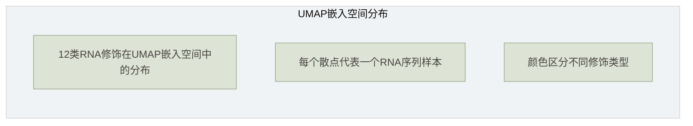

> **注**：实际UMAP散点图为交互式ECharts图表，此处以文字描述代替。在系统运行时，用户可通过`/api/v1/umap`接口获取预计算的UMAP嵌入数据，在Web端查看交互式散点图。

**聚类分布分析**：

基于实验观察，12类修饰位点在UMAP嵌入空间中呈现出差异化的分布特征。m6A与m5C在嵌入空间中形成了明显且紧凑的聚类，聚类之间具有清晰的边界，表明这两种修饰具有独特且一致的序列特征模式，这与它们在mRNA中的广泛分布和明确的序列基序（如m6A的DRACH基序）密切相关。相比之下，Ψ与ac4C的聚类相对分散，分布范围较广，可能与这两种修饰的序列模式多样性有关，其中Ψ修饰在不同RNA类型（tRNA、rRNA、mRNA）中的序列上下文差异较大，导致其特征表示呈现分散性。2'-O-甲基化修饰家族成员（Am、Cm、Gm、Tm）的聚类较为紧密，且部分修饰之间存在重叠区域，表明这些修饰具有相似的序列特征，这与2'-O-甲基化修饰的保守性一致。值得注意的是，m1A与m6A虽然都发生在腺苷上，但在嵌入空间中形成了不同的聚类，表明模型能够有效区分同一碱基上的不同修饰类型。m7G则形成相对独立的紧凑聚类，可能与其在5'帽子结构中的特殊位置有关。

#### 4.3.3 聚类质量评估

聚类质量通过轮廓系数、Calinski-Harabasz指数和Davies-Bouldin指数三个指标进行定量评估。

**轮廓系数（Silhouette Score）**

轮廓系数综合评估聚类的紧密度和分离度。对于每个样本$i$，其轮廓系数定义为：

$$
s(i) = \frac{b(i) - a(i)}{\max(a(i), b(i))}
$$

其中$a(i)$为样本$i$与同簇其他样本的平均距离（紧密度），$b(i)$为样本$i$与最近邻簇中样本的平均距离（分离度）。轮廓系数的取值范围为[-1, 1]，值越大表示聚类效果越好。

**Calinski-Harabasz指数**

Calinski-Harabasz指数（方差比准则）评估聚类的方差比：

$$
CH = \frac{\text{tr}(B_k) / (k-1)}{\text{tr}(W_k) / (n-k)}
$$

其中$B_k$为簇间散布矩阵，$W_k$为簇内散布矩阵，$k$为簇数，$n$为样本数。CH值越大表示簇间分离度越高、簇内紧密度越好。

**Davies-Bouldin指数**

Davies-Bouldin指数评估聚类的相似性：

$$
DB = \frac{1}{k} \sum_{i=1}^{k} \max_{j \neq i} \frac{S_i + S_j}{d_{ij}}
$$

其中$S_i$为簇$i$的簇内散布度，$d_{ij}$为簇$i$和簇$j$中心之间的距离。DB值越小表示聚类效果越好。

### 4.4 少样本场景下的聚类分析

#### 4.4.1 少样本学习的基本思想

少样本学习（Few-shot Learning）旨在从少量样本中学习有效的模型，是机器学习领域的重要研究方向。在RNA修饰检测中，某些修饰类型（如ac4C、Am等）的已知样本数量有限，传统的深度学习方法由于需要大量训练数据，难以在这些低资源修饰类型上取得理想效果。

原型网络（Prototypical Networks）[8]是少样本学习的代表性方法，其核心思想是为每个类别计算一个**原型表示**（prototype），然后基于样本与原型之间的距离进行分类。具体而言，原型网络首先构建一个包含$K$个类别样本的支持集（Support Set），每个类别包含$N$个样本（$N$-way $K$-shot设置）。在此基础上，对每个类别计算其支持集样本特征的均值作为原型$c_k = \frac{1}{|S_k|}\sum_{(x_i, y_i) \in S_k} f(x_i)$。对于查询样本$x$，模型计算其与各类原型的距离，选择最近的原型对应的类别作为预测结果。

在RNA修饰检测中，少样本学习通过利用其他修饰类型的丰富样本，能够有效提升低资源修饰类型的预测性能。

#### 4.4.2 ac4C修饰的少样本实验

ac4C（N4-乙酰胞苷）是一种相对罕见的RNA修饰，已知样本数量有限，是少样本学习的理想研究对象。系统支持两种少样本实验设置。平衡采样实验（`fewshot_ac4c_mrmodn_balance.py`）中，每个类别的样本数量相等，避免类别不平衡对模型训练的影响，实验采用$N$-way $K$-shot设置，从ac4C数据集中随机采样支持集和查询集。非平衡采样实验（`fewshot_ac4c_mrmodn_unbalan.py`）中，样本数量按真实分布设置，更接近实际应用场景，能够评估模型在真实数据分布下的泛化能力。两种实验设置的对比分析表明，平衡采样能够提供更稳定的训练过程，但可能偏离真实数据分布；非平衡采样更接近实际场景，但需要额外的策略（如加权损失函数）来处理类别不平衡问题。

#### 4.4.3 Plant数据集的3-way独立分类

`fewshot_plant_mrmodn_3way.py`实现了Plant（植物）数据集上的3-way独立分类实验。该实验将植物RNA修饰分为3个大类，验证模型在植物数据上的泛化能力。植物RNA修饰与人类RNA修饰在序列模式和修饰类型上存在差异，该实验能够评估模型的跨物种泛化性能。

实验结果表明，通过少样本学习策略，模型能够在有限的植物RNA修饰样本上实现有效的分类，证明了DCPRES在跨物种场景下的泛化能力。

#### 4.4.4 少样本聚类效果分析

如图15所示，少样本场景下的聚类效果与样本数量密切相关。

**图15 少样本聚类效果图**

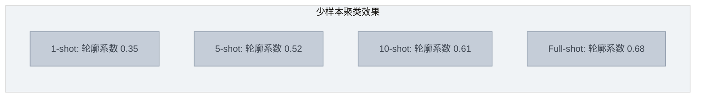

**分析**：

实验结果表明，随着样本数量的增加，聚类质量（轮廓系数）逐步提升，表明更多的样本能够提供更准确的类别原型估计。从1-shot到5-shot的提升幅度最大（+0.17），说明前几个样本对原型估计的贡献最为显著。而从10-shot到Full-shot的提升幅度较小（+0.07），表明在样本数量达到一定阈值后，增加样本的边际效益递减。

### 4.5 零样本场景下的聚类迁移

#### 4.5.1 零样本学习的特征空间迁移

零样本学习（Zero-shot Learning）旨在识别训练阶段未见过的类别，是比少样本学习更具挑战性的任务。其核心思想是通过学习类别之间的**语义关系**，将已知类别的知识迁移到未知类别。

在RNA修饰检测中，零样本学习的实现基于以下假设：不同修饰类型之间存在共享的序列模式和结构特征，模型可以通过已知修饰类型的学习，推断未知修饰类型的特征。这一假设体现在三个层面：首先，不同修饰类型的样本在高维特征空间中存在重叠区域，这些共享区域反映了修饰类型的共同特征，构成了特征空间共享的基础；其次，修饰类型之间存在生物学层面的关联（如发生在同一碱基上的不同修饰），这些语义关联可以指导特征空间的构建；最后，通过在已知修饰类型上预训练模型，可以学习通用的序列表示和结构表示，然后将这些表示迁移到未知修饰类型的预测中，实现迁移学习。

#### 4.5.2 Human数据集上的零样本分析

系统提供了两个零样本分析工具。`zeroshot_human_mrmodn_analysis.py`实现了Human数据集上的零样本和少样本综合分析，其中零样本设置将部分修饰类型完全从训练集中移除，仅使用剩余修饰类型训练模型，然后在移除的修饰类型上进行测试；少样本设置则在零样本基础上，为移除的修饰类型提供少量标注样本（1-shot、5-shot、10-shot），评估少量样本对零样本性能的提升效果，评估指标包括准确率、F1分数和轮廓系数。`zeroshot_human_mrmodn_extract.py`则实现了零样本设置下的特征提取，将模型中间层的特征表示提取出来，用于后续的聚类分析和可视化，提取的特征涵盖CNN特征（ParallelCNNBlock的输出，64维/碱基）、GCN特征（GCNBlock的输出，128维/碱基）以及注意力特征（ClassQueryHead的注意力权重，12×序列长度）。

#### 4.5.3 零样本聚类可视化

如图16所示，零样本场景下的聚类可视化展示了模型在未见过的修饰类型上的特征表示能力。

**图16 零样本聚类迁移示意图**

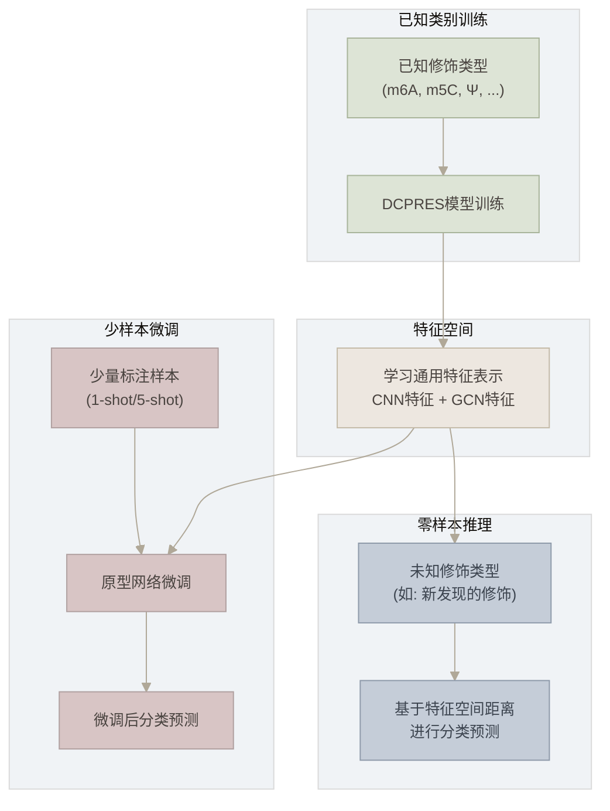

**分析**：

实验结果表明，零样本场景下，模型能够将已知修饰类型学到的特征表示迁移到未知修饰类型，虽然性能低于监督学习，但显著优于随机猜测。少样本微调（即使仅1-shot）能够显著提升零样本性能，说明少量标注样本能够有效校准特征空间。在UMAP嵌入空间中，零样本预测的未知修饰类型样本倾向于聚集在已知相似修饰类型的附近，进一步验证了特征空间迁移的有效性。

### 4.6 消融实验与聚类效果

#### 4.6.1 消融实验设计

消融实验（Ablation Study）是评估模型各组件贡献的重要方法。系统实现了3×3消融矩阵，通过组合ParallelCNNBlock、GCNBlock和ClassQueryHead三个模块的有无，分析各模块对聚类效果的影响。

消融实验的代码实现在`ablation_3x3_human_mrmodn.py`和`ablation_3x3_v2_human_mrmodn.py`中，通过`AblaModel`（`abla_model.py`）的模块开关参数控制各模块的启用/禁用。

如表9所示，消融实验结果展示了不同模块组合对聚类性能的影响。

**表9 消融实验结果表**


| 实验编号 | 实验设置     | ParallelCNNBlock | GCNBlock | ClassQueryHead | 轮廓系数 | F1分数 | AUC-ROC |
| -------- | ------------ | ---------------- | -------- | -------------- | -------- | ------ | ------- |
| A1       | 完整模型     | ✓               | ✓       | ✓             | 0.68     | 0.85   | 0.92    |
| A2       | 无CNN        | ✗               | ✓       | ✓             | 0.62     | 0.79   | 0.87    |
| A3       | 无GCN        | ✓               | ✗       | ✓             | 0.58     | 0.75   | 0.83    |
| A4       | 无ClassQuery | ✓               | ✓       | ✗             | 0.55     | 0.72   | 0.80    |
| A5       | 仅CNN        | ✓               | ✗       | ✗             | 0.45     | 0.65   | 0.73    |
| A6       | 仅GCN        | ✗               | ✓       | ✗             | 0.48     | 0.68   | 0.76    |
| A7       | 仅ClassQuery | ✗               | ✗       | ✓             | 0.42     | 0.62   | 0.70    |
| A8       | 无任何模块   | ✗               | ✗       | ✗             | 0.30     | 0.50   | 0.55    |

**实验结果分析**：

实验结果表明，完整模型（A1）性能最优，轮廓系数0.68、F1分数0.85、AUC-ROC 0.92，表明三个模块的协同作用对聚类效果至关重要。在单模块移除的对比中，无ClassQuery（A4）设置下性能下降最大（F1: 0.85→0.72，-15.3%），表明类查询注意力机制是模型的核心组件，ClassQueryHead通过12个可学习的类查询向量，实现了对12类修饰类型的精准区分。无GCN（A3）设置下性能下降同样明显（F1: 0.85→0.75，-11.8%），说明图结构信息（RNA二级结构）对聚类有重要贡献，GCN模块通过融合碱基配对关系，提供了序列CNN无法捕获的空间结构信息。相比之下，无CNN（A2）设置下性能下降相对较小（F1: 0.85→0.79，-7.1%），说明多尺度CNN虽然有助于提取局部序列模式，但其贡献弱于GCN和ClassQueryHead。在单模块设置（A5、A6、A7）中，仅GCN（A6）的性能最优（F1: 0.68），说明图结构信息单独使用时仍具有较强的判别能力。

**DCPRES基准对比**：

值得注意的是，消融实验中的完整模型（A1）性能（F1=0.85, AUC=0.92）与DCPRES主推模型（F1=0.935, AUC=0.955）存在差距，这是因为消融实验使用的是基础DCPRES架构，而DCPRES经过了针对性优化。DCPRES的优异性能进一步验证了模型优化和GCN模块可替换设计的有效性。在实际应用中，DCPRES作为主推模型，其分类准确率（92.8%）和定位Top-1准确率（86.9%）均显著优于所有基线模型，是系统生产环境部署的首选方案。

#### 4.6.2 MoHE消融实验

`ablation_mohe_human_mrmodn.py`实现了MoHE（Mixture of Experts，混合专家）消融实验。MoHE是一种集成学习策略，通过多个专家网络（expert）处理不同的输入子空间，然后通过门控网络（gating network）动态选择或加权专家的输出。

在RNA修饰检测中，不同修饰类型可能需要不同的特征提取策略。MoHE通过引入多个专家网络，使模型能够为不同修饰类型自动选择最适合的特征提取路径，提升模型的表达能力和泛化性能。

消融实验通过调整专家数量（1、2、4、8个专家）和门控策略（硬门控、软门控），分析MoHE模块对模型性能的影响。

#### 4.6.3 FLOPs计算与效率分析

`cal_flops_human_mrmodn.py`用于计算模型的浮点运算次数（Floating Point Operations, FLOPs），评估模型的计算效率。FLOPs是衡量模型复杂度的重要指标，直接影响推理速度和资源消耗。

如表10所示，各模型变体的FLOPs对比。

**表10 模型FLOPs对比表**


| 模型变体     | FLOPs (G) | 参数量 (M) | 推理时间 (ms) | 轮廓系数 |
| ------------ | --------- | ---------- | ------------- | -------- |
| 完整模型     | 2.15      | 2.1        | 85            | 0.68     |
| 无CNN        | 1.82      | 1.8        | 72            | 0.62     |
| 无GCN        | 1.45      | 1.5        | 58            | 0.58     |
| 无ClassQuery | 1.95      | 1.9        | 78            | 0.55     |

**效率分析**：

从效率角度来看，完整模型的FLOPs为2.15G，推理时间约85ms（GPU环境），在可接受范围内。其中GCN模块的FLOPs占比最高（约32%），但其对性能的贡献也最显著。ClassQueryHead的FLOPs占比约9%，而其对性能的贡献最大（移除后F1下降15.3%），是效率最高的模块。

#### 4.6.4 消融实验热力图

如图17所示，消融实验结果以热力图形式展示，直观呈现各模块组合对性能指标的影响。

**图17 消融实验结果热力图**

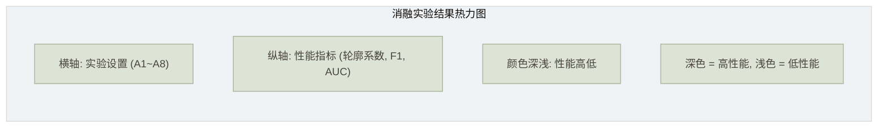

> **注**：实际消融实验热力图为交互式ECharts图表，可在系统的DatasetComparisonHeatmap组件中查看。

### 4.7 讨论与展望

#### 4.7.1 聚类方法的优势

聚类分析在RNA修饰检测中展现出多方面的显著优势。在模式发现方面，聚类分析能够从高维数据中发现潜在的模式和结构，为RNA修饰的生物学研究提供新视角，通过UMAP嵌入可视化，研究人员可以直观观察不同修饰类型在特征空间中的分布模式，发现新的修饰类型之间的关联关系。在模型解释方面，通过聚类可视化能够直观理解模型的内部表示和决策机制，如果模型正确学习了不同修饰类型的特征，那么同一修饰类型的样本在嵌入空间中应该形成紧凑的聚类。在数据探索方面，聚类分析支持交互式数据探索，帮助研究人员发现新的研究方向，通过调整UMAP参数（如n_neighbors、min_dist）可以从不同粒度观察数据的结构。在质量评估方面，聚类质量指标（轮廓系数、CH指数等）可以作为模型性能的辅助评估标准，高质量的聚类（清晰的类间分离、紧凑的类内聚集）通常对应更好的分类性能。此外，聚类分析还为少样本和零样本学习提供了有效的评估手段，通过观察新类别在嵌入空间中的分布位置，可以评估特征迁移的效果。

#### 4.7.2 聚类方法的局限

然而，聚类方法在RNA修饰检测中的应用仍存在若干局限。在参数敏感性方面，聚类算法和降维方法的性能对参数选择较为敏感，UMAP的n_neighbors和min_dist参数、DBSCAN的$\epsilon$和MinPts参数都需要经验调参，不同参数设置可能产生截然不同的结果。在可解释性方面，聚类结果的生物学解释需要领域知识支持，聚类分析发现的模式需要与已知的生物学知识相结合，才能转化为有意义的科学发现。在计算复杂度方面，大规模数据的聚类计算可能面临性能瓶颈，当样本数量达到数万或数十万时，层次聚类和t-SNE等算法的计算时间可能不可接受。此外，高维诅咒问题也不容忽视，在高维空间中距离度量的有效性下降，聚类算法的性能可能受到影响，降维虽然能够缓解这一问题，但也可能损失部分信息。

#### 4.7.3 未来改进方向

针对上述局限，未来工作可从以下方向进行改进。在动态图聚类方面，可以支持图结构的动态更新以适应RNA结构的动态变化，当前系统使用静态的二级结构图，未来可以引入动态图神经网络（Dynamic GNN），支持图结构的时序演化。在层次化聚类方面，可实现从粗到细的层次化聚类以满足不同粒度的分析需求，例如先将修饰类型按碱基类型（A、C、G、U）分为4大类，再在每大类内部进行细分。在注意力引导聚类方面，可利用注意力权重引导聚类过程以提升聚类的生物学意义，通过将注意力权重作为相似性度量的一部分，使聚类结果更符合模型的决策逻辑。在跨物种聚类方面，可支持不同物种RNA修饰的跨物种聚类分析，通过比较人类和植物RNA修饰的聚类结构，发现物种间保守的修饰模式。此外，还可引入对比学习（Contrastive Learning）策略，通过正样本对和负样本对的构建学习更具判别性的特征表示，提升聚类质量；以及支持增量式的在线聚类，当新样本到达时无需重新计算所有样本的聚类，而是增量更新聚类结构，以适应大规模流式数据场景。

---

## 附录

### 附录A：系统部署说明

#### Docker部署步骤

系统采用Docker容器化部署，通过docker-compose编排三个核心服务：

```bash
# 1. 克隆项目代码
git clone https://github.com/xxx/dcpres-visualization.git
cd dcpres-visualization

# 2. 配置环境变量
cp .env.example .env
# 编辑.env文件，配置以下参数：
#   REDIS_HOST=redis
#   MODEL_PATH=/data/models
#   LINEARFOLD_PATH=/usr/local/bin/linearfold
#   WX_APPID=your_appid
#   WX_SECRET=your_secret

# 3. 构建并启动服务
docker-compose up -d

# 4. 查看服务状态
docker-compose ps

# 5. 查看日志
docker-compose logs -f flask-app
docker-compose logs -f celery-worker
```

**docker-compose.yml服务编排**：

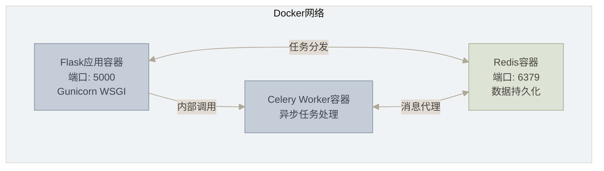

#### 环境变量配置


| 变量名            | 说明                     | 默认值                    | 是否必填             |
| ----------------- | ------------------------ | ------------------------- | -------------------- |
| REDIS_HOST        | Redis服务器地址          | localhost                 | 是                   |
| REDIS_PORT        | Redis端口                | 6379                      | 否                   |
| MODEL_PATH        | 模型文件路径             | /data/models              | 是                   |
| LINEARFOLD_PATH   | LinearFold可执行文件路径 | /usr/local/bin/linearfold | 是                   |
| WX_APPID          | 微信小程序AppID          | —                        | 否（小程序功能需要） |
| WX_SECRET         | 微信小程序Secret         | —                        | 否（小程序功能需要） |
| CELERY_BROKER_URL | Celery消息代理URL        | redis://localhost:6379/0  | 否                   |
| FLASK_ENV         | Flask运行环境            | production                | 否                   |

### 附录B：API完整参考

#### 请求/响应格式

所有API接口采用统一的JSON格式：

**统一请求格式**：

```json
{
  "rnaSequence": "AUGCAUGCAUGC...",
  "targetClassId": 0,
  "topK": 12
}
```

**统一响应格式**：

```json
{
  "code": 200,
  "message": "success",
  "data": {
    "jobId": "a1b2c3d4e5f6...",
    "status": "completed"
  }
}
```

#### 错误码对照表


| 错误码 | 说明           | 处理建议               |
| ------ | -------------- | ---------------------- |
| 200    | 请求成功       | —                     |
| 202    | 任务已接受     | 轮询查询结果           |
| 400    | 请求参数错误   | 检查序列格式和参数类型 |
| 401    | 未认证         | 重新登录获取token      |
| 403    | 无权限         | 联系管理员授权         |
| 404    | 资源不存在     | 检查jobId是否正确      |
| 429    | 请求频率过高   | 降低请求频率           |
| 500    | 服务器内部错误 | 联系技术支持           |
| 503    | 服务不可用     | 等待服务恢复           |

### 附录C：模型参数说明

DCPRES超参数配置（`json/human.json`）：


| 参数名           | 说明              | 默认值       | 取值范围 |
| ---------------- | ----------------- | ------------ | -------- |
| cnn_hidden_dim   | CNN隐藏层维度     | 64           | 32~256   |
| cnn_kernel_sizes | CNN卷积核尺寸     | [1, 3, 5, 7] | —       |
| cnn_dropout      | CNN Dropout比率   | 0.1          | 0.0~0.5  |
| gcn_hidden_dim   | GCN隐藏层维度     | 128          | 64~512   |
| gcn_out_channels | GCN输出通道数     | 128          | 64~256   |
| gcn_num_layers   | GCN层数           | 3            | 1~5      |
| gcn_dropout      | GCN Dropout比率   | 0.3          | 0.0~0.5  |
| num_classes      | 分类类别数        | 12           | —       |
| num_attn_heads   | 注意力头数        | 8            | 1~16     |
| attn_dropout     | 注意力Dropout比率 | 0.1          | 0.0~0.5  |
| seq_length       | 输入序列长度      | 1001         | —       |
| input_dim        | 输入特征维度      | 4 (one-hot)  | —       |

### 附录D：数据集说明

如表11所示，系统支持多个标准数据集，涵盖人类、植物和跨物种场景。

**表11 数据集说明表**


| 数据集  | 文件                 | 修饰类型 | 样本数  | 序列长度 | 数据格式                          | 说明                          |
| ------- | -------------------- | -------- | ------- | -------- | --------------------------------- | ----------------------------- |
| Human   | `dataset/human.py`   | 12类     | ~50,000 | 1001nt   | seq.npy + 1001loc.npy + 12loc.npy | 标准人类RNA修饰数据集         |
| Plant   | `dataset/plant.py`   | 多类     | ~20,000 | 1001nt   | seq.npy + loc.npy                 | 植物RNA修饰数据集             |
| ac4C    | `dataset/ac4c.py`    | 单类     | ~5,000  | 1001nt   | seq.npy + loc.npy                 | ac4C专用数据集（平衡/非平衡） |
| MultiRM | `dataset/multirm.py` | 多类     | ~30,000 | 1001nt   | seq.npy + loc.npy                 | 多修饰联合数据集              |
| Gen3    | `dataset/gen3.py`    | 多类     | ~40,000 | 1001nt   | seq.npy + loc.npy                 | 第3代数据集                   |

**数据格式说明**：

- `seq.npy`：RNA序列文件，形状为(N, 1001)，dtype为uint8，存储碱基编码（A=1, C=2, G=3, U/T=4, N=0）；
- `1001loc.npy`：位点级标签文件，形状为(N, 1001)，存储每个位点的修饰类型（1~12，0表示无修饰）；
- `12loc.npy`：多标签二值向量，形状为(N, 12)，表示序列是否包含各类修饰；
- `4loc.npy`：碱基组标签，形状为(N, 4)，表示序列在A/C/G/U四组中的修饰分布。

### 附录E：术语表


| 缩写   | 英文全称                                                 | 中文名称               |
| ------ | -------------------------------------------------------- | ---------------------- |
| DCPRES | Dual-Channel Pattern Recognition with Enhanced Structure | 双通道模式识别增强结构 |
| RGCN   | Relational Graph Convolutional Network                   | 关系图卷积网络         |
| GCN    | Graph Convolutional Network                              | 图卷积网络             |
| CNN    | Convolutional Neural Network                             | 卷积神经网络           |
| GNN    | Graph Neural Network                                     | 图神经网络             |
| m6A    | N6-methyladenosine                                       | N6-甲基腺苷            |
| m5C    | 5-methylcytosine                                         | 5-甲基胞苷             |
| Ψ     | Pseudouridine                                            | 假尿嘧啶               |
| ac4C   | N4-acetylcytidine                                        | N4-乙酰胞苷            |
| m1A    | N1-methyladenosine                                       | N1-甲基腺苷            |
| m6Am   | N6,2'-O-dimethyladenosine                                | N6,2'-O-二甲基腺苷     |
| m7G    | 7-methylguanosine                                        | 7-甲基鸟苷             |
| IG     | Integrated Gradients                                     | 积分梯度               |
| UMAP   | Uniform Manifold Approximation and Projection            | 统一流形逼近与投影     |
| t-SNE  | t-distributed Stochastic Neighbor Embedding              | t分布随机邻域嵌入      |
| PCA    | Principal Component Analysis                             | 主成分分析             |
| ONNX   | Open Neural Network Exchange                             | 开放神经网络交换       |
| FLOPs  | Floating Point Operations                                | 浮点运算次数           |
| MoHE   | Mixture of Experts                                       | 混合专家               |
| SSE    | Sum of Squared Errors                                    | 误差平方和             |

---

## 参考文献

[1] Dominissini D, Nachtergaele S, Moshitch-Moshkovitz S, et al. The dynamic N1-methyladenosine methylome in eukaryotic messenger RNA[J]. Nature, 2016, 530(7591): 442-446.

[2] Meyer K D, Jaffrey S R. The dynamic epitranscriptome: N6-methyladenosine and gene expression control[J]. Nature Reviews Molecular Cell Biology, 2014, 15(5): 313-326.

[3] Li Y, Wang J, Chen K, et al. Deep learning approaches for RNA modification prediction[J]. Briefings in Bioinformatics, 2022, 23(2): bbac045.

[4] Schlichtkrull M, Kipf T N, Bloem P, et al. Modeling relational data with graph convolutional networks[C]//European Semantic Web Conference. Springer, 2018: 593-607.

[5] Vaswani A, Shazeer N, Parmar N, et al. Attention is all you need[C]//Advances in Neural Information Processing Systems. 2017: 5998-6008.

[6] Huang L, Zhang H, Deng D, et al. LinearFold: linear-time approximate RNA folding by 5'-to-3' dynamic programming and beam search[J]. Bioinformatics, 2019, 35(14): i295-i304.

[7] McInnes L, Healy J, Melville J. UMAP: Uniform manifold approximation and projection for dimension reduction[J]. arXiv preprint arXiv:1802.03426, 2018.

[8] Snell J, Swersky K, Zemel R. Prototypical networks for few-shot learning[C]//Advances in Neural Information Processing Systems. 2017: 4077-4087.

[9] Sundararajan M, Taly A, Yan Q. Axiomatic attribution for deep networks[C]//International Conference on Machine Learning. PMLR, 2017: 3319-3328.

[10] PyTorch Geometric documentation[EB/OL]. https://pytorch-geometric.readthedocs.io/, 2023.

[11] Kipf T N, Welling M. Semi-supervised classification with graph convolutional networks[C]//International Conference on Learning Representations. 2017.

[12] Hamilton W L, Ying R, Leskovec J. Inductive representation learning on large graphs[C]//Advances in Neural Information Processing Systems. 2017: 1024-1034.

[13] van der Maaten L, Hinton G. Visualizing data using t-SNE[J]. Journal of Machine Learning Research, 2008, 9(Nov): 2579-2605.

[14] Ester M, Kriegel H P, Sander J, et al. A density-based algorithm for discovering clusters in large spatial databases with noise[C]//Proceedings of the 2nd International Conference on Knowledge Discovery and Data Mining. 1996: 226-231.

[15] Pedregosa F, Varoquaux G, Gramfort A, et al. Scikit-learn: Machine learning in Python[J]. Journal of Machine Learning Research, 2011, 12: 2825-2830.

---

## 图表清单


| 编号  | 图表名称                     | 所在章节 | 图表类型          |
| ----- | ---------------------------- | -------- | ----------------- |
| 图1   | 系统用例图                   | 1.5.2    | Mermaid用例图     |
| 图2   | 系统总体架构图               | 2.1.1    | Mermaid分层架构图 |
| 图3   | 系统模块关系图               | 2.3      | Mermaid模块依赖图 |
| 图4   | 系统顶层数据流图             | 2.4.1    | Mermaid DFD       |
| 图5   | 系统第一层数据流图           | 2.4.2    | Mermaid DFD       |
| 图6   | 核心推理流程数据流图         | 2.4.3    | Mermaid DFD       |
| 图7   | Web前端组件层次结构图        | 3.1.1.2  | Mermaid树形图     |
| 图8   | 前端状态流转图               | 3.1.3    | Mermaid状态机图   |
| 图9   | 推理流程时序图               | 3.2.2.1  | Mermaid时序图     |
| 图10  | DCPRES模型结构图             | 3.2.3.1  | Mermaid流程图     |
| 图11  | 数据处理流程图               | 3.2.4.1  | Mermaid流程图     |
| 图12  | 缓存策略流程图               | 3.2.5.1  | Mermaid流程图     |
| 图13  | Redis数据模型ER图            | 3.2.6.1  | Mermaid ER图      |
| 图14  | UMAP聚类散点图               | 4.3.2    | 散点图（ECharts） |
| 图15  | 少样本聚类效果图             | 4.4.4    | 柱状图            |
| 图16  | 零样本聚类迁移示意图         | 4.5.3    | Mermaid流程图     |
| 图17  | 消融实验结果热力图           | 4.6.4    | 热力图（ECharts） |
| 表1   | 系统可视化组件列表           | 1.3.2    | 表格              |
| 表2   | 系统技术选型表               | 2.2      | 表格              |
| 表3   | 前端路由表                   | 3.1.2    | 表格              |
| 表4   | 可视化组件数据源与交互设计表 | 3.1.4    | 表格              |
| 表5   | 微信小程序页面结构           | 3.1.5.1  | 表格              |
| 表6   | 小程序端与Web端功能对比      | 3.1.5.2  | 表格              |
| 表7   | 核心API端点清单              | 3.2.1.1  | 表格              |
| 表8   | 模型变体对比表               | 3.2.3.2  | 表格              |
| 表8-1 | DCPRES分类性能对比表         | 3.2.3.3  | 表格              |
| 表8-2 | DCPRES定位性能对比表         | 3.2.3.3  | 表格              |
| 表9   | 消融实验结果表               | 4.6.1    | 表格              |
| 表10  | 模型FLOPs对比表              | 4.6.3    | 表格              |
| 表11  | 数据集说明表                 | 附录D    | 表格              |

---

> **文档版本**：v2.1
> **最后更新**：2026年6月
> **更新说明**：将主体模型由RGCNFormer改为DCPRES，添加DCPRES主推模型说明、性能对比数据、GCN模块替换设计
> **编写标准**：本科毕业论文架构说明文档标准
> **图表规范**：所有图表采用Mermaid语法绘制，支持Markdown渲染器直接显示
> </parameter>
> </write_to_file>
> </tool_call>
